# 《DSLRBooth 深度分析与下一代 AI Photo Booth 设计方案》

> 文档状态：持续更新中  
> 分析对象：`d:\安装包归档\dslrBooth-Professional-7.47.1112.1`  
> 当前分析基线：已定位真实安装目录 `D:\AI\多连拍软件\多连拍软件`，当前结论基于商业发行版安装体、配置、资源、程序集元数据、WPF 资源与安装日志，不是官方源码审阅。

## TOC

- [1. 项目概览](#1-项目概览)
- [2. 技术栈分析](#2-技术栈分析)
- [3. 整体架构分析](#3-整体架构分析)
- [4. 模块分析](#4-模块分析)
- [5. 功能分析](#5-功能分析)
- [6. 相机系统](#6-相机系统)
- [7. 拍照流程](#7-拍照流程)
- [8. 模板系统](#8-模板系统)
- [9. 美颜系统](#9-美颜系统)
- [10. 打印系统](#10-打印系统)
- [11. 相册系统](#11-相册系统)
- [12. 分享系统](#12-分享系统)
- [13. UI/UX](#13-uiux)
- [14. 性能分析](#14-性能分析)
- [15. 安全分析](#15-安全分析)
- [16. 最佳实践](#16-最佳实践)
- [17. 行业竞品分析](#17-行业竞品分析)
- [18. 当前存在的问题](#18-当前存在的问题)
- [19. 优化建议](#19-优化建议)
- [20. 下一代 AI Photo Booth 设计](#20-下一代-ai-photo-booth-设计)
- [21. 软件架构设计](#21-软件架构设计)
- [22. 数据流设计](#22-数据流设计)
- [23. 插件系统设计](#23-插件系统设计)
- [24. AI架构设计](#24-ai架构设计)
- [25. 数据库设计](#25-数据库设计)
- [26. API设计](#26-api设计)
- [27. 前端设计](#27-前端设计)
- [28. 后端设计](#28-后端设计)
- [29. 部署架构](#29-部署架构)
- [30. 开发路线图](#30-开发路线图)
- [31. 风险分析](#31-风险分析)
- [32. 最终总结](#32-最终总结)

---

## 1. 项目概览

### 1.1 分析目标

本报告的目标不是解释 DSLRBooth 如何“工作”，而是回答三个更有商业价值的问题：

1. DSLRBooth Professional 7.47.1112.1 作为成熟商业 Photo Booth 软件，其真实产品边界、系统分层和业务闭环是什么。
2. 它为什么能长期成为市场代表产品，又为什么在 AI 时代出现明显架构和能力天花板。
3. 如果重新设计一款未来 5 到 10 年仍有竞争力的下一代 AI Photo Booth，应该如何在产品、架构、模板、拍摄、美颜、打印、分享、同步与商业化上全面超越它。

### 1.2 当前输入物的真实形态

本次输入并不是源码仓库，而是商业发行包，包含：

- 安装器：`dslrBooth7-Setup.exe`
- 汉化资源：`汉化包/content/Localization/*.json`
- 替换核心库：`Crack/dslrBooth.Core.dll`

安装器类型已确认是 `Tarma InstallMate 9`。通过安装日志与安装后目录，可定位真实分析对象为：

```text
D:\AI\多连拍软件\多连拍软件
```

这意味着本报告采用的是“商业软件逆向架构分析”方法，而非“源码设计审计”方法。

### 1.3 分析方法论

当前阶段采用以下证据源交叉还原系统：

- 安装日志
- 程序集清单与依赖
- `.config` 配置
- WPF `BAML` 资源
- 目录结构与资源命名
- 模板 XML
- 本地化 JSON
- 运行时第三方 SDK
- 数据层迁移资源
- PDB 与程序集命名空间

### 1.4 初步结论

DSLRBooth 不是单纯“拍照+打印”工具，而是一个以本地 Windows 桌面应用为中心、向外延伸出：

- 多相机接入
- 多输出格式
- 多媒体模板
- 局域网/云分享
- 活动管理
- 订阅与设备绑定
- 远程/扫码/支付/Survey
- 背景替换与 AI 去背景
- 机器人运动控制

的复合型商业系统。

它的优势在于：能力覆盖广、离线主链路完整、WPF 成熟稳定、对婚礼/活动/线下拍照亭场景理解深。  
它的局限也很明显：架构年代跨度大、模块堆叠严重、模板系统表达力有限、AI 能力是后加层、技术债已经开始影响未来扩展。

---

## 2. 技术栈分析

### 2.1 主技术栈识别

基于 `dslrBooth.exe.config` 与程序集清单，当前可确认：

| 维度 | 结论 |
|---|---|
| 主语言 | C# |
| 主平台 | Windows Desktop |
| 运行时 | `.NET Framework 4.8` |
| UI 框架 | `WPF` |
| UI 模式 | `MVVM` 倾向，混合大量 View/Control/Window 直连代码 |
| 主题框架 | `MahApps.Metro` + `ControlzEx` |
| MVVM 框架 | `GalaSoft.MvvmLight` |
| 日志 | `log4net` + `Common.Logging` |
| ORM | `EntityFramework 6` |
| 本地数据库 | `SQL Server Compact 4.0`，同时也引入 `SQLitePCLRaw` / `e_sqlite3` |
| 图像库 | `NetVips` / `libvips`、`TurboJpeg`、`WriteableBitmapEx`、`ExifLib`、`ColorMine` |
| 视频处理 | `ffmpeg.exe` |
| AI 推理 | `Microsoft.ML.OnnxRuntime` + `onnxruntime.dll` + `DirectML.dll` |
| 相机 SDK | `EDSDK.dll`、`Canon.Eos.Framework.dll`、`CameraControl.Devices.dll`、`Webcam.Framework.dll` |
| 分享/云 | `AWSSDK.*`、`Amazon.Extensions.CognitoAuthentication`、`AWS.AppSync.Client`、`Twilio.dll` |
| Web/HTTP | `Griffin.WebServer`、`Griffin.Networking.Protocol.Http` |
| 局域网发现 | `Makaretu.Dns` / `Multicast` |
| 音频 | `NAudio` |
| 二维码 | `Gma.QrCodeNet.Encoding.dll` |
| 崩溃与埋点 | `Microsoft.AppCenter.Analytics`、`Microsoft.AppCenter.Crashes` |

### 2.2 技术栈信号的商业解读

这套技术栈不是一次性设计出来的，而是典型“多年商业产品持续叠加”的结果：

- 早期核心：WPF + 本地数据库 + Canon/DSLR 拍摄 + 打印
- 中期增强：模板编辑、分享、云账户、活动管理
- 后期增强：AI 去背景、绿幕、二维码分享、支付、云同步、Luma/LamaBot、远程控制

这类产品的好处是：交付稳定、演进可控、兼容历史客户。  
代价是：技术栈分层不纯，新旧技术共存，模块之间容易出现“功能有了，但体系感不强”的问题。

### 2.3 关键版本结论

从配置可确认：

- 主运行时：`.NET Framework 4.8`
- EF：`6.x`
- `Newtonsoft.Json`：`12.0.0.0`
- SQL CE：`4.0`
- ONNX Runtime：已引入，但尚不能据此认定所有 AI 链路都已 GPU 实时化

### 2.4 当前技术栈的战略评价

| 维度 | 评价 |
|---|---|
| 商业稳定性 | 高 |
| Windows 生态适配 | 高 |
| 快速叠加业务能力 | 高 |
| AI 原生能力 | 中 |
| 高性能多引擎协作 | 中 |
| 模块边界清晰度 | 中下 |
| 未来 5 年扩展性 | 中下 |
| 云原生与多端协同 | 中 |

---

## 3. 整体架构分析

### 3.1 架构判断

当前判断 DSLRBooth 属于：

**WPF 桌面主程序 + Core 共享库 + 业务模块堆叠 + 资源驱动模板系统 + 本地数据库 + 云服务接入 + 若干外部进程/原生 DLL 的混合架构。**

不是纯粹的：

- 传统 MVC
- 纯 MVVM
- DDD
- 明确微内核插件架构

更接近：

**MVVM + 模块化 + 资源驱动 + 事件驱动 + 外部工具协同 的混合商业桌面架构。**

### 3.2 当前分层推断

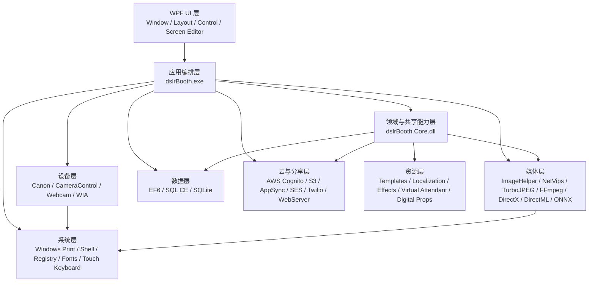

### 3.3 架构优点

- 本地主链路完整，适合弱网或无网活动现场
- WPF 对多窗口、触摸屏、模板编辑和打印预览足够成熟
- 通过资源和配置文件驱动，非研发人员可部分调整内容
- 将高成本能力外包给成熟 SDK：相机、FFmpeg、AWS、ONNX、打印驱动

### 3.4 架构问题

1. 核心能力耦合在桌面主进程中，拍摄、渲染、分享、AI、打印之间缺少清晰边界。
2. AI 明显是叠加层，不是底座能力，未来换模型、加 GPU pipeline、做人像多任务推理时扩展成本会快速上升。
3. 模板系统表达能力强依赖“坐标布局 + 元素类型”，弱于现代组件化模板引擎。
4. 云能力存在，但更像外围增量功能，不是全局一致的数据与身份模型。
5. 本地数据库同时出现 SQL CE 和 SQLite 信号，说明数据层存在历史包袱或双轨并行。

### 3.5 生命周期初步推断

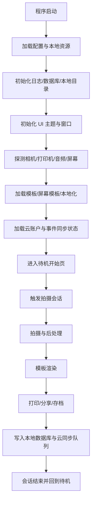

---

## 4. 模块分析

### 4.1 当前目录树

```text
D:\AI\多连拍软件\多连拍软件
├─ content
│  ├─ DigitalProps
│  ├─ Effects
│  ├─ LamaBotMovements
│  ├─ Localization
│  ├─ Templates
│  ├─ VideoAnimatedOverlays
│  └─ VirtualAttendant
├─ Microsoft.VC90.CRT
├─ Resources
├─ runtimes
│  ├─ win-arm\native
│  ├─ win-x64\native
│  └─ win-x86\native
├─ dslrBooth.exe
├─ dslrBooth.Core.dll
├─ dslrBooth.Localization.dll
├─ dslrBooth.UserControls.dll
├─ dslrBooth.DirectXFilters.dll
├─ CameraControl.Devices.dll
├─ Canon.Eos.Framework.dll
├─ Webcam.Framework.dll
├─ ImageHelper.dll
├─ D3DVisualization.dll
├─ DirectML.dll
├─ Microsoft.ML.OnnxRuntime.dll
├─ onnxruntime.dll
├─ ffmpeg.exe
├─ AWSSDK.*.dll
├─ AWS.AppSync.Client.dll
├─ Twilio.dll
├─ Griffin.WebServer.dll
├─ EntityFramework*.dll
├─ System.Data.SqlServerCe.dll
├─ e_sqlite3.dll
└─ 其他第三方与系统依赖
```

### 4.2 目录职责归类

| 目录/文件 | 角色归类 | 职责判断 |
|---|---|---|
| `dslrBooth.exe` | UI / App | 主程序入口、界面编排、流程调度 |
| `dslrBooth.Core.dll` | Core / Business | 模板、设置、资源、业务实体、屏幕模板、共享逻辑 |
| `dslrBooth.Localization.dll` | Resource / UI | 本地化支持 |
| `dslrBooth.UserControls.dll` | UI | 可复用控件 |
| `dslrBooth.DirectXFilters.dll` | Media / AI | GPU/特效/滤镜相关 |
| `CameraControl.Devices.dll` | Camera | DSLR 设备接入 |
| `Canon.Eos.Framework.dll` | Camera / SDK | Canon EDSDK 封装 |
| `Webcam.Framework.dll` | Camera | Webcam 输入 |
| `ImageHelper.dll` | Media | 原生图像处理辅助 |
| `D3DVisualization.dll` | Media / GPU | Direct3D 可视化与渲染 |
| `DirectML.dll` / `onnxruntime.dll` | AI / GPU | ONNX 推理与 DirectML 加速 |
| `ffmpeg.exe` | Media | GIF、Boomerang、视频转码合成 |
| `content/Templates` | Template | 成品打印模板 |
| `content/Localization` | Resource / Config | 多语言文案 |
| `content/Effects` | Media / Config | 滤镜配置 |
| `content/VirtualAttendant` | UX / Media | 语音/视频引导素材 |
| `content/VideoAnimatedOverlays` | Template / Media | 动态叠加层资源 |
| `content/DigitalProps` | Product / Template | 数字贴纸道具 |
| `content/LamaBotMovements` | Robot / Motion | 运动路径、错误信息、预览 |
| `Resources/*.ttf` | UI Resource | 内置字体 |
| `runtimes/*/native/e_sqlite3.dll` | Data | 跨架构 SQLite 原生依赖 |

### 4.3 已识别的核心命名空间

基于 `dslrBooth.Core.dll` 已识别出如下业务域：

- `dslrBooth.Core.Template`
- `dslrBooth.Core.Survey`
- `dslrBooth.Core.Effects`
- `dslrBooth.Core.Controls.ScreenEditor`
- `dslrBooth.Core.Classes`
- `dslrBooth.Core.Classes.ScreenEditor`
- `dslrBooth.Core.Classes.CryptoUtils`

这说明 DSLRBooth 的 `Core` 并不是纯基础库，而是已经承载了：

- 模板模型
- 屏幕模板模型
- 效果模型
- 调查问卷
- 账户/分享/事件链接
- 绿幕与视频设置
- 虚拟主持
- 打印纸张与会话配置
- 加密与订阅校验

### 4.4 当前模块边界的评价

`dslrBooth.Core.dll` 的职责已经明显偏大。  
这在商业软件中很常见，因为：

- 共享逻辑需要复用
- 桌面应用更倾向“功能可交付优先”
- 早期不会主动做重模块边界拆分

但从下一代产品角度看，这也是未来最大架构瓶颈之一。

### 4.5 更细粒度的程序集 / 页面 / ViewModel 映射

基于当前反编译目录，可进一步确认主程序层至少包含以下几个高密度命名空间簇：

| 命名空间 / 目录 | 当前观察 | 角色判断 |
|---|---:|---|
| `dslrBooth.Windows` | `77+` 个窗口/控件类 | 管理后台、弹窗、编辑器、设备交互界面 |
| `dslrBooth.ViewModel` | `34+` 个 ViewModel 类 | MVVM 编排层、设置页、主窗口、导出与统计 |
| `dslrBooth.Layouts` | `13` 个布局类 | Booth 前台运行时布局与会话界面 |
| `dslrBooth.classes` | 大量业务/工具/流程类 | 相机、打印、上传、同步、遥测、API、工作流 |
| `dslrBooth.classes.AIBackgroundRemoval` | AI 去背景子域 | 模型、缓冲区、图像处理与推理辅助 |
| `dslrBooth.classes.BoothApi` | 本地 API 子域 | 命令响应、控制管理器 |
| `dslrBooth.classes.BoothCopilot` | 运行提示/状态子域 | 状态面板、提示消息、Copilot 雏形 |
| `dslrBooth.classes.Dobot` | 机器人子域 | 动作控制、状态反馈 |

### 4.6 Booth 前台 Layout 映射

`dslrBooth.Layouts` 明确说明 Booth 前台并不是单一主界面，而是一组会话状态布局切换系统：

| Layout 类 | 业务含义 |
|---|---|
| `LayoutStart` | 待机 / 开始页 |
| `LayoutCapture` | 拍摄中 / 倒计时 / Live View |
| `LayoutFinish` | 拍后完成页 / 分享入口 |
| `LayoutBrowse` | 浏览历史内容 / 相册式视图 |
| `LayoutSurvey` | 问卷采集 |
| `LayoutTemplate` | 模板选择 / 模板预览 |
| `LayoutEventManagement` | 活动管理入口 |
| `LayoutSelectEffectAfterCapture` | 拍后效果选择 |
| `LayoutDigitalProps` | 数字道具 |
| `LayoutLockScreen` | 锁屏 / 营业锁定态 |
| `LayoutPickAMovementForLamaBot` | LamaBot 动作选择 |

这进一步证明 DSLRBooth 的 Booth 模式不是一个简单拍照页，而是一个基于状态布局切换的前台工作流 UI。

### 4.7 关键 Window 映射

从 `dslrBooth.Windows` 中可以看到，后台并不是单个设置窗口，而是大量专题窗口组合：

| Window / Control 类 | 业务作用 |
|---|---|
| `SettingsWnd` | 总设置中心 |
| `AssetManagerWnd` | 资产管理 |
| `BeautyFilterSettingsWnd` | 美颜设置 |
| `EffectsSettingsWnd` | 效果设置 |
| `GreenScreenSettingsWnd` | 绿幕设置 |
| `RemoteControlSettingsWnd` | 远程控制 / API 相关设置 |
| `LockScreenSettingsWnd` | 锁屏设置 |
| `ExportEventWnd` / `ExportEventSharesWnd` | 活动导出 / 分享导出 |
| `CreateStripeAccountWnd` | Stripe 支付接入 |
| `ConnectYourGoProWnd` | GoPro 接入 |
| `ConnectYourLamaBotWnd` | LamaBot 接入 |
| `ManageEventLinkWnd` | 活动链接管理 |
| `PreviewVideoTimelinesWnd` | 视频时间轴预览 |
| `SendMailWnd` / `SendLogWnd` | 邮件与日志发送 |
| `SyncingEventsWnd` | 同步进度与状态 |
| `TemplateEditor` / `BaseTemplateEditorWindow` | 模板编辑器 |

这类窗口分布说明：

- 后台设置项已经高度产品化
- 各高级能力都倾向于形成独立配置界面
- 但这些界面仍集中在同一桌面进程中，导致复杂度不断上升

### 4.8 关键 ViewModel 映射

`dslrBooth.ViewModel` 进一步说明当前产品采用了明显的 `WPF + MVVM` 组织方式，但主 ViewModel 已过重：

| ViewModel 类 | 作用判断 |
|---|---|
| `MainWindowViewModel` | 主流程、启动、导航、打印、分享、同步的总编排器 |
| `CameraSettingsViewModel` | 相机相关配置 |
| `BeautyFilterSettingsViewModel` | 美颜调参 |
| `EffectsSettingsViewModel` | 效果管理 |
| `GreenScreenSettingsViewModel` | 绿幕配置 |
| `RemoteControlSettingsViewModel` | 本地 API / 远程控制配置 |
| `VirtualAttendantSettingsViewModel` | 虚拟主持配置 |
| `VideoAnimatedOverlaySettingsViewModel` | 视频动态叠加层配置 |
| `ExportViewModel` / `ExportEventSharesViewModel` | 导出链路 |
| `AssetManagerViewModel` | 素材与模板资源管理 |
| `StatsDetailViewModel` | 统计信息呈现 |
| `WizardViewModel` | 引导式配置流程 |

### 4.9 对下一代产品的直接启示

这一层映射给出的最重要启示是：

1. DSLRBooth 已经形成了完整的“前台 Layout 系统 + 后台 Window 系统 + ViewModel 编排层”。
2. 它不是缺少产品结构，而是这些结构全部堆叠在同一桌面应用中。
3. 如果重做下一代产品，正确方向不是简单“把旧窗口迁到新框架”，而是：
   - 前台 Booth Runtime 独立
   - Studio 设计与配置独立
   - Cloud Admin 独立
   - 支持与运维工作台独立

---

## 5. 功能分析

### 5.1 已确认的功能面

基于目录、资源与 WPF BAML 命名，已确认 DSLRBooth 覆盖以下功能面：

- 拍照会话
- GIF 会话
- Boomerang 会话
- 视频会话
- 打印会话
- 相册浏览
- 模板编辑
- 屏幕模板编辑
- 分享页与分享状态
- QR 扫码
- 短信发送
- 邮件发送
- WhatsApp 分享
- 打印数量选择
- 数字道具
- 动态视频覆盖层
- 绿幕设置
- Beauty Filter 设置
- GoPro 连接与配对
- LamaBot 连接与运动选择
- 活动管理与事件导出
- Survey 问卷
- 锁屏与开始页定制
- 远程控制设置
- 订阅验证与设备限制
- 同步与云账户管理
- Stripe 相关收款入口

### 5.2 从资源命名推断出的商业定位

它并不是仅面向“传统 DSLR 婚礼拍照亭”，而是已覆盖：

- 传统相纸打印 Booth
- GIF / Boomerang / 视频 Booth
- Mirror Booth
- 分享站
- QR 自助分享
- 支付与活动运营
- 调查问卷采集
- GoPro / 机器人运动等扩展玩法

这正是 DSLRBooth 作为行业成熟产品仍具竞争力的原因。

---

## 6. 相机系统

### 6.1 已确认支持的相机与输入源

基于 `CameraManager`、`CameraControl.Devices`、`Canon.Eos.Framework`、`Webcam.Framework` 与资源命名，当前可确认支持：

- Canon DSLR / Mirrorless
- Nikon DSLR / Mirrorless
- Sony MTP 相机
- Webcam
- Wired / Wi-Fi GoPro
- 通过机器人/运动控制扩展的视频采集场景

当前没有发现独立的厂商插件目录，说明相机支持主要依赖：

- 内置托管程序集封装
- 原厂 SDK
- PTP/MTP / DirectShow / WIA

### 6.2 相机能力面

从 `CameraManager.cs` 与 `SonyMtpCamera.cs` 可确认以下能力：

- Live View
- Trigger Shutter
- Auto Focus
- 视频录制模式切换
- ISO / 快门 / 白平衡 / 对焦模式 / 光圈 等属性控制
- Canon 视频 Live View
- Nikon/Sony 的远程拍摄模式
- Webcam 帧级拉流
- GoPro 视频模式与网络连接管理

已验证的 Sony 属性枚举包括：

- `FocusMode`
- `WhiteBalance`
- `ShutterSpeed`
- `ISO`
- `ExposureProgramMode`

这说明 DSLRBooth 不是“只触发快门”的浅集成，而是具备设备参数控制能力。

### 6.3 Live View 架构

相机链路明显分为两类：

1. `DSLR / Mirrorless`
2. `Webcam`

两者使用不同定时器模型：

- DSLR / Mirrorless：`DispatcherTimer`
- Webcam：`System.Timers.Timer(10ms)`

并通过 `CameraManager.ProcessLiveViewImage()` 汇合到统一后处理通道。

### 6.4 Live View 实时处理链

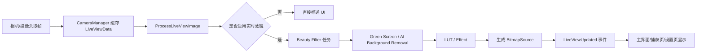

### 6.5 线程模型观察

`CameraManager` 采用了典型的“主线程拉流 + 后台长任务滤镜处理 + 锁与事件协同”模式：

- `DispatcherTimer` / `System.Timers.Timer`
- `Task.Factory.StartNew(..., LongRunning)`
- `AutoResetEvent`
- `Barrier`
- `Thread` 用于 Nikon / 某些阻塞 stop 操作
- 多处 `lock`

这说明团队优先保证现场稳定性，而不是追求最纯的 async/await 架构。

### 6.6 优点与问题

优点：

- 兼容设备广
- Live View 与拍摄链路成熟
- DSLR / Webcam / GoPro 共存
- 能覆盖传统 Booth 与新型玩法

问题：

- 相机适配代码明显集中在 `CameraManager`
- 不同设备分支逻辑很重
- 线程同步复杂，后续接入更多 AI 链路会继续增大维护成本
- RAW/HDR 不是当前体系的核心优势，至少从现有二进制中未看到强证据

---

## 7. 拍照流程

### 7.1 会话类型

根据 `WorkflowManager.SessionType` 与 API 可确认支持：

- `PrintOnly`
- `PrintAndGIF`
- `OnlyGIF`
- `Boomerang`
- `Video`

### 7.2 会话启动入口

会话可以由多种入口触发：

- 主开始页触摸
- Booth API `/api/start?mode=...`
- Guest QR / Touchless 控制
- 远程控制 / 传感器 / 外设

### 7.3 标准拍照流程

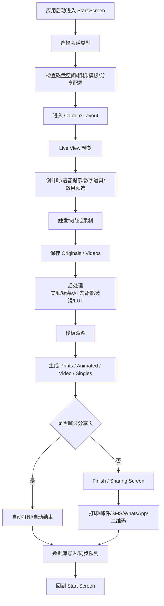

### 7.4 特殊拍照分支

- `Boomerang` / `Video` 会先选择或自动轮换：
  - MP3 音轨
  - Animated Overlay
  - Image Overlay
  - LUT / Effect
- `GreenScreen` / `AI Background Removal` 会在 Live View 和成片阶段分别发挥作用
- `Payments` 开启时，分享/打印结束逻辑会被支付流程插入

### 7.5 生命周期控制风格

`WorkflowMessages` 暴露了大量字符串事件，例如：

- `StartPhotoSession`
- `StartMovieSession`
- `NextPhoto`
- `FinalProcessing`
- `PrintLastImage`
- `ShareByEmail`
- `ShareBySMS`
- `ShareByWhatsApp`
- `CancelSession`
- `LiveViewBackgroundRemovalModelStartedLoading`

这说明它的会话流程本质上是：

**字符串消息驱动的 UI/工作流编排器。**

优点是快、灵活。  
问题是缺乏类型约束，长期演进后易变脆。

---

## 8. 模板系统

### 8.1 当前模板分为两套

DSLRBooth 当前并不是单一模板系统，而是两套并行：

1. **打印模板** `dslrBooth.Core.Template.Template`
2. **屏幕模板** `dslrBooth.Core.Classes.ScreenEditor.ScreenTemplate`

这点非常关键。

打印模板负责：

- 成片排版
- 打印纸张尺寸
- 双联输出
- 二维码叠加
- 图片 / 文本 / 图形元素

屏幕模板负责：

- 开始页
- 捕获页
- 分享页
- QR / 支付 / 分享按钮
- Guest 控制 UI

### 8.2 当前打印模板格式

打印模板是 XML 驱动，样例：

```xml
<Template Name="Four poses, double strip (vertical)" Width="1200" Height="1800" BackgroundColor="#FFFFFFFF">
  <Elements>
    <Photo ... PhotoNumber="1" />
    <Photo ... PhotoNumber="2" />
    <Image ... ImagePath="sample_foreground_vertical.png" />
  </Elements>
</Template>
```

特点：

- 坐标绝对定位
- 基于像素尺寸
- 元素类型固定
- 模板目录中包含 `template.xml + preview.png + 附件图`

### 8.3 当前元素能力

打印模板元素已确认包含：

- `Photo`
- `Image`
- `Text`
- `UserData`
- `QrCode`
- `Line`
- `Rectangle`
- `Ellipse`
- `Star`

屏幕模板元素已确认包含：

- `StartPrintSessionButton`
- `StartGIFSessionButton`
- `StartBoomerangSessionButton`
- `StartVideoSessionButton`
- `StartLiveView`
- `GuestQRCode`
- `SharingEmailButton`
- `SharingPrintButton`
- `SharingSMSButton`
- `SharingWhatsAppButton`
- `SharingQRCode`
- `ScanToPayQRCode`
- `SharingFinalPhotoVideo`

### 8.4 当前模板系统优点

- 简单、稳定、可落地
- 非研发可编辑
- 打印模板与屏幕模板分离，适配 Booth 行业实际需要
- 资源目录自包含，便于导入导出和同步

### 8.5 当前模板系统限制

1. 以绝对坐标为中心，不是响应式布局。
2. 缺少组件、变量、表达式、约束布局和数据绑定体系。
3. 设计语言停留在“图层堆叠”，不支持现代设计协作源如 Figma/Canva。
4. 模板与业务事件的关系较弱，无法自然表达“支付后显示”“多语言条件显示”“多人脸自适配布局”等动态逻辑。
5. 两套模板系统虽然合理，但存在模型重复和演化成本。

### 8.6 对下一代模板系统的要求

下一代系统必须从“排版文件”升级为“体验编排引擎”：

- 支持 PSD / Figma / SVG / JSON 导入
- 支持组件、主题、变量、表达式
- 支持横竖版自适应
- 支持多终端 Screen Template 响应式布局
- 支持 AI 自动生成模板
- 支持云模板、版本控制、模板市场
- 支持模板性能缓存与预渲染

---

## 9. 美颜系统

### 9.1 当前美颜能力不是纯概念功能

当前版本至少实现了两条 AI / 图像增强路径：

1. `Beauty Filter`
2. `AI Background Removal / Green Screen`

### 9.2 Beauty Filter 架构

从 `BeautyFilterSettingsViewModel` 与 `CameraManager` 可确认：

- 存在独立 `BeautyFilterSettingsWnd`
- 支持实时预览与测试照片
- 采用 `FilterPictureFromMemoryBatchBegin` / `ApplyBeautyFilterToBitmapInBatch` / `BatchEnd`
- 在 Live View、视频录制、成片处理中复用
- 使用批处理方式减少重复初始化成本

这说明其美颜实现并非简单 LUT，而是独立滤镜引擎，极可能依赖原生加速库。

### 9.3 AI 背景移除架构

从 `LiveViewBackgroundRemovalModel` 与 `HighQualityBackgroundRemovalModel` 可确认：

- 使用 `Microsoft.ML.OnnxRuntime`
- 优先尝试 `DirectML`
- 自动检测最高性能 GPU
- 标准实时模型输入 `640x640`
- 高质量模型输入 `768x768`
- 高质量模型要求最少约 `3.5GB` 独显显存
- 启动推理前后通过工作流消息通知 UI

### 9.4 当前 AI 去背景流程

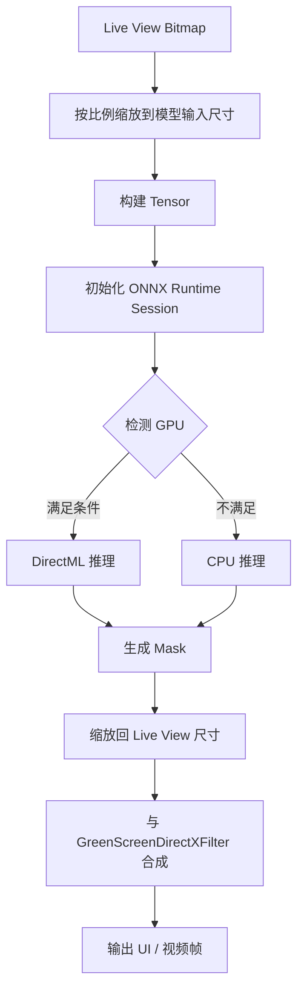

### 9.5 当前美颜系统的边界

已有能力：

- 磨皮强度级别
- 实时预览
- 视频链路复用
- AI 去背景
- 绿幕与 AI 背景替换共存

未看到强证据的能力：

- 瘦脸
- 大眼
- 祛痘
- 法令纹
- 多人脸精细美容
- 人脸关键点驱动美型

因此当前“Beauty”更接近：

**平滑/风格化 + AI 抠图 + 绿幕增强**  
而不是完整的多参数人像美型引擎。

### 9.6 下一代 AI Beauty 2.0 方向

下一代必须做到：

- 多人脸检测与跟踪
- 结构化美型参数
- 人像分割与发丝级抠图
- GPU 优先、CPU 降级
- 模型热更新
- 模型注册中心
- 100FPS 级预览目标
- 摄像头 / 成片 / 视频 / 360 统一 AI Pipeline

---

## 10. 打印系统

### 10.1 当前打印架构

DSLRBooth 当前打印链路明显建立在 **Windows Print API** 之上，而不是厂商专用 SDK：

- `PrintDialog`
- `PrintQueue`
- `PrintTicket`
- `PrintCapabilities`
- `MergeAndValidatePrintTicket`

当前未发现：

- DNP SDK
- HiTi SDK
- Citizen SDK
- Epson 专用 SDK
- ICC 独立色彩引擎

这意味着它的打印兼容性主要来自：

- Windows 驱动层
- 纸张尺寸 / PrintTicket
- 页面缩放与边距控制

### 10.2 已实现的打印特性

- 主打印机 / 次打印机
- 可保存各打印机的 `PrintTicket`
- 打印纸张检测与错误状态获取
- 自动打印
- 双打印机轮询
- 一图双联 `Print2PerPage`
- 打印缩放和上下左右偏移量
- 自动旋转
- 打印统计写库
- 可在分享页二次打印

### 10.3 当前打印流程

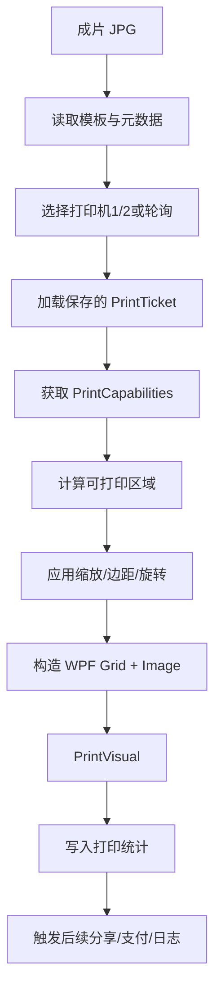

### 10.4 当前架构优点

- 兼容性高
- 不依赖厂商 SDK 发布节奏
- 适合婚礼、活动公司常见的“驱动即能力”环境
- 双打印机和自动打印对商用价值很高

### 10.5 当前架构缺点

1. 纸张、裁切、颜色、耗材状态严重依赖驱动质量。
2. 缺少对热升华打印机的深度状态管理与恢复策略。
3. 没有看到 ICC 颜色管理作为一等公民。
4. 打印异常更多是提示型，不是完整队列调度型。

### 10.6 企业级打印架构升级方向

下一代应分成三层：

- `Render Print Job`
- `Spool / Retry / Recover`
- `Vendor Adapter`

并支持：

- DNP / HiTi / Citizen / Mitsubishi / Epson 专属适配器
- 队列优先级
- 自动重试与幂等打印
- 耗材预警
- ICC Profile
- 热升华纸型与裁切策略
- 打印机健康状态中心

---

## 11. 相册系统

### 11.1 物理存储结构

相册并非单库抽象，而是“文件夹 + 数据库元数据”双轨模型：

- `Originals`
- `Prints`
- `Singles`
- `Animated`
- `Videos`
- `GreenScreen`
- `thumb`
- `Qr`

### 11.2 数据模型

`FileItem` 当前字段包括：

- `FileName`
- `FileType`
- `AlbumName`
- `UploadHash`
- `UploadUrl`
- `ImageUrl`
- `SessionID`
- `SessionNanoId`
- `DateTaken`
- `EventId`
- `IsDeleted`

这说明相册系统同时服务于：

- 本地浏览
- 分享追踪
- 云同步
- 按活动管理
- 软删除恢复

### 11.3 当前能力判断

已确认：

- 活动级分类
- 缩略图
- 导出 Event
- 删除确认
- 软删除字段
- 分享/打印统计
- 基于会话的聚合

未看到强证据：

- 全文搜索
- 标签体系
- NAS / WebDAV 原生适配
- 对象存储作为本地资源库替代

### 11.4 下一代升级方向

- 本地相册索引服务
- 面部/模板/活动/设备多维检索
- 热/温/冷分层存储
- 本地回收站与版本恢复
- NAS / S3 / B2 / WebDAV 抽象存储层
- CDN 化分享资源

---

## 12. 分享系统

### 12.1 当前分享方式

从 `Exporter`、`WebserverModule`、`LayoutFinishViewModel`、`ScreenEditor` 可确认支持：

- Email
- SMS（Twilio）
- WhatsApp（基于 `wa.me` 链接）
- QR Code
- 本地 Web Server 列表/下载
- 打印
- fotoShare 云追踪

历史/遗留字段还表明曾覆盖：

- Twitter
- Facebook Page

### 12.2 分享队列与状态

数据库中的 `Share` 实体包含：

- `ShareType`
- `Status`
- `ToField`
- `Data`
- `DateEntered`
- `DateSent`
- `DateLastTried`
- `LastError`
- `Done`
- `Count`

这说明分享不是同步 UI 动作，而是：

**本地持久化队列驱动的异步发送系统。**

### 12.3 本地 Web/API 能力

当前内置 `Griffin.WebServer`，暴露：

- `/list`
- `/print/...`
- `/print_with_file`
- `/api/start`
- `/api/print`
- `/api/share/email`
- `/api/share/sms`
- `/api/lockscreen/...`

这表明 DSLRBooth 已经具备“可被外部系统控制”的自动化接口基础。

### 12.4 云分享与同步

已确认的云侧组件：

- fotoShare Cloud
- AWS Cognito
- AWS AppSync
- S3 / Backblaze B2
- Booth synchronization
- 上传 URL / 下载 URL / UploadHash 追踪

### 12.5 当前分享系统优缺点

优点：

- 覆盖现场主流分享动作
- 本地队列抗网络抖动
- QR 与 Booth API 为无接触体验提供基础

问题：

- 能力碎片化，渠道适配不统一
- API 安全边界弱
- 分享编排不够“平台化”
- 没看到 WebDAV / NAS / 企业开放 API 作为标准一等能力

---

## 13. UI/UX

### 13.1 当前 UI 框架判断

UI 采用：

- `WPF`
- `MahApps.Metro`
- `ControlzEx`
- 多 Window + 多 Layout + Screen Editor

从 BAML 可识别的主要页面/布局包括：

- `LayoutStart`
- `LayoutCapture`
- `LayoutFinish`
- `LayoutBrowse`
- `LayoutSurvey`
- `LayoutTemplate`
- `LayoutEventManagement`
- `LayoutSelectEffectAfterCapture`
- `LayoutDigitalProps`
- `LayoutLockScreen`
- `Settings*`
- `TemplateEditor`
- `ScreenTemplatesEditor`

### 13.2 UX 优势

- 线下 Booth 流程完整
- 设置项极多，适合专业运营者
- 屏幕模板可视化编辑，业务灵活
- Mirror Booth / Virtual Attendant / QR Guest Control 都是强行业特性

### 13.3 UX 问题

1. 信息架构偏重，学习成本高。
2. 多年叠加导致设置项密度过大。
3. 设计语言更偏“工具软件”，品牌感和现代感不足。
4. 编辑器、设置、运行态三种体验风格混杂。
5. 商业上很强，但不够“惊艳”。

### 13.4 下一代 UI 方向

应拆分为三类体验：

- `Operator Console`
- `Guest Experience`
- `Cloud Backoffice`

并做到：

- 触摸优先
- 品牌主题化
- 组件化 Screen Builder
- 动态动效与状态反馈
- 快速启动模式 / 深度配置模式 分层

---

## 14. 性能分析

### 14.1 当前性能热点

基于架构与代码路径，当前高概率瓶颈在：

1. Live View 帧获取与解码
2. Beauty / Green Screen / AI Background Removal 链式处理
3. 视频/GIF/Boomerang 的 FFmpeg 合成
4. WPF 图片解码与大图内存占用
5. 打印前图像加载与 UI 构图
6. 同步与上传链路

### 14.2 当前性能设计中的积极做法

- Live View 单独任务与同步原语隔离
- 批处理美颜初始化减少重复开销
- ONNX 优先 DirectML
- 双分辨率 AI 模型
- ConcurrentBag / ConcurrentDictionary 用于部分并发场景
- 用外部 `ffmpeg.exe` 处理复杂视频链路

### 14.3 当前瓶颈判断

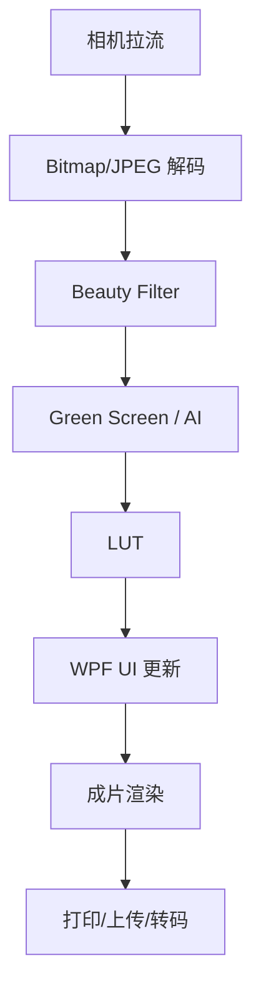

最可能的瓶颈不是单点，而是 **多阶段位图往返与 CPU/GPU 混合流水线的不连续性**。

### 14.4 优化空间估计

基于现有实现方式，保守估计：

- Live View 端到端延迟：可优化 `20% ~ 45%`
- AI 去背景链路：可优化 `30% ~ 60%`
- 视频导出：可优化 `15% ~ 35%`
- 启动与模板载入：可优化 `20% ~ 40%`
- 打印前准备：可优化 `10% ~ 25%`

前提是：

- 统一媒体缓冲区
- 更少 Bitmap 拷贝
- GPU pipeline 一体化
- 异步队列分层

### 14.5 反编译证据与瓶颈指纹

基于当前反编译结果，可直接确认下列“性能债特征”：

- `Task.Factory.StartNew` 命中约 `102` 处
- `Thread.Sleep` 命中约 `97` 处
- `new Thread(...)` 命中约 `17` 处
- `GC.Collect()` 命中约 `19` 处
- `catch (Exception ...)` 命中约 `718` 处
- `CameraManager.cs` 约 `2623` 行
- `SyncQueueManager.cs` 约 `1970` 行
- `MainWindowViewModel.cs` 约 `7277` 行
- `SettingsWnd.cs` 约 `5715` 行

这些数据并不直接等于“慢”，但它们强烈说明系统存在以下结构性风险：

- 线程模型并不统一，存在 UI 线程、Timer 线程、LongRunning 任务、显式 Thread 混用
- 大量同步等待和休眠正在替代事件驱动编排
- 强制 GC 说明内存峰值与对象生命周期管理存在压力
- 超大类与超大窗口通常意味着热路径穿透太多职责边界

### 14.6 性能瓶颈排行

| 排名 | 瓶颈 | 证据锚点 | 影响范围 | 当前判断 | 可优化空间 |
|---|---|---|---|---|---|
| 1 | Live View 多阶段位图处理 | `CameraManager.cs:68,70,90,96,108,2165-2264,2516-2562` | 预览、滤镜、拍摄等待感 | 最高 | `30% ~ 55%` |
| 2 | AI 去背景 GPU/CPU 回退与模型切换 | `LiveViewBackgroundRemovalModel`、`HighQualityBackgroundRemovalModel`、`CameraManager.cs:2516` | 绿幕、分享图、导出图 | 极高 | `35% ~ 60%` |
| 3 | 启动期主流程过重 | `MainWindowViewModel.cs:1577,1957,3407,4115,5347,7662` | 首启、重进 Booth、恢复 | 极高 | `20% ~ 40%` |
| 4 | WPF 大图与 Canvas 渲染 | `TemplateManager.cs:309,368,625`、`ScreenTemplateManager.cs:213,215` | 模板预览、打印预览、分享页 | 高 | `20% ~ 35%` |
| 5 | FFmpeg 外部进程链路 | 安装资源与视频模式、Boomerang/GIF/Video 导出链路 | GIF、Boomerang、视频导出 | 高 | `15% ~ 35%` |
| 6 | 同步队列串行化与轮询 | `SyncQueueManager.cs:24,92,169,1824` | 云同步、资产上传、活动切换 | 高 | `25% ~ 45%` |
| 7 | 打印前准备与驱动协商 | `PrinterHelper.cs:19-66,91-141` | 连续打印、双打印机 | 中高 | `10% ~ 25%` |
| 8 | SQL CE 本地数据库与磁盘访问 | `DatabaseContext.cs:18-33,60` | 列表、分享队列、恢复 | 中高 | `15% ~ 30%` |
| 9 | 日志与后台任务碎片化 | `Logger.cs` 多个 `Task.Factory.StartNew` | 全局 | 中 | `10% ~ 20%` |
| 10 | 设置窗口巨型代码路径 | `SettingsWnd.cs:2010,3091,4505,4558,5960,6021` | 管理后台、模板验证、媒体验证 | 中 | `15% ~ 30%` |

### 14.7 性能瓶颈关系图

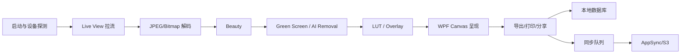

### 14.8 企业级优化优先级

#### 第一优先级：必须先解决的热路径

- 把 Live View 媒体链路改为单一帧缓冲协议，消除多次 `Bitmap` 往返
- 把 AI、美颜、绿幕、LUT 统一进可插拔媒体管线
- 去掉热路径里的 `Thread.Sleep`、强制 `GC.Collect()`、隐式长任务嵌套
- 对启动流程做延迟初始化，把“拍摄必须项”和“后台能力项”分离

#### 第二优先级：影响持续稳定性的中后台链路

- 把同步队列改为真正的异步消息泵，而不是 Timer + 轮询 + 状态位
- 把 SQL CE 升级为更稳定的本地存储方案，并引入索引、归档和压缩策略
- 把打印前布局计算、色彩转换、驱动协商前置缓存化

#### 第三优先级：提升规模化活动吞吐

- 建立资源预热：模板、字体、背景、音视频轨道、AI 模型
- 建立事件级缓存与会话级缓存分层
- 建立 GPU 能力探测、模型编译缓存、导出参数预设

---

## 15. 安全分析

### 15.1 当前安全模型评价

DSLRBooth 有基本安全意识，但整体仍然是：

**以商业可用为目标，而非以零信任/企业级安全为底座。**

### 15.2 已确认的积极做法

- fotoShare 凭据存入 Windows Credential Manager
- 订阅校验带签名验证
- API 基于 Booth 密码
- Stripe 承担支付合规责任
- 可配置锁屏和 PIN

### 15.3 已确认的重大风险

#### 风险 1：硬编码云密钥与 SMTP 凭据

在反编译代码中已直接看到：

- AWS Access Key
- AWS Secret
- SES 发信凭据
- Mailgun SMTP 账号密码
- Google Analytics Measurement API Secret
- YouTube OAuth Client Secret

这是严重的供应链与资产泄漏风险。

#### 风险 2：本地 API 以查询字符串传密码

示例 URL 形态为：

```text
/api/start?mode=print&password=...
```

问题：

- 易被日志、代理、历史记录泄露
- 缺少请求签名与时效控制
- 缺少来源校验

#### 风险 3：本地 WebServer CORS 过宽

已确认响应头：

```text
Access-Control-Allow-Origin: *
```

若 Booth API 还可被浏览器跨源调用，则攻击面显著扩大。

#### 风险 4：分享与日志数据涉及个人信息

系统会处理：

- 邮箱
- 手机号
- 调查问卷
- 活动数据
- 用户设备信息

但当前更像产品内数据流，并非严格隐私治理体系。

### 15.4 企业级安全方案方向

- 删除所有客户端硬编码密钥
- 引入服务端签发的短期令牌
- 本地 API 改为 HMAC / JWT / One-time token
- Booth 设备绑定证书化
- 分享、支付、同步按最小权限拆分
- 审计日志与敏感字段脱敏
- API 访问启用来源、速率和时效限制

---

## 16. 最佳实践

### 16.1 DSLRBooth 值得学习的地方

- 以线下商用稳定性为首要目标
- 本地主链路完整，不依赖云即可核心运行
- 业务理解深，不只做“拍照”，而是做“活动现场转化系统”
- 模板、屏幕、支付、分享、同步逐步产品化
- 多相机、多模式、多分享渠道融合得足够实用

### 16.2 对下一代产品最重要的启示

不要只做“AI 特效演示软件”。  
行业第一的软件，必须同时做好：

- 拍摄稳定
- 模板效率
- 打印可靠
- 分享转化
- 活动运营
- 远程协作
- 云资产
- 设备管理

---

## 17. 行业竞品分析

### 17.1 说明

本节包含两类结论：

- 本地逆向得到的 DSLRBooth 事实
- 基于公开网页的竞品研究结论

其中竞品事实优先参考官方站点与官方帮助中心。

### 17.2 当前行业格局

截至 **2026 年 7 月 2 日**，Photo Booth 赛道大致分为四类：

1. **Windows 本地重型运营软件**  
   代表：DSLRBooth / Remote Pro / Darkroom Booth
2. **iPad / 移动优先 SaaS 型 Booth**  
   代表：Snappic / Simple Booth / Breeze Booth
3. **360 / Video / Multi-device 平台型**  
   代表：TouchPix / Snappic
4. **轻量通用型**  
   代表：Sparkbooth

### 17.3 竞品对比初判

| 产品 | 平台倾向 | 主要优势 | 主要弱点 |
|---|---|---|---|
| DSLRBooth / LumaBooth for Windows | Windows 本地 | 拍摄、模板、打印、分享、支付、云同步一体化 | 技术债重，AI 与模板表达力仍非行业天花板 |
| Breeze Remote Pro | Windows | 可靠、灵活、行业口碑强 | 设计语言与 AI 叙事不如新平台激进 |
| Darkroom Booth | Windows/iPad | 打印与活动运营强，绿幕成熟 | 官方信息更强调传统 Booth，而非 AI 原生平台 |
| Snappic | iOS/平台化 | AI、360、实时分析、硬件兼容广、增长导向强 | 对重型本地打印/离线链路的稳定性理解未必优于 Windows 老牌 |
| Simple Booth | iPad/品牌营销 | 交付简单、分享和品牌运营强 | 更偏品牌活动与 SaaS 体验，重型拍摄工作站深度略弱 |
| TouchPix | 多平台/360 强 | 360、视频、跨平台、AI 特效、离线背景移除强 | 传统 DSLR 打印工作流不是其最核心护城河 |
| Sparkbooth | Windows/Mac | 简单、上手快、DIY 友好 | 企业化、AI、云协同能力明显弱于头部产品 |

### 17.4 关键竞品观察

#### DSLRBooth / LumaBooth for Windows

- 官方已将 Windows 产品放入 `LumaBooth for Windows` 体系中，支持 Canon/Nikon/Sony/GoPro/Webcam，并继续扩展 360、支付、Booth Guest Control 等能力。  
  来源：`lumasoft.co`、`support.lumasoft.co`
- 这说明 LumaSoft 的核心策略不是放弃 Windows，而是把 Windows 端继续作为高强度现场运行平台，同时向云协同和多设备控制延展。

#### Breeze Remote Pro

- 官方定位仍然非常清晰：Windows PC Photo Booth，强调轻量、可靠、灵活。  
  来源：`breezesoftware.com/remote-pro`
- 其竞争优势不在“平台叙事”，而在“把现场拍摄与稳定工作流做扎实”。这对任何想超越 DSLRBooth 的新产品都是直接压力。

#### Darkroom Booth

- 官方继续强调绿幕、外接显示器、360/VR 图像和事件体验。  
  来源：`darkroomsoftware.com/darkroom-booth`
- 这类产品的强项通常不是最前沿 AI，而是把传统活动 Booth 关键路径做得足够成熟、可收费、可交付。

#### Snappic

- 官方已把 AI、360、实时分析、机器人/镜面 Booth、专业模板作为核心卖点，并强调商业增长。  
  来源：`snappic.com`
- Snappic 的威胁不只在特效，而在它更明确地把 Photo Booth 作为“品牌营销和增长平台”来包装和销售。

#### Simple Booth

- 官方明显更偏品牌营销和极低上手门槛，分享渠道覆盖面非常强。  
  来源：`simplebooth.com`
- Simple Booth 的产品方向证明：某些客户群体宁可牺牲一部分底层硬件深度，也会优先选择更轻、更快、更营销导向的解决方案。

#### TouchPix

- 官方在 2026 年仍主打跨平台、360、AI 换脸、离线背景移除、GoPro/DSLR 兼容和强视频体验。  
  来源：`touchpix.com`
- TouchPix 对下一代产品最大的提醒是：360、短视频、AI 创意玩法和跨平台体验，已经不是附属功能，而是独立增长引擎。

#### Sparkbooth

- 官方卖点仍集中在简单、布局编辑、Mirror Booth、照片亭/分享亭一体。  
  来源：`sparkbooth.com`
- Sparkbooth 说明“简单好上手”的市场始终存在，但它不代表行业天花板，而代表入门和轻运营市场。

### 17.5 官方能力路线对比

| 产品 | 官方叙事重心 | 当前更强的能力方向 | 对你的核心威胁 |
|---|---|---|---|
| LumaBooth for Windows | Windows Booth + 云协同 + 多设备控制 | 现场稳定、相机兼容、打印闭环 | 你若现场稳定性不够，将很难替代 |
| Breeze Remote Pro | 可靠、灵活、专业 PC Booth | 传统专业工作流、Windows 商业口碑 | 你若流程不够稳，会在专业用户群失分 |
| Darkroom Booth | 活动 Booth、绿幕、显示联动 | 传统活动场景成熟交付 | 你若只强调 AI，会忽略真正的活动交付深度 |
| Snappic | AI、360、分析、增长 | 平台化、创意玩法、品牌营销叙事 | 你若没有云平台和增长价值，会被其上层价值压制 |
| Simple Booth | 易用、分享、品牌体验 | 低学习成本、品牌包装、分享旅程 | 你若体验复杂，会失去非技术型客户 |
| TouchPix | 360、视频、跨平台、AI 特效 | 创意视频、360、AI 效果推进速度 | 你若创意玩法更新慢，会被其拉开差距 |
| Sparkbooth | 简单、轻量、易上手 | 低门槛部署、DIY 场景 | 你若产品过重，入门市场会被其吸走 |

### 17.6 当前判断

如果你的目标是“全面超越 DSLRBooth”，真正需要正面对抗的不是 Sparkbooth，而是三条路线：

- `Breeze / Darkroom` 的稳定与专业工作流
- `Snappic / Simple Booth` 的 SaaS 化运营与品牌体验
- `TouchPix` 的 360 / 多平台 / AI 效果推进速度

### 17.7 结论

从竞品视角看，下一代 AI Photo Booth 若想真正成为行业第一，必须同时满足以下三条：

1. 在 **本地稳定性** 上达到或超越 `Breeze / Darkroom / LumaBooth for Windows`
2. 在 **品牌营销与云平台能力** 上达到或超越 `Snappic / Simple Booth`
3. 在 **360 / 视频 / AI 创意速度** 上达到或超越 `TouchPix`

### 17.8 官方来源索引表

本节用于说明当前竞品判断主要参考的公开官方信息类型。  
当前版本已补入一批可直接访问的 **官方页面入口**，用于后续继续做更细粒度核验。

| 产品 | 官方页面入口 | 当前重点参考内容面 |
|---|---|---|
| LumaBooth / DSLRBooth | `https://lumasoft.co`、`https://support.lumasoft.co` | 平台定位、支持设备、360、Guest Control、支付、同步 |
| Breeze Remote Pro | `https://www.breezesoftware.com/remote-pro` | Windows PC Booth 定位、专业工作流、可靠性叙事 |
| Darkroom Booth | `https://www.darkroomsoftware.com/products/darkroom-booth` | 绿幕、外屏、活动场景、打印与 Booth 模式 |
| Snappic | `https://snappic.com` | AI、360、分析、品牌营销、机器人/镜面 Booth |
| Simple Booth | `https://www.simplebooth.com` | 品牌体验、分享、数据收集、低门槛运营 |
| TouchPix | `https://touchpix.com/photo-booth-software/` | 360、视频、AI 特效、离线背景移除、跨平台 |
| Sparkbooth | `https://sparkbooth.com` | 轻量化、Mirror Booth、DIY 场景、照片/分享亭 |

#### 建议的后续核验重点

- `Breeze`：重点核验其最新的相机支持、自动化能力与打印工作流表述
- `Darkroom`：重点核验其最新的 Booth / iPad / 360 组合能力
- `Snappic`：重点核验其实时分析、AI 和平台化功能边界
- `Simple Booth`：重点核验其数据采集、品牌页和活动运营表述
- `TouchPix`：重点核验其 360、离线 AI 和跨设备兼容策略
- `Sparkbooth`：重点核验其当前在分享、Mirror Booth 和轻运营方面的边界

---

## 18. 当前存在的问题

### 18.1 当前问题总览

1. `dslrBooth.Core.dll` 职责过重，边界膨胀。
2. 工作流消息大量依赖字符串常量，类型安全不足。
3. 相机、Live View、AI、滤镜、视频录制流程在 `CameraManager` 中高度集中。
4. 模板系统停留在绝对坐标与有限元素类型，表达力不足。
5. 打印依赖 Windows 驱动层，没有形成企业级打印适配框架。
6. 分享通道多，但治理和安全边界偏弱。
7. 本地 API 安全模型偏弱。
8. 存在硬编码密钥与凭据，属于严重安全债。
9. AI 去背景已落地，但仍是附加能力，不是统一 AI 底座。
10. UI 与设置项持续叠加，学习成本高。

### 18.2 当前 TOP 问题首批清单

| 编号 | 问题 | 影响 |
|---|---|---|
| P-001 | 客户端硬编码 AWS / SMTP / 第三方密钥 | 高危安全风险 |
| P-002 | 本地 API 使用 query string 密码 | 容易泄露、可被重放 |
| P-003 | `Access-Control-Allow-Origin: *` | 放大本地 API 攻击面 |
| P-004 | `CameraManager` 过于庞大 | 相机/AI/视频维护困难 |
| P-005 | `WorkflowMessages` 字符串驱动 | 重构和排错成本高 |
| P-006 | `dslrBooth.Core.dll` 兼具模型、模板、同步、设置 | 高耦合 |
| P-007 | 模板系统缺乏响应式与组件化 | 难以支撑下一代体验 |
| P-008 | 打印缺少供应商适配层 | 企业级可控性不足 |
| P-009 | 本地数据库仍使用 SQL CE | 技术陈旧，生态弱 |
| P-010 | AI / 美颜 / 绿幕链路割裂 | 性能与扩展性受限 |

### 18.3 代码质量与架构债量化指纹

本节不是“代码风格点评”，而是把当前商业软件继续演进时最可能拖垮交付效率、稳定性和可扩展性的结构债量化出来。

#### 18.3.1 已确认的高风险统计

| 指标 | 当前观察值 | 解读 |
|---|---:|---|
| `catch (Exception...)` | `718+` | 异常治理弱，真实失败原因容易被淹没 |
| `Task.Factory.StartNew` | `102+` | 旧式任务启动方式较多，线程模型分散 |
| `Thread.Sleep` | `97+` | 轮询/阻塞等待偏多，影响吞吐与响应 |
| `new Thread(...)` | `17+` | 显式线程管理较多，生命周期复杂 |
| `GC.Collect()` | `19+` | 说明内存压力已反向影响业务代码设计 |
| `CameraManager.cs` | `2623` 行 | 相机、Live View、滤镜、AI、缓存耦合 |
| `SyncQueueManager.cs` | `1970` 行 | 同步编排、状态控制、网络容错集中 |
| `MainWindowViewModel.cs` | `7277` 行 | 主流程、启动、打印、上传、导航集中 |
| `SettingsWnd.cs` | `5715` 行 | 配置后台膨胀，交互和业务逻辑混杂 |

#### 18.3.2 TOP100 问题清单

| 编号 | 类别 | 问题 | 证据锚点 / 说明 |
|---|---|---|---|
| Q-001 | 架构 | `dslrBooth.Core.dll` 职责过重 | 已覆盖模板、设置、实体、同步模型，边界膨胀 |
| Q-002 | 架构 | `MainWindowViewModel` 过大 | `MainWindowViewModel.cs` 约 `7277` 行 |
| Q-003 | 架构 | `SettingsWnd` 过大 | `SettingsWnd.cs` 约 `5715` 行 |
| Q-004 | 架构 | `CameraManager` 过大 | `CameraManager.cs` 约 `2623` 行 |
| Q-005 | 架构 | `SyncQueueManager` 过大 | `SyncQueueManager.cs` 约 `1970` 行 |
| Q-006 | 架构 | `WorkflowManager` 以单例集中流程状态 | `WorkflowManager.Instance` + 多模式流程分支 |
| Q-007 | 架构 | `Provider` 形成服务定位器模式 | 全局获取 `CameraManager/DatabaseManager/AppSyncManager` |
| Q-008 | 架构 | UI、业务、基础设施混写 | `MainWindowViewModel`、`SettingsWnd` 同时操作设备/打印/上传 |
| Q-009 | 架构 | 屏幕模板与打印模板两套体系割裂 | `TemplateManager` 与 `ScreenTemplateManager` 分离 |
| Q-010 | 架构 | 缺少统一媒体处理管线 | 美颜、绿幕、LUT、AI 去背景在不同路径拼接 |
| Q-011 | 架构 | 缺少明确领域上下文 | Event、Asset、Share、Payment、Survey 未形成边界 |
| Q-012 | 架构 | 原生 DLL 与外部进程依赖分散 | `EDSDK/ffmpeg/DirectML/libvips/D3DVisualization` 混用 |
| Q-013 | 架构 | 视频处理依赖外部进程耦合 | `ffmpeg.exe` 参与 GIF/Boomerang/Video 生产 |
| Q-014 | 架构 | 资源驱动配置缺少统一 schema | `content`、`template.xml`、`Localization JSON` 并存 |
| Q-015 | 架构 | 产品功能是叠加式扩展，不是平台式扩展 | Survey、Payments、LamaBot、VirtualAttendant 并入主程序 |
| Q-016 | 并发 | 同时使用 `DispatcherTimer` 与 `System.Timers.Timer` | `CameraManager.cs:68,70` |
| Q-017 | 并发 | 显式 `new Thread(...)` 仍较多 | 全局命中 `17+` 处 |
| Q-018 | 并发 | `Task.Factory.StartNew` 广泛使用 | 全局命中 `102+` 处 |
| Q-019 | 并发 | 同步队列由 Timer + Busy Flag 驱动 | `SyncQueueManager.cs:24,92,169` |
| Q-020 | 并发 | 硬件驱动层大量 `Thread.Sleep` 轮询 | Nikon/Sony/GoPro/Webcam 路径大量命中 |
| Q-021 | 并发 | Live View 滤镜链依赖 `Barrier` | `CameraManager.cs:90,2165-2264` |
| Q-022 | 并发 | Live View 滤镜链依赖 `AutoResetEvent` | `CameraManager.cs:96,2166,2173` |
| Q-023 | 并发 | 存在 `async void` 设备捕获方法 | `WebCamera.cs:201` 等 |
| Q-024 | 并发 | 缺少统一 `CancellationToken` 传播 | 各后台任务多为裸 `Task/Thread` |
| Q-025 | 并发 | 大量布尔状态位控制线程行为 | `_isQueueBusy`、`_hasStopBeenRequested`、`LiveViewRunning` |
| Q-026 | 并发 | 手工 `lock` 边界大且分散 | 相机设备类与分享/同步队列大量 `lock` |
| Q-027 | 并发 | `Interlocked` 仅做简单状态翻转 | `SyncQueueManager` 以计数位代替消息泵 |
| Q-028 | 并发 | 启动流程依赖后台线程推进 UI 生命周期 | `MainWindowViewModel.cs:1577` |
| Q-029 | 并发 | LongRunning/普通 Task 混用 | 线程池策略不可预测 |
| Q-030 | 并发 | Timer Stop/Start 重入复杂 | `SyncQueueManager.ProcessSyncQueueTimer_Elapsed` |
| Q-031 | 可靠性 | `catch (Exception)` 数量过多 | 全局命中 `718+` 处 |
| Q-032 | 可靠性 | 存在吞异常模式 | `catch (Exception) {}` 在多处出现 |
| Q-033 | 可靠性 | 失败后仅日志继续，缺少补偿动作 | 打印、同步、上传、相机多条路径如此 |
| Q-034 | 可靠性 | 重试策略分散在循环和 sleep 中 | 设备驱动、支付、同步均有自定义轮询 |
| Q-035 | 可靠性 | 没有统一错误码/故障分类 | API、打印、相机、同步均返回自由文本 |
| Q-036 | 可靠性 | 本地 API 的错误信息过于通用 | `WebserverModule` 多为 `"Incorrect password"` 等字符串 |
| Q-037 | 可靠性 | 订阅/同步异常容易被宽泛 catch 覆盖 | `AppSyncManager.cs` 大量泛型 catch |
| Q-038 | 可靠性 | 打印回退策略过于静默 | `PrinterHelper.cs:53-66` 出错后回退默认票据 |
| Q-039 | 可靠性 | 数据库恢复依赖启动期状态修正 | `SyncQueueManager.Start()` 把 Processing 改回 Pending |
| Q-040 | 可靠性 | 相机捕获异常只保存在字段中 | `CameraManager` 存在 `lastCaptureException` |
| Q-041 | 可靠性 | 硬件错误抽象层不足 | Canon/Nikon/Sony/GoPro/Webcam 逻辑分叉大 |
| Q-042 | 可靠性 | 外部进程错误未形成统一诊断 | FFmpeg 失败、超时、退出码治理不足 |
| Q-043 | 可靠性 | 文件 IO 错误治理分散 | 上传、模板、打印、导出、缩略图均直接操作磁盘 |
| Q-044 | 可靠性 | 缺少关键状态不变量检查 | 比如流程状态、打印状态、分享状态未见统一状态机 |
| Q-045 | 可靠性 | Dispose/释放顺序依赖手工维护 | 典型见 Live View 滤镜对象与 Bitmap 缓存 |
| Q-046 | 性能 | 热路径手动 `GC.Collect()` | `MainWindowViewModel.cs:2646,2723,2962,6282,6360,6484` |
| Q-047 | 性能 | Live View 旋转路径易重复分配位图 | `CameraManager.cs:2550-2562` |
| Q-048 | 性能 | WPF `Canvas` 承载大图渲染成本高 | `TemplateManager.cs:309,368,625` |
| Q-049 | 性能 | 模板依赖 XML 解析与对象重建 | `TemplateManager.cs:34,171` |
| Q-050 | 性能 | ScreenTemplate 也重复 XML/Canvas 渲染 | `ScreenTemplateManager.cs:116,213,215` |
| Q-051 | 性能 | 本地数据库仍使用 SQL CE | `DatabaseContext.cs:33,60` |
| Q-052 | 性能 | 列表接口先全量查 `FileItems` 再处理 | `WebserverModule.SendListing()` 中 `ToList()` |
| Q-053 | 性能 | 缩略图在列举时同步生成 | `WebserverModule.SendListing()` 调 `GetThumbFromFile` |
| Q-054 | 性能 | 启动期间后台任务碎片化 | `MainWindowViewModel.cs:1957,5751,5765,6280,7662` |
| Q-055 | 性能 | 日志也通过多个并行任务写出 | `Logger.cs` 多个 `Task.Factory.StartNew` |
| Q-056 | 性能 | 外部 `ffmpeg` 启动成本固定偏高 | 每次导出都有进程启动/参数装配开销 |
| Q-057 | 性能 | 同步队列串行处理吞吐有限 | `SyncQueueManager.ProcessQueue()` |
| Q-058 | 性能 | 高质量 AI 模型预热侵入主流程 | `MainWindowViewModel.cs:7662` |
| Q-059 | 性能 | 打印机队列查询依赖系统枚举 | `PrinterHelper.cs:108-112` |
| Q-060 | 性能 | 设置页多种媒体验证后台跑批 | `SettingsWnd.cs:4505,4558,5960,6021` |
| Q-061 | 安全 | 客户端硬编码 AWS Key | `Uploader.cs:38` |
| Q-062 | 安全 | 客户端硬编码 AWS Secret | `Uploader.cs:40` |
| Q-063 | 安全 | 客户端硬编码 FotoShare Secret | `Uploader.cs:44` |
| Q-064 | 安全 | 客户端硬编码 Mailgun SMTP 凭据 | `Uploader.cs:245-246` |
| Q-065 | 安全 | 客户端硬编码 GA4 API Secret | `GoogleTracker.cs:22-29` |
| Q-066 | 安全 | 客户端硬编码 YouTube Client Secret | `Exporter.cs:33` |
| Q-067 | 安全 | 本地 API 用 query string 密码 | `WebserverModule.cs:224` |
| Q-068 | 安全 | CORS 直接允许全部来源 | `WebserverModule.cs:187` |
| Q-069 | 安全 | 本地打印/分享接口均走弱鉴权 | `/api/start` `/api/share/*` `/print/*` |
| Q-070 | 安全 | Booth API 示例直接把密码拼到 URL | `SettingsWnd.cs:2010-2011` |
| Q-071 | 安全 | 事件文件列表可通过本地 web 暴露 | `WebserverModule.SendListing()` |
| Q-072 | 安全 | 云端端点和租户信息下发到客户端 | `AppSyncManager.cs:69,427` |
| Q-073 | 安全 | 终端收集的邮箱/手机号/问卷缺少分级治理 | `Share`、`SurveyResponse`、分享导出链路 |
| Q-074 | 安全 | 遥测收集用户/设备属性过多 | `GoogleTracker.cs` 上报语言、国家、GPU、内存等 |
| Q-075 | 安全 | 缺少可见的密钥轮换与吊销策略 | 凭据长期驻留客户端 |
| Q-076 | 数据 | SQL CE 文件数据库是单文件单点 | `database_2021.sdf` |
| Q-077 | 数据 | 同步“处理中”状态在启动时粗暴回滚 | `SyncQueueManager.Start()` |
| Q-078 | 数据 | 时间漂移会直接阻断同步 | `SyncQueueManager.ProcessQueue()` 检查 NTP 时间 |
| Q-079 | 数据 | 同步请求以单队列串行推进 | `_processQueueTask` 单任务模型 |
| Q-080 | 数据 | Create/Update 回退逻辑重复 | `SyncQueueManager.cs:1673-1729` 一类逻辑多次出现 |
| Q-081 | 数据 | 资产同步与事件设置同步高度耦合 | 同一管理器内处理 Asset/Settings/Event |
| Q-082 | 数据 | 分享队列与同步队列基础设施重复 | `SharingQueueManager` 与 `SyncQueueManager` 模式相似 |
| Q-083 | 数据 | `IsDeleted` 仅表达软删除，不表达保留期 | `FileItem` 软删语义有限 |
| Q-084 | 数据 | 本地/云双向一致性缺少版本冲突模型 | 主要依赖时间戳与最后写入 |
| Q-085 | 数据 | 缺少审计事件流 | 无统一 append-only audit/event store |
| Q-086 | UI/UX | 设置后台信息架构失控 | `SettingsWnd` 体量已远超单窗口合理规模 |
| Q-087 | UI/UX | 配置页直接暴露底层实现细节 | 打印、API、模板、同步参数混列 |
| Q-088 | UI/UX | 高级功能缺少渐进式暴露 | Booth API、支付、AI、同步均并列堆叠 |
| Q-089 | UI/UX | 屏幕模板与打印模板心智不统一 | 用户要维护两套编辑规则 |
| Q-090 | UI/UX | 运行状态可观测性不足 | 同步、打印、相机、AI 缺少统一运行面板 |
| Q-091 | UI/UX | 错误恢复路径不统一 | 弹窗、状态条、日志、静默失败并存 |
| Q-092 | UI/UX | 品牌表达偏“功能堆叠”而非系统设计 | MahApps 风格上承载了过多传统设置页 |
| Q-093 | 模板 | `template.xml` 本质是绝对坐标布局 | `TemplateManager.cs:34,171,309` |
| Q-094 | 模板 | 不支持响应式/约束式布局 | 主要依赖 `Canvas.SetLeft/SetTop` |
| Q-095 | 模板 | 不支持 PSD/Figma/Canva 原生工作流 | 当前主格式为 XML + 本地资源 |
| Q-096 | 打印 | `PrintTicket` 保存可用但抽象层偏薄 | `PrinterHelper.cs:19-66` |
| Q-097 | 打印 | 缺少厂商适配器层 | 当前主要依赖 Windows Print API |
| Q-098 | 媒体 | Screen 渲染对复杂动画承载有限 | `ScreenTemplateManager.GenerateCanvasForLayout` |
| Q-099 | 媒体 | GIF/Boomerang/Video 导出链路分裂 | 模式多，统一导出引擎不足 |
| Q-100 | AI | AI 能力是附加模块，不是平台底座 | 去背景、美颜、绿幕、LUT 没有统一 AI Runtime |

### 18.4 根因归纳

如果只看“功能数量”，DSLRBooth 很强；如果从未来 5 到 10 年的平台化视角看，它的核心问题集中在四个根因：

1. **增长方式是功能叠加，不是平台抽象。**
2. **稳定性主要靠经验补丁，不是靠统一运行时。**
3. **扩展性主要靠继续往主程序塞模块，不是靠插件边界。**
4. **AI 已进入产品，但还没有成为第一性架构能力。**

---

## 19. 优化建议

### 19.1 说明

本章最终目标是形成 `200+` 条可执行升级建议。  
当前版本已建立统一格式，并累计给出 `210` 条高价值 `P0 / P1 / P2` 建议，后续继续在同一章节追加，不覆盖既有内容。

### 19.2 字段说明

- `开发周期`：根据当前文档约束，不写时间估算，改写为依赖阶段：
  - `A`：可直接落地
  - `B`：依赖基础架构改造
  - `C`：依赖平台能力完成
  - `D`：依赖生态与云端协同

### 19.3 当前已累计升级建议

#### R-001 建立统一 Booth Runtime 内核

- 问题：当前 DSLRBooth 通过大单体桌面程序承载绝大多数能力。
- 原因：历史上以“快速叠加功能”满足商业需求。
- 当前影响：任何新功能都会继续放大 `MainWindowViewModel`、`SettingsWnd`、`CameraManager` 的复杂度。
- 最佳方案：拆分为 `Session Runtime`、`Media Runtime`、`Device Runtime`、`Job Runtime` 四个运行时子域。
- 技术实现：以 .NET 8 Application Layer 编排，底层通过接口访问相机、打印、AI、同步、文件系统。
- UI优化：前台 Booth 界面只消费状态，不再直接操纵底层对象。
- 性能收益：减少热路径跨层调用和状态污染，提升整体稳定性。
- 开发难度（1~5）：5
- 开发周期：B
- 优先级：P0

#### R-002 用强类型工作流替换字符串消息总线

- 问题：流程消息大量依赖字符串常量。
- 原因：历史上用最轻量方式在多个窗口与流程节点间传递事件。
- 当前影响：重构风险高，事件名拼写错误无法在编译期发现。
- 最佳方案：建立 `Command + Event + State Machine` 的强类型工作流层。
- 技术实现：引入统一 `SessionCommand`、`SessionEvent`、`SessionState` 模型，所有流程节点显式注册。
- UI优化：界面可直接读取“当前会话状态”而不是推断流程。
- 性能收益：主要收益在可维护性和故障恢复，不以 CPU 提升为主。
- 开发难度（1~5）：4
- 开发周期：B
- 优先级：P0

#### R-003 重构本地 API 安全模型

- 问题：本地 API 使用 query string 密码和开放 CORS。
- 原因：以快速自动化集成为目标，忽略了企业级攻击面。
- 当前影响：容易被重放、截获、浏览器脚本调用。
- 最佳方案：改为 `localhost only + signed token + capability scope + replay protection`。
- 技术实现：本地 API 启动时签发 Booth 范围短期 token，请求带时间戳、nonce、签名。
- UI优化：设置页不再显示包含明文密码的示例 URL，只显示“复制安全调用示例”。
- 性能收益：性能影响极小，安全收益极高。
- 开发难度（1~5）：3
- 开发周期：A
- 优先级：P0

#### R-004 移除客户端硬编码密钥

- 问题：客户端包含第三方密钥、SMTP 凭据、统计 secret。
- 原因：历史上把服务端职责直接放进桌面端。
- 当前影响：密钥泄露、租户越权、合规失败。
- 最佳方案：所有敏感凭据从客户端移除，改为服务端签发临时凭据或代理调用。
- 技术实现：邮件、分享、对象存储、遥测全部经云端 broker 或短期 STS token。
- UI优化：账号接入改为“连接状态”和“权限状态”展示，而不是展示底层凭据相关概念。
- 性能收益：安全收益远高于性能收益；同时便于集中缓存和连接复用。
- 开发难度（1~5）：4
- 开发周期：A
- 优先级：P0

#### R-005 用统一媒体管线替换当前特效拼接模式

- 问题：美颜、绿幕、LUT、AI 去背景在当前实现中是链式拼接而非统一管线。
- 原因：功能逐步增加时，各能力分别接入 Live View 和导出链路。
- 当前影响：重复拷贝位图、难以插拔、难以调优、难以多模型并存。
- 最佳方案：建立 `FrameGraph` 式媒体处理管线。
- 技术实现：每一帧进入统一 `MediaFrame` 容器，节点按优先级和硬件能力执行。
- UI优化：操作员可看到当前启用的处理节点与性能状态。
- 性能收益：Live View 延迟与导出吞吐可获得显著改善。
- 开发难度（1~5）：5
- 开发周期：B
- 优先级：P0

#### R-006 建立 AI Runtime 底座

- 问题：AI 目前是单点功能接入，不是统一底座。
- 原因：先解决去背景、美颜等单个需求，再逐步增加功能。
- 当前影响：模型切换、GPU 争用、回退策略、版本管理都难统一。
- 最佳方案：建立独立的 AI Runtime。
- 技术实现：统一模型注册、推理调度、GPU 选择、批处理、日志、熔断、回退。
- UI优化：设置界面从“单个功能开关”升级为“AI 能力配置中心”。
- 性能收益：可显著减少模型冷启动、重复初始化和 GPU 抖动。
- 开发难度（1~5）：5
- 开发周期：B
- 优先级：P0

#### R-007 升级本地数据库到 SQLite 并引入 Outbox

- 问题：当前使用 SQL CE，且分享/同步任务模型分散。
- 原因：历史技术选型沿用多年，功能是在既有模型上增加。
- 当前影响：生态弱、恢复能力有限、任务一致性弱。
- 最佳方案：迁移到 SQLite，并统一采用 `Outbox / Inbox / Job Queue` 模式。
- 技术实现：会话、分享、打印、同步、审计都落入本地事务性任务表。
- UI优化：后台可展示任务状态、重试次数、死信队列。
- 性能收益：IO 稳定性和恢复能力明显提升。
- 开发难度（1~5）：4
- 开发周期：B
- 优先级：P0

#### R-008 重做模板引擎为组件化系统

- 问题：当前模板以 XML 和绝对坐标为主。
- 原因：传统打印模板强调像素级控制。
- 当前影响：难支持响应式、变量、主题、动态布局和云模板。
- 最佳方案：建立 `Component + Slot + Variable + Constraint` 模板系统。
- 技术实现：模板编译为中间表示，渲染器分别面向 Live View、打印、分享页输出。
- UI优化：设计台支持图层、组件、变量面板、主题切换、设备预览。
- 性能收益：模板缓存、预编译和多终端复用能力提升。
- 开发难度（1~5）：5
- 开发周期：C
- 优先级：P0

#### R-009 增加 PSD / Figma / Canva 资产导入链路

- 问题：当前模板生态与现代设计工具脱节。
- 原因：传统 Booth 模板更多由运营或本地设计师手工拼装。
- 当前影响：品牌交付效率低，设计资产需要重复制作。
- 最佳方案：建立现代设计工具导入链路。
- 技术实现：解析 PSD/Figma 导出结构为模板组件树，保留文本、图层、占位符语义。
- UI优化：提供“导入后映射向导”，让设计师把图层映射为 Booth 组件。
- 性能收益：主要收益是交付效率与模板生产速度。
- 开发难度（1~5）：4
- 开发周期：C
- 优先级：P1

#### R-010 建立企业级 Print Orchestrator

- 问题：当前打印主要依赖 Windows Print API，没有形成企业级编排层。
- 原因：先满足通用打印可用性，再叠加双打印机和票据配置。
- 当前影响：厂商差异被上层业务吞掉，诊断与回退能力有限。
- 最佳方案：建立 `Print Orchestrator + Vendor Adapter`。
- 技术实现：打印任务、色彩配置、纸型、重试、双机路由、耗材诊断都进入统一引擎。
- UI优化：显示打印机健康状态、纸张状态、重试状态、故障建议。
- 性能收益：连续打印吞吐和故障恢复能力显著增强。
- 开发难度（1~5）：5
- 开发周期：B
- 优先级：P0

#### R-011 建立 Operator Health Console

- 问题：当前系统缺少统一运行健康面板。
- 原因：历史上更多依赖日志、分散状态和弹窗提示。
- 当前影响：现场操作员很难快速判断故障点在相机、打印、AI、网络还是同步。
- 最佳方案：建立 Booth 运行健康控制台。
- 技术实现：统一汇总相机、GPU、打印机、磁盘、网络、同步、分享、队列状态。
- UI优化：一屏显示红黄绿状态，支持一键自检和一键导出诊断包。
- 性能收益：间接降低停机时间和运维成本。
- 开发难度（1~5）：3
- 开发周期：A
- 优先级：P0

#### R-012 建立远程设备舰队管理

- 问题：当前产品虽有同步和云能力，但还不是完整的设备舰队平台。
- 原因：产品历史重心主要是单机现场运行。
- 当前影响：门店化、连锁化、代理商化运营成本高。
- 最佳方案：建立 `Device Fleet` 平台。
- 技术实现：设备注册、心跳、版本、模型、模板、活动、远程命令、健康遥测全部纳管。
- UI优化：云端后台提供门店地图、设备列表、在线状态、错误趋势、远程操作入口。
- 性能收益：对单机性能影响小，但对规模化运营收益极高。
- 开发难度（1~5）：4
- 开发周期：D
- 优先级：P1

#### R-013 建立统一相机能力契约

- 问题：Canon、Nikon、Sony、Webcam、GoPro 能力差异直接暴露到业务层。
- 原因：相机支持是逐家逐型号累积接入的。
- 当前影响：业务层需要感知设备差异，维护成本高。
- 最佳方案：定义统一 `CaptureCapabilityContract`。
- 技术实现：抽象曝光、连拍、Live View、录制、回传、对焦、遥控等能力矩阵。
- UI优化：设置页自动根据能力显示支持项，而不是硬编码控件。
- 性能收益：减少条件分支和重复探测，提高设备接入一致性。
- 开发难度（1~5）：4
- 开发周期：B
- 优先级：P0

#### R-014 引入相机设备状态机

- 问题：当前相机连接、预览、拍摄、重连状态分散在多个布尔位中。
- 原因：历史上为了快速处理设备异常，采用局部状态变量。
- 当前影响：断线重连和异常恢复路径复杂，容易出现边缘状态。
- 最佳方案：建立显式设备状态机。
- 技术实现：定义 `Disconnected/Connecting/Ready/Previewing/Capturing/Error/Reconnecting` 状态与跃迁。
- UI优化：操作员能直观看到相机当前所处状态及恢复动作。
- 性能收益：减少无效轮询和重复初始化。
- 开发难度（1~5）：4
- 开发周期：B
- 优先级：P0

#### R-015 建立设备热插拔总线

- 问题：设备变化事件没有统一总线。
- 原因：硬件管理来自不同 SDK 和系统消息。
- 当前影响：相机、打印机、按钮盒、灯光设备难统一监控。
- 最佳方案：建立 `Hardware Event Bus`。
- 技术实现：统一汇聚 USB、蓝牙、网络设备变更，转换为标准事件。
- UI优化：设备变更以状态卡形式出现，不再依赖零散弹窗。
- 性能收益：避免各模块各自轮询设备列表。
- 开发难度（1~5）：3
- 开发周期：B
- 优先级：P1

#### R-016 为 Live View 建立帧预算控制

- 问题：实时预览缺少统一帧预算治理。
- 原因：当前更强调功能叠加，而不是实时性预算。
- 当前影响：开启多个特效后延迟上升不可控。
- 最佳方案：为 Live View 引入帧预算和降级策略。
- 技术实现：每个处理节点声明目标耗时与降级等级，超预算时自动降级。
- UI优化：高级设置中显示“性能档位”和“当前实时帧率”。
- 性能收益：显著提升复杂效果场景下的预览稳定性。
- 开发难度（1~5）：4
- 开发周期：B
- 优先级：P0

#### R-017 建立相机预热机制

- 问题：首拍前可能存在对焦、预览、曝光和 SDK 唤醒抖动。
- 原因：硬件初始化与首帧采集通常发生在首次使用时。
- 当前影响：第一张体验不稳定，现场观感差。
- 最佳方案：在活动开始前执行预热。
- 技术实现：进入 Ready 状态后自动完成一次隐式能力探测、预览初始化和缓冲区预分配。
- UI优化：开始营业前显示“设备预热完成”状态。
- 性能收益：降低首拍延迟和首帧失败率。
- 开发难度（1~5）：2
- 开发周期：A
- 优先级：P1

#### R-018 引入相机参数档案

- 问题：不同活动和场地的曝光参数需要重复手调。
- 原因：当前参数更偏一次性配置。
- 当前影响：跨活动复制效率低，误操作概率高。
- 最佳方案：建立 `Camera Profiles`。
- 技术实现：按场景保存 ISO、快门、白平衡、镜头、闪光同步、裁切等档案。
- UI优化：提供“室内舞台”“商场中庭”“婚礼外拍”等模板档案。
- 性能收益：间接减少调试时间和无效重拍。
- 开发难度（1~5）：2
- 开发周期：A
- 优先级：P1

#### R-019 引入多相机同步拍摄抽象

- 问题：未来若做多机位、子弹时间、360 组合，当前结构难承载。
- 原因：现有架构主要围绕单主相机会话。
- 当前影响：产品上限受限，难扩展高级现场玩法。
- 最佳方案：建立 `Multi-Capture Coordinator`。
- 技术实现：统一时钟、触发、缓冲、命名、同步容错。
- UI优化：Studio 中支持为活动定义多机位模式。
- 性能收益：减少多机位实现时的临时补丁。
- 开发难度（1~5）：5
- 开发周期：C
- 优先级：P2

#### R-020 建立 Live View 录制与输出分流

- 问题：预览流、录制流、AI 流当前耦合度高。
- 原因：同一帧数据承担多个下游职责。
- 当前影响：录制和 AI 处理会相互争用资源。
- 最佳方案：将 Preview、Record、Process 三路解耦。
- 技术实现：统一帧源，多消费者零拷贝订阅。
- UI优化：状态栏分别展示预览、录制、AI 通道负载。
- 性能收益：降低竞争和抖动，提升吞吐。
- 开发难度（1~5）：5
- 开发周期：B
- 优先级：P0

#### R-021 建立工作流编辑器

- 问题：会话流程主要由固定代码路径和设置项组合决定。
- 原因：传统 Booth 模式有限，流程变化通过代码增量实现。
- 当前影响：新增业务模式需要开发介入。
- 最佳方案：建立可视化工作流编辑器。
- 技术实现：把开始页、倒计时、拍摄、审核、打印、分享、问卷、支付节点做成图形化流程。
- UI优化：运营人员可在 Studio 中拖拽编排流程。
- 性能收益：减少定制开发返工，提高配置复用效率。
- 开发难度（1~5）：5
- 开发周期：C
- 优先级：P1

#### R-022 建立会话恢复点

- 问题：拍摄途中异常退出后恢复能力有限。
- 原因：当前流程状态持久化不够系统。
- 当前影响：现场异常会直接打断用户体验和运营流程。
- 最佳方案：为关键流程节点写入恢复点。
- 技术实现：在倒计时前、拍摄后、打印前、分享前写入 `Checkpoint`。
- UI优化：重启后提示“恢复上一会话”或“安全回滚到待机页”。
- 性能收益：减少异常后的重复处理和人工介入。
- 开发难度（1~5）：3
- 开发周期：B
- 优先级：P1

#### R-023 建立会话 SLA 监控

- 问题：无法系统评估一次会话到底慢在什么阶段。
- 原因：当前更偏日志记录，不偏链路指标。
- 当前影响：性能问题定位慢，优化缺少依据。
- 最佳方案：建立会话级 SLA 指标。
- 技术实现：记录 `StartToPreview`、`PreviewToCapture`、`CaptureToRender`、`RenderToPrint`、`RenderToShare`。
- UI优化：支持后台按活动查看会话漏斗和阶段耗时。
- 性能收益：帮助精准优化热路径。
- 开发难度（1~5）：3
- 开发周期：A
- 优先级：P1

#### R-024 将 Survey / Payment / Guest Book 变为流程插件

- 问题：增值流程容易继续堆入主程序。
- 原因：现有业务能力通过直连流程实现。
- 当前影响：每个新商业模式都会继续扩大单体边界。
- 最佳方案：把增值步骤插件化。
- 技术实现：定义 `BeforeCapture`、`AfterCapture`、`BeforeShare` 等扩展钩子。
- UI优化：流程节点面板中可插入问卷、支付、签名、抽奖。
- 性能收益：减少主流程复杂度，降低回归风险。
- 开发难度（1~5）：4
- 开发周期：C
- 优先级：P1

#### R-025 建立品牌级活动模板包

- 问题：活动配置、模板、素材、分享文案、问卷往往分散维护。
- 原因：系统缺少“活动包”这一更高层抽象。
- 当前影响：复制活动和品牌复用效率低。
- 最佳方案：建立 `Campaign Package`。
- 技术实现：将模板、背景、分享文案、二维码、支付规则、同意文案一起版本化。
- UI优化：提供“从品牌活动包创建新活动”。
- 性能收益：减少重复加载与错误配置。
- 开发难度（1~5）：3
- 开发周期：B
- 优先级：P1

#### R-026 建立模板变量系统

- 问题：当前模板动态表达有限。
- 原因：绝对坐标模板更多针对静态设计。
- 当前影响：品牌名、门店名、活动名、用户字段等动态内容难优雅管理。
- 最佳方案：建立强类型变量系统。
- 技术实现：支持文本变量、日期变量、二维码变量、条件变量、集合变量。
- UI优化：设计台内置变量面板和变量预览值。
- 性能收益：模板复用率显著提升。
- 开发难度（1~5）：3
- 开发周期：B
- 优先级：P0

#### R-027 建立模板表达式引擎

- 问题：仅有变量还不足以表达复杂业务逻辑。
- 原因：模板系统缺少计算和条件能力。
- 当前影响：很多布局和文案仍需代码实现。
- 最佳方案：增加安全表达式引擎。
- 技术实现：支持条件显示、字符串拼接、格式化、简单数学和时间函数。
- UI优化：图形化表达式编辑器与校验提示。
- 性能收益：减少重复模板数量和定制开发。
- 开发难度（1~5）：4
- 开发周期：C
- 优先级：P1

#### R-028 建立响应式模板约束布局

- 问题：横竖屏、不同分辨率、不同打印尺寸适配困难。
- 原因：当前布局主要依赖绝对坐标。
- 当前影响：模板迁移和复用成本高。
- 最佳方案：引入约束布局与响应式断点。
- 技术实现：支持相对定位、锚点、最小最大尺寸、流式排布。
- UI优化：同一模板可预览 `4x6`、`2x6`、竖版屏幕、横版屏幕。
- 性能收益：减少多版本模板维护成本。
- 开发难度（1~5）：5
- 开发周期：C
- 优先级：P0

#### R-029 建立模板组件市场

- 问题：模板资产复用粒度太粗。
- 原因：当前更像整模板复制，而不是组件复用。
- 当前影响：设计效率和品牌复用能力受限。
- 最佳方案：把边框、贴纸、按钮、倒计时、二维码卡、Logo 区块组件化。
- 技术实现：每个组件独立版本和依赖，支持组合成模板。
- UI优化：Studio 左侧提供组件资产库。
- 性能收益：提升设计生产效率和缓存命中率。
- 开发难度（1~5）：4
- 开发周期：C
- 优先级：P1

#### R-030 建立动态模板时间轴

- 问题：动态内容目前主要依靠视频覆盖层和外部资产。
- 原因：模板引擎对时间维度支持有限。
- 当前影响：复杂动态品牌表达难统一控制。
- 最佳方案：为模板加入时间轴。
- 技术实现：组件支持关键帧、入场、停留、退场、循环与触发器。
- UI优化：提供简化版时间轴编辑器。
- 性能收益：动态内容从外部视频转回原生渲染，提升控制力。
- 开发难度（1~5）：5
- 开发周期：C
- 优先级：P2

#### R-031 建立模板预编译缓存

- 问题：模板解析与渲染初始化可能重复发生。
- 原因：当前模板主要在使用时解析为 WPF 结构。
- 当前影响：切换模板和首次加载较慢。
- 最佳方案：建立模板中间表示与预编译缓存。
- 技术实现：模板发布时编译为 `IR`，运行时直接加载。
- UI优化：模板列表显示“已预热”“待预热”状态。
- 性能收益：可显著提升模板切换和启动性能。
- 开发难度（1~5）：3
- 开发周期：B
- 优先级：P1

#### R-032 建立模板质量检查器

- 问题：设计资产容易出现字体缺失、分辨率不足、越界、遮挡等问题。
- 原因：模板制作链路缺少自动质检。
- 当前影响：现场才发现问题，代价高。
- 最佳方案：建立模板 QA 规则引擎。
- 技术实现：检查字体、分辨率、安全边距、二维码可读性、文本溢出、颜色对比度。
- UI优化：发布模板前显示质量评分与问题列表。
- 性能收益：减少现场返工和模板失效。
- 开发难度（1~5）：2
- 开发周期：A
- 优先级：P1

#### R-033 建立 AI Beauty 2.0 参数分层

- 问题：美颜参数若全部暴露给终端操作员，会导致复杂度过高。
- 原因：技术参数和业务参数未分层。
- 当前影响：调参成本高，活动复制性弱。
- 最佳方案：分为 `品牌预设`、`运营档位`、`专家高级参数` 三层。
- 技术实现：底层参数仍存在，但默认只暴露预设。
- UI优化：现场界面只显示“自然”“精致”“高清”等档位。
- 性能收益：减少误调参造成的性能波动。
- 开发难度（1~5）：2
- 开发周期：A
- 优先级：P1

#### R-034 引入多人脸实时优化策略

- 问题：多人同框场景下美颜与抠图成本急剧上升。
- 原因：单人模型思路直接扩展到多人场景。
- 当前影响：派对、婚礼、商场活动体验不稳定。
- 最佳方案：建立多人检测、优先级、局部细化策略。
- 技术实现：先粗分割再对主脸高精处理，对边缘人脸降级处理。
- UI优化：在高级设置中允许定义“多人优先稳定”或“单人优先精修”。
- 性能收益：显著提升多人场景下帧率。
- 开发难度（1~5）：4
- 开发周期：B
- 优先级：P0

#### R-035 建立 AI 模型包管理器

- 问题：未来模型会不断增加，当前缺少统一分发和版本管理。
- 原因：现阶段 AI 能力较少，尚未形成模型供应链。
- 当前影响：升级、回滚、灰度、兼容测试都困难。
- 最佳方案：建立 `Model Package Manager`。
- 技术实现：模型包具备签名、版本、依赖、硬件要求和回滚策略。
- UI优化：后台可查看各 Booth 已安装模型和运行状态。
- 性能收益：减少错误模型加载和重复下载。
- 开发难度（1~5）：4
- 开发周期：C
- 优先级：P1

#### R-036 建立 AI 故障降级矩阵

- 问题：GPU 不可用、显存不足、模型加载失败时体验不可预测。
- 原因：异常回退逻辑多为局部处理。
- 当前影响：某些 Booth 可能直接失去关键能力。
- 最佳方案：建立统一降级矩阵。
- 技术实现：定义 `Full AI`、`Lite AI`、`No AI` 三层能力包及切换规则。
- UI优化：状态面板明确标示当前 AI 档位和原因。
- 性能收益：减少异常卡死，提高稳定性。
- 开发难度（1~5）：3
- 开发周期：B
- 优先级：P0

#### R-037 建立 AI 结果缓存

- 问题：相同背景、相似帧、相同模板下重复计算较多。
- 原因：当前 AI 调用更偏逐帧即时处理。
- 当前影响：GPU/CPU 开销偏高。
- 最佳方案：建立分层缓存。
- 技术实现：对静态背景、模板 mask、局部人像特征做短期缓存。
- UI优化：无需额外交互，作为底层优化。
- 性能收益：在稳定取景条件下明显降低推理成本。
- 开发难度（1~5）：4
- 开发周期：B
- 优先级：P1

#### R-038 建立 AI 特效插件市场

- 问题：AI 创意能力如果都内置，会再次拖垮主程序。
- 原因：创意玩法更新速度比核心拍摄流程快得多。
- 当前影响：产品创新和稳定性难兼得。
- 最佳方案：把高阶 AI 效果做成插件市场。
- 技术实现：特效通过 AI Plugin SDK 访问人脸、分割、姿态、模板变量。
- UI优化：Studio 中可按行业安装特效包。
- 性能收益：核心系统更稳定，创意能力更快迭代。
- 开发难度（1~5）：4
- 开发周期：D
- 优先级：P2

#### R-039 建立供应商打印机能力库

- 问题：不同打印机纸型、边距、ICC、双切、长图行为差异大。
- 原因：当前多依赖 Windows 驱动抽象。
- 当前影响：跨设备一致性不足。
- 最佳方案：建立 `Printer Capability Catalog`。
- 技术实现：为 DNP、HiTi、Citizen、Canon、Epson、Mitsubishi 等维护能力库。
- UI优化：选择打印机时自动加载推荐策略。
- 性能收益：减少试错和错误配置。
- 开发难度（1~5）：4
- 开发周期：B
- 优先级：P0

#### R-040 建立打印任务优先级与批处理

- 问题：打印任务可能与重打、补打、双份输出相互竞争。
- 原因：当前任务组织方式较平铺。
- 当前影响：高峰时段易造成顺序混乱和等待。
- 最佳方案：建立优先级和批处理策略。
- 技术实现：区分正常打印、重打、运营测试打印、后台导出打印。
- UI优化：打印队列面板可拖动调整和标记优先级。
- 性能收益：高峰吞吐更稳定，减少现场阻塞。
- 开发难度（1~5）：3
- 开发周期：B
- 优先级：P1

#### R-041 建立打印前 ICC 与裁切预检

- 问题：色偏、边距、裁切错误经常在打印后才发现。
- 原因：打印前缺少标准预检。
- 当前影响：耗材浪费和品牌品质不稳定。
- 最佳方案：打印前执行预检。
- 技术实现：按打印机和纸型校验 ICC、出血、安全边距、方向、像素密度。
- UI优化：预检失败时给出修复建议，而不是仅报错。
- 性能收益：减少废片和返工。
- 开发难度（1~5）：3
- 开发周期：A
- 优先级：P1

#### R-042 建立打印异常自恢复策略

- 问题：缺纸、离线、卡纸、驱动异常时恢复链路不统一。
- 原因：当前更多依赖操作员手动处理。
- 当前影响：中断现场连续性。
- 最佳方案：建立自恢复与人工接管协同机制。
- 技术实现：任务暂停、状态重查、路由到备用打印机、恢复后续打。
- UI优化：提供“切换备用机”“继续队列”“取消本任务”快捷按钮。
- 性能收益：减少停机和重拍。
- 开发难度（1~5）：4
- 开发周期：B
- 优先级：P0

#### R-043 建立数字分享编排器

- 问题：Email、SMS、QR、WhatsApp、云盘等分享方式各自实现。
- 原因：渠道是逐个接入的。
- 当前影响：治理、统计、合规和错误处理分散。
- 最佳方案：建立 `Share Orchestrator`。
- 技术实现：渠道适配器统一消费 `ShareJob`，共享模板、限流、重试、审计。
- UI优化：分享页基于用户旅程编排渠道顺序，而不是固定按钮集合。
- 性能收益：减少重复逻辑，提高异步处理稳定性。
- 开发难度（1~5）：4
- 开发周期：B
- 优先级：P0

#### R-044 建立分享漏斗分析

- 问题：当前更强调“可分享”，不够强调“分享转化”。
- 原因：早期 Booth 软件主要关注功能闭环。
- 当前影响：品牌活动无法系统优化线索转化。
- 最佳方案：建立分享漏斗模型。
- 技术实现：记录展示、点击、输入、发送成功、打开、下载等事件。
- UI优化：后台提供每场活动的渠道转化漏斗。
- 性能收益：主要是商业收益与决策效率提升。
- 开发难度（1~5）：3
- 开发周期：D
- 优先级：P1

#### R-045 建立数据同意与隐私记录中心

- 问题：邮箱、手机号、问卷、照片等敏感数据需要企业级治理。
- 原因：传统 Booth 软件长期以活动现场便利性为先。
- 当前影响：合规、审计、客户信任和跨区域扩张受限。
- 最佳方案：建立 `Consent Center`。
- 技术实现：为每次收集记录目的、范围、时间、版本、渠道、撤回状态。
- UI优化：分享前和问卷前统一呈现简洁同意界面。
- 性能收益：主要是合规收益和企业可销售性提升。
- 开发难度（1~5）：4
- 开发周期：B
- 优先级：P0

#### R-046 建立租户级数据保留策略

- 问题：不同客户对媒体和 PII 的保留期要求不同。
- 原因：当前数据生命周期策略不够精细。
- 当前影响：存储成本高，合规风险大。
- 最佳方案：支持按租户、活动、数据类型配置保留策略。
- 技术实现：本地和云端统一执行清理、归档、脱敏和导出规则。
- UI优化：后台以策略卡片形式配置“保留”“归档”“删除”。
- 性能收益：降低存储占用，提高数据治理效率。
- 开发难度（1~5）：3
- 开发周期：B
- 优先级：P1

#### R-047 建立 Booth 遥测与可观测性平台

- 问题：日志、性能、设备状态、任务状态缺少统一观测。
- 原因：现有系统偏日志导向，而非可观测性导向。
- 当前影响：远程支持效率低，问题定位依赖经验。
- 最佳方案：建立 `Metrics + Logs + Traces + Device Events` 平台。
- 技术实现：会话链路、打印链路、同步链路、AI 链路全部打点。
- UI优化：运维后台提供趋势图、异常告警、回放入口。
- 性能收益：帮助持续优化，显著降低诊断时间。
- 开发难度（1~5）：4
- 开发周期：D
- 优先级：P1

#### R-048 建立安全发布与灰度回滚体系

- 问题：模型、模板、插件、运行时若缺乏灰度，会放大现场风险。
- 原因：传统桌面软件发布更偏整包升级。
- 当前影响：一次错误更新可能影响大量 Booth。
- 最佳方案：建立分层发布体系。
- 技术实现：Runtime、Plugin、Model、Template、Campaign 分别版本化和灰度。
- UI优化：后台展示发布批次、影响范围、回滚按钮和健康分数。
- 性能收益：减少错误升级造成的停机和紧急修复。
- 开发难度（1~5）：4
- 开发周期：D
- 优先级：P0

#### R-049 建立相册域模型

- 问题：当前相册更多是文件列表与缩略图集合，而不是完整业务域。
- 原因：早期需求集中在拍摄后查看与导出。
- 当前影响：分类、标签、收藏、恢复、归档能力都偏弱。
- 最佳方案：建立 `Album Domain`。
- 技术实现：区分 `Album`、`Moment`、`AssetGroup`、`Favorite`、`Tag`、`ArchiveState`。
- UI优化：相册页支持按活动、会话、人物、标签、输出类型切换视图。
- 性能收益：为索引、缓存和检索优化建立基础。
- 开发难度（1~5）：3
- 开发周期：B
- 优先级：P1

#### R-050 建立相册多级索引

- 问题：海量活动后，本地媒体检索成本会持续升高。
- 原因：当前数据模型和文件结构更偏单机场景。
- 当前影响：打开历史活动、搜索文件、恢复打印都可能变慢。
- 最佳方案：建立媒体索引层。
- 技术实现：按活动、时间、人物、输出类型、上传状态建立多级索引。
- UI优化：历史搜索支持筛选器和快速保存视图。
- 性能收益：显著提升媒体检索速度。
- 开发难度（1~5）：3
- 开发周期：B
- 优先级：P1

#### R-051 建立缩略图缓存金字塔

- 问题：不同界面重复生成缩略图会浪费 IO 和 CPU。
- 原因：缩略图生命周期未系统化管理。
- 当前影响：相册页、分享页、后台页滚动时容易卡顿。
- 最佳方案：建立 `thumbnail pyramid cache`。
- 技术实现：维护超小图、小图、中图三档缓存，并按热度清理。
- UI优化：列表滚动和多列视图更流畅。
- 性能收益：减少重复解码和重复缩放。
- 开发难度（1~5）：2
- 开发周期：A
- 优先级：P1

#### R-052 建立相册快速预取机制

- 问题：浏览相册时下一屏资源准备不足。
- 原因：当前更多是按需即时读取。
- 当前影响：快速翻页时出现白屏或延迟。
- 最佳方案：建立滚动方向感知预取。
- 技术实现：依据用户滚动速度和方向预读缩略图与元数据。
- UI优化：相册浏览观感更接近原生图库。
- 性能收益：降低滚动顿挫。
- 开发难度（1~5）：2
- 开发周期：A
- 优先级：P2

#### R-053 建立软删除与恢复站

- 问题：误删照片或会话后恢复能力不足。
- 原因：历史上删除更多是运营后台动作。
- 当前影响：现场误操作代价高。
- 最佳方案：建立 `Recycle Bin` 和多级恢复。
- 技术实现：媒体、打印任务、分享任务、问卷记录分别具备软删除与恢复站。
- UI优化：删除前显示恢复期和影响对象。
- 性能收益：减少因误删导致的重复生成和人工排查。
- 开发难度（1~5）：2
- 开发周期：A
- 优先级：P1

#### R-054 建立 NAS / WebDAV / 对象存储分层归档

- 问题：长期历史媒体不能只依赖本地磁盘。
- 原因：单机 Booth 存储成本和风险都会增长。
- 当前影响：磁盘膨胀、换机迁移困难、历史资产难共享。
- 最佳方案：建立冷热分层归档。
- 技术实现：热数据留本地，温数据去 NAS/WebDAV，冷数据去对象存储。
- UI优化：后台可设置归档策略和可见性规则。
- 性能收益：降低本地存储压力，提高历史资产可持续性。
- 开发难度（1~5）：4
- 开发周期：C
- 优先级：P1

#### R-055 建立相册 AI 检索

- 问题：传统文件名和时间搜索难以满足品牌与运营查询。
- 原因：媒体数据缺少语义标签。
- 当前影响：回找“红色背景”“双人合影”“视频会话”等资产效率低。
- 最佳方案：引入 AI 语义索引。
- 技术实现：离线提取场景标签、人数、输出类型、品牌元素命中等元数据。
- UI优化：支持自然语言搜索和智能筛选建议。
- 性能收益：主要提升运营检索效率。
- 开发难度（1~5）：4
- 开发周期：D
- 优先级：P2

#### R-056 建立 QR 分享会话模型

- 问题：二维码分享常被当作单一渠道，而非完整用户旅程。
- 原因：传统 Booth 更关注生成二维码本身。
- 当前影响：缺少扫码率、访问率、下载率、转发率分析。
- 最佳方案：把 QR 分享建模为独立会话。
- 技术实现：为每个二维码实例记录生成、展示、扫码、打开、下载、失效事件。
- UI优化：后台直接显示每个活动的二维码表现。
- 性能收益：主要为运营优化提供依据。
- 开发难度（1~5）：3
- 开发周期：B
- 优先级：P1

#### R-057 建立手机号与邮箱输入优化层

- 问题：现场用户输入邮箱和手机号错误率高。
- 原因：触摸屏输入成本高、格式校验体验差。
- 当前影响：分享失败率高，线索质量差。
- 最佳方案：建立输入优化层。
- 技术实现：区域号自动推断、即时格式校验、常见域名补全、手机号纠错。
- UI优化：大尺寸键盘、分组输入、错误提示和一键修正建议。
- 性能收益：减少失败任务和人工重发。
- 开发难度（1~5）：2
- 开发周期：A
- 优先级：P1

#### R-058 建立分享失败智能重试

- 问题：当前分享失败多为简单重试或人工重发。
- 原因：渠道差异、网络差异、输入错误未被统一建模。
- 当前影响：发送成功率不稳定。
- 最佳方案：建立基于错误类型的智能重试。
- 技术实现：区分网络错误、限流错误、地址错误、渠道拒收，采用不同策略。
- UI优化：后台显示“可自动修复”“需用户更正”“已放弃”状态。
- 性能收益：提高发送成功率，降低死循环重试。
- 开发难度（1~5）：3
- 开发周期：B
- 优先级：P1

#### R-059 建立多渠道分享模板中心

- 问题：不同渠道的文案、尺寸、附件策略经常分散维护。
- 原因：渠道接入是按功能逐步叠加的。
- 当前影响：品牌一致性差，运营维护成本高。
- 最佳方案：建立 `Share Template Center`。
- 技术实现：按渠道维护主题文案、封面图、CTA、过期策略、短链规则。
- UI优化：营销人员可在后台预览各渠道发送样式。
- 性能收益：减少重复配置和出错率。
- 开发难度（1~5）：3
- 开发周期：B
- 优先级：P1

#### R-060 建立短链与落地页平台

- 问题：分享内容若直接发原始链接，品牌和分析能力有限。
- 原因：历史目标是尽快把资源发出去。
- 当前影响：品牌呈现弱，渠道归因弱。
- 最佳方案：建立统一短链与落地页平台。
- 技术实现：所有分享链接先进入品牌化落地页，再进行下载、二次引流和线索收集。
- UI优化：落地页支持品牌皮肤、活动介绍、再次分享入口。
- 性能收益：增强传播和转化，不显著影响本地性能。
- 开发难度（1~5）：4
- 开发周期：D
- 优先级：P1

#### R-061 建立分享渠道限流器

- 问题：同一时间高并发分享可能触发第三方渠道限流。
- 原因：渠道适配层目前不一定统一做速率治理。
- 当前影响：群发活动中失败率升高。
- 最佳方案：建立统一 `Rate Limiter`。
- 技术实现：按渠道、租户、活动、设备维度做速率限制和排队。
- UI优化：后台显示每个渠道的实时流量与等待队列。
- 性能收益：减少无效请求和被封禁风险。
- 开发难度（1~5）：3
- 开发周期：B
- 优先级：P1

#### R-062 建立分享结果回执统一模型

- 问题：不同渠道返回的送达、打开、失败语义不一致。
- 原因：第三方平台回执结构各异。
- 当前影响：报表难统一，运营难比较渠道效果。
- 最佳方案：建立统一回执模型。
- 技术实现：映射为 `Queued/Sent/Delivered/Open/Failed/Expired/Blocked` 等标准状态。
- UI优化：后台状态颜色和术语统一。
- 性能收益：降低数据清洗成本。
- 开发难度（1~5）：2
- 开发周期：B
- 优先级：P1

#### R-063 建立 Guest CRM 接口层

- 问题：分享和问卷数据难直接进入客户 CRM。
- 原因：当前导出与集成偏通用，不够 CRM 原生。
- 当前影响：品牌客户后链路价值释放不足。
- 最佳方案：建立 CRM Connectors。
- 技术实现：支持 Webhook、REST、CSV、SFTP、营销自动化平台连接器。
- UI优化：后台以“目标系统模板”方式配置映射字段。
- 性能收益：主要提升商业转化和企业交付能力。
- 开发难度（1~5）：4
- 开发周期：D
- 优先级：P2

#### R-064 建立双向同步冲突解决策略

- 问题：本地与云端同时修改活动或模板时，冲突处理不够明确。
- 原因：现有同步更偏时间戳驱动。
- 当前影响：运营误覆盖和配置漂移风险高。
- 最佳方案：建立冲突解决策略。
- 技术实现：支持最后写入、人工合并、字段级优先级、锁定发布等模式。
- UI优化：冲突中心可视化展示差异和建议处理。
- 性能收益：减少错误同步后的恢复成本。
- 开发难度（1~5）：4
- 开发周期：C
- 优先级：P1

#### R-065 建立资产增量同步与去重

- 问题：素材和模板反复上传下载会浪费带宽与时间。
- 原因：资产同步缺少更强的去重层。
- 当前影响：大活动包同步慢，门店部署慢。
- 最佳方案：建立内容寻址与增量同步。
- 技术实现：按文件块哈希、模板组件哈希、模型包分片进行去重。
- UI优化：后台显示“节省带宽”“增量同步完成”指标。
- 性能收益：显著减少网络流量和同步时间。
- 开发难度（1~5）：4
- 开发周期：C
- 优先级：P1

#### R-066 建立门店级配置继承体系

- 问题：连锁客户往往需要总部、区域、门店三级配置。
- 原因：当前活动配置更偏单 Booth。
- 当前影响：大客户运营维护复杂。
- 最佳方案：建立配置继承树。
- 技术实现：支持全局模板、区域覆盖、门店局部覆盖和活动临时覆盖。
- UI优化：后台显示继承来源和覆盖关系。
- 性能收益：减少重复配置与配置漂移。
- 开发难度（1~5）：3
- 开发周期：C
- 优先级：P1

#### R-067 建立离线配置包签名校验

- 问题：离线导入模板和活动包可能带来污染或篡改风险。
- 原因：现场环境经常依赖 U 盘和手工导入。
- 当前影响：安全与稳定性受威胁。
- 最佳方案：所有离线配置包必须签名。
- 技术实现：配置包包含签名、版本、来源、依赖和校验哈希。
- UI优化：导入向导直接显示“可信”“过期”“未知来源”。
- 性能收益：减少损坏资源导致的异常。
- 开发难度（1~5）：3
- 开发周期：B
- 优先级：P0

#### R-068 建立边缘缓存节点

- 问题：多个 Booth 同场地时重复拉取相同活动资源。
- 原因：每台设备各自缓存。
- 当前影响：局域网和外网流量浪费。
- 最佳方案：建立场地级边缘缓存节点。
- 技术实现：门店内一台设备或轻量服务作为资产代理和缓存源。
- UI优化：后台显示场地缓存命中率。
- 性能收益：大幅减少多 Booth 部署时间。
- 开发难度（1~5）：4
- 开发周期：D
- 优先级：P2

#### R-069 建立命令审计总线

- 问题：远程配置、远程打印、远程切活动等操作需要可追责。
- 原因：设备管理能力增强后，操作风险同步上升。
- 当前影响：客户和内部运维都需要审计。
- 最佳方案：建立命令审计总线。
- 技术实现：每个命令记录操作者、设备、参数摘要、结果、回滚记录。
- UI优化：后台提供命令时间线。
- 性能收益：主要是治理和追踪收益。
- 开发难度（1~5）：2
- 开发周期：B
- 优先级：P1

#### R-070 建立多租户权限矩阵

- 问题：操作员、设计师、品牌方、代理商、支持工程师权限诉求不同。
- 原因：现有桌面软件角色模型较轻。
- 当前影响：大型客户交付和协作成本高。
- 最佳方案：建立细粒度 RBAC/ABAC。
- 技术实现：按资源、操作、环境、门店、活动和时段授权。
- UI优化：权限预设按角色模板呈现。
- 性能收益：降低误操作和支持成本。
- 开发难度（1~5）：4
- 开发周期：C
- 优先级：P1

#### R-071 建立 Operator 模式与 Admin 模式分层

- 问题：现场操作界面与管理界面混合，会增加认知负担。
- 原因：历史上同一程序同时承担 Booth 和后台管理。
- 当前影响：误触设置、误改活动、学习成本高。
- 最佳方案：前台和后台彻底分层。
- 技术实现：Operator Shell 仅提供运行相关操作，Admin/Studio 独立进入。
- UI优化：前台大按钮、低干扰，后台才显示高级能力。
- 性能收益：前台界面更轻，减少无关 UI 负担。
- 开发难度（1~5）：3
- 开发周期：B
- 优先级：P0

#### R-072 建立触摸优先交互规范

- 问题：传统桌面控件不一定适合 Booth 触摸屏。
- 原因：设置页历史上偏桌面管理工具风格。
- 当前影响：操作员误触与用户犹豫增多。
- 最佳方案：建立 Booth 触摸交互规范。
- 技术实现：定义最小热区、触摸反馈、危险操作确认、输入键盘行为等标准。
- UI优化：所有关键流程控件统一升级为触摸优先组件。
- 性能收益：主要提升交互效率和错误率控制。
- 开发难度（1~5）：2
- 开发周期：A
- 优先级：P1

#### R-073 建立场景化主页

- 问题：前台主页若只是功能集合，会削弱品牌氛围和引导效率。
- 原因：传统 Booth 更偏功能入口。
- 当前影响：用户参与感和现场沉浸感不足。
- 最佳方案：首页以活动场景化入口设计。
- 技术实现：根据活动包决定背景、文案、动效、按钮布局和指引语音。
- UI优化：首页更接近品牌体验页而不是工具页。
- 性能收益：不以技术性能为主，但可提升转化。
- 开发难度（1~5）：3
- 开发周期：B
- 优先级：P2

#### R-074 建立倒计时与拍摄反馈系统

- 问题：倒计时、闪光、完成反馈若表达不强，会影响用户配合。
- 原因：很多 Booth 产品仅做基础倒数。
- 当前影响：重拍率、姿态不统一、现场互动感不足。
- 最佳方案：建立多模态拍摄反馈系统。
- 技术实现：视觉倒计时、语音、震动外设、灯光控制、拍后庆祝动画联动。
- UI优化：倒计时更具品牌感和仪式感。
- 性能收益：减少重拍，提升流程流畅度。
- 开发难度（1~5）：3
- 开发周期：B
- 优先级：P1

#### R-075 建立品牌主题系统

- 问题：品牌色、字体、按钮样式、落地页风格当前难系统复用。
- 原因：主题能力未提升到平台层。
- 当前影响：每个客户都像一次定制开发。
- 最佳方案：建立全局品牌主题系统。
- 技术实现：主题包包含视觉 token、动效、文案语气、分享皮肤、落地页模板。
- UI优化：一键切换品牌主题并全链路预览。
- 性能收益：减少重复设计和实现成本。
- 开发难度（1~5）：3
- 开发周期：C
- 优先级：P1

#### R-076 建立操作员快捷面板

- 问题：现场常见动作需要快速进入，如重打、重分享、暂停、切活动。
- 原因：这些动作常散落在多个菜单。
- 当前影响：操作员响应慢。
- 最佳方案：建立快捷操作面板。
- 技术实现：提供可配置快捷键、触摸快捷卡、外设按钮映射。
- UI优化：把高频运维动作集中在不打扰前台体验的位置。
- 性能收益：缩短人工处理时间。
- 开发难度（1~5）：2
- 开发周期：A
- 优先级：P1

#### R-077 建立异常引导式修复界面

- 问题：错误弹窗若只显示异常文本，操作员往往不知道下一步做什么。
- 原因：历史桌面软件习惯直接展示技术错误。
- 当前影响：现场处理效率低，支持压力大。
- 最佳方案：所有常见错误都配引导式修复。
- 技术实现：把错误分类映射为“检查相机线”“切换备用打印机”“重试同步”等步骤卡。
- UI优化：错误界面从“报错”改为“修复向导”。
- 性能收益：减少故障停机时间。
- 开发难度（1~5）：3
- 开发周期：B
- 优先级：P0

#### R-078 建立门店大屏运营看板

- 问题：多 Booth 门店需要即时了解当前运行状况。
- 原因：现有系统更偏单机视角。
- 当前影响：店长和运营人员难实时掌控。
- 最佳方案：建立门店大屏看板。
- 技术实现：展示在线 Booth、拍摄数、打印数、失败数、排队长度、异常设备。
- UI优化：大屏用状态化图表，不强调后台表格。
- 性能收益：快速发现局部问题，提升运营效率。
- 开发难度（1~5）：3
- 开发周期：D
- 优先级：P2

#### R-079 建立无障碍与多语言策略

- 问题：大型活动可能面对儿童、老人、外国用户和障碍用户。
- 原因：Booth 软件往往先满足核心功能，再补国际化与可达性。
- 当前影响：体验覆盖面不足。
- 最佳方案：建立无障碍和多语言策略。
- 技术实现：大字号、对比度、语音引导、多语言资源、字幕、色弱安全色。
- UI优化：活动包可按地区和受众切换语言与交互模式。
- 性能收益：主要提升用户覆盖和商业普适性。
- 开发难度（1~5）：3
- 开发周期：C
- 优先级：P2

#### R-080 建立 UI 性能预算

- 问题：随着前台动效和后台面板变复杂，UI 自身也会成为性能瓶颈。
- 原因：设计增强若无预算，很容易拖慢 Booth。
- 当前影响：动画卡顿、界面切换慢。
- 最佳方案：为 UI 建立预算。
- 技术实现：约束启动时间、页面切换时间、首帧时间、动效帧率和内存峰值。
- UI优化：动画只保留高价值部分，减少无效华丽效果。
- 性能收益：提升整体流畅度和响应性。
- 开发难度（1~5）：2
- 开发周期：A
- 优先级：P1

#### R-081 建立集成测试沙盒

- 问题：相机、打印、分享、同步、AI 的集成回归风险极高。
- 原因：能力横跨硬件、桌面、网络和云端。
- 当前影响：每次升级都容易引入隐蔽回归。
- 最佳方案：建立集成测试沙盒。
- 技术实现：相机模拟器、打印机模拟器、分享渠道 mock、同步 mock、模型 mock。
- UI优化：后台可一键运行健康测试套件。
- 性能收益：减少线上事故和手工验证成本。
- 开发难度（1~5）：4
- 开发周期：C
- 优先级：P0

#### R-082 建立故障回放系统

- 问题：现场异常如果不能回放，很难复盘。
- 原因：现有诊断更偏日志文本。
- 当前影响：支持工程师复现困难。
- 最佳方案：建立轻量故障回放。
- 技术实现：记录关键状态、事件流、截图、性能指标和错误上下文。
- UI优化：支持后台一键导出问题包并在支持端回放。
- 性能收益：大幅缩短定位时间。
- 开发难度（1~5）：4
- 开发周期：D
- 优先级：P1

#### R-083 建立配置漂移检测

- 问题：同一活动在多 Booth 上容易因手工改动产生漂移。
- 原因：现场经常临时改参数。
- 当前影响：品牌体验不一致，排错困难。
- 最佳方案：建立漂移检测。
- 技术实现：定期比对运行配置和发布配置，识别未授权变更。
- UI优化：后台直接显示“已偏离标准配置”的设备。
- 性能收益：减少异常差异导致的支持成本。
- 开发难度（1~5）：3
- 开发周期：C
- 优先级：P1

#### R-084 建立插件兼容性矩阵测试

- 问题：插件生态起来后，兼容性会成为新风险源。
- 原因：插件、模型、运行时和驱动版本组合很多。
- 当前影响：升级时可能出现跨版本崩溃。
- 最佳方案：建立兼容矩阵测试。
- 技术实现：自动组合关键版本集，运行标准场景回归。
- UI优化：市场与后台都显示插件兼容性等级。
- 性能收益：减少升级后不稳定情况。
- 开发难度（1~5）：4
- 开发周期：D
- 优先级：P2

#### R-085 建立许可证与订阅中心

- 问题：随着多角色、多设备、多插件、多模型出现，授权会变复杂。
- 原因：产品形态从单软件走向平台。
- 当前影响：计费、配额、启用能力难统一管理。
- 最佳方案：建立授权中心。
- 技术实现：按 Booth 数、功能包、AI 包、存储、渠道、品牌包计量。
- UI优化：后台清晰展示当前租户的配额、超额和升级路径。
- 性能收益：主要是商业化和运维收益。
- 开发难度（1~5）：4
- 开发周期：D
- 优先级：P1

#### R-086 建立模板市场与行业包

- 问题：商业增长不能只靠单次项目交付。
- 原因：模板和行业方案没有充分产品化。
- 当前影响：扩张速度受人力限制。
- 最佳方案：建立模板市场和行业包商店。
- 技术实现：婚礼、商场、品牌快闪、学校毕业、宠物、体育赛事等打包交付。
- UI优化：Studio 中直接浏览、试用、安装、收藏行业包。
- 性能收益：提高交付效率和复用率。
- 开发难度（1~5）：3
- 开发周期：D
- 优先级：P2

#### R-087 建立运营 KPI 中心

- 问题：拍摄量、打印量、分享率之外，缺少更深 KPI。
- 原因：早期 Booth 软件偏执行工具，而不是运营平台。
- 当前影响：客户价值证明和复购策略不足。
- 最佳方案：建立 KPI 中心。
- 技术实现：汇总会话完成率、重拍率、分享率、扫码率、线索率、停机率、耗材效率。
- UI优化：品牌客户后台直接查看活动效果。
- 性能收益：提升商业分析与续费说服力。
- 开发难度（1~5）：3
- 开发周期：D
- 优先级：P1

#### R-088 建立 A/B 活动实验框架

- 问题：不同首页、分享页、问卷、CTA 的效果难系统比较。
- 原因：活动优化还缺实验基础设施。
- 当前影响：产品和品牌优化依赖经验。
- 最佳方案：建立 A/B 实验框架。
- 技术实现：支持模板版本、分享文案、按钮顺序、二维码文案等实验。
- UI优化：后台以实验卡片展示样本量和差异结果。
- 性能收益：主要提升产品与品牌转化优化效率。
- 开发难度（1~5）：4
- 开发周期：D
- 优先级：P2

#### R-089 建立客服与支持工作台

- 问题：商用 Booth 平台最终会需要更强支持体系。
- 原因：现场问题往往需要快速远程介入。
- 当前影响：支持知识、远程操作、问题单和设备数据分散。
- 最佳方案：建立支持工作台。
- 技术实现：整合设备状态、日志、版本、截图、命令、知识库、工单。
- UI优化：支持工程师视角独立于品牌客户视角。
- 性能收益：缩短 MTTR，提升服务质量。
- 开发难度（1~5）：4
- 开发周期：D
- 优先级：P2

#### R-090 建立产品化北极星指标

- 问题：如果只盯功能数量，团队会重复 DSLRBooth 的堆叠路径。
- 原因：缺少统一的产品判断标准。
- 当前影响：路线容易偏向短期需求而牺牲平台演进。
- 最佳方案：建立北极星指标体系。
- 技术实现：以 `现场稳定度`、`模板生产效率`、`分享转化率`、`门店运维效率` 作为四大一级指标。
- UI优化：管理后台和内部看板围绕这些指标组织。
- 性能收益：帮助技术与产品方向长期一致。
- 开发难度（1~5）：2
- 开发周期：A
- 优先级：P0

#### R-091 建立本地密钥保险箱

- 问题：未来即便移除硬编码密钥，终端仍需存放部分令牌与设备凭据。
- 原因：Booth 需要离线运行与周期性联网。
- 当前影响：若存储方式不统一，仍会产生泄露和权限漂移风险。
- 最佳方案：建立本地密钥保险箱。
- 技术实现：使用 Windows DPAPI 或企业级 Secret Vault，集中管理 token、证书、刷新令牌。
- UI优化：后台仅展示连接状态和过期时间，不直接展示敏感值。
- 性能收益：对性能影响极小，显著提高安全性与可维护性。
- 开发难度（1~5）：3
- 开发周期：A
- 优先级：P0

#### R-092 建立设备身份证书体系

- 问题：设备认证若只依赖账号和配置，难以满足企业级安全要求。
- 原因：多 Booth、多门店、多代理场景下设备身份必须可信。
- 当前影响：设备克隆、未授权接入和命令冒用风险较高。
- 最佳方案：为每台 Booth 签发设备身份证书。
- 技术实现：首次注册时完成设备签名、证书下发、轮换和吊销。
- UI优化：云端后台显示设备信任级别和证书健康状态。
- 性能收益：减少非授权连接和错误接入。
- 开发难度（1~5）：4
- 开发周期：C
- 优先级：P0

#### R-093 建立本地 API mTLS 模式

- 问题：即使有 token，本地自动化接口在企业环境中仍需要更强身份校验。
- 原因：某些 Booth 会被接入店内控制系统、机器人控制台或第三方终端。
- 当前影响：单纯 token 难覆盖全部高安全场景。
- 最佳方案：为高权限场景提供 mTLS 模式。
- 技术实现：支持客户端证书绑定、证书吊销和能力范围限制。
- UI优化：设置页提供“标准模式”和“企业安全模式”。
- 性能收益：安全收益显著，握手成本可接受。
- 开发难度（1~5）：4
- 开发周期：C
- 优先级：P1

#### R-094 建立配置与资源完整性扫描

- 问题：模板、模型、字体、插件、视频资源被局部损坏时难以及时发现。
- 原因：Booth 长期运行且经常手工导入外部资源。
- 当前影响：现场异常往往在真正使用时才暴露。
- 最佳方案：启动期和空闲期定期做完整性扫描。
- 技术实现：对关键资源做哈希校验、版本校验、签名校验和依赖一致性校验。
- UI优化：健康面板显示资源完整性评分和修复入口。
- 性能收益：减少资源损坏导致的现场故障。
- 开发难度（1~5）：3
- 开发周期：B
- 优先级：P1

#### R-095 建立 PII 脱敏日志策略

- 问题：手机号、邮箱、问卷答案、分享目标等若进入日志会带来合规风险。
- 原因：历史日志系统多以排障方便为先。
- 当前影响：支持、备份、同步链路都可能放大敏感信息暴露面。
- 最佳方案：在日志层统一脱敏。
- 技术实现：对邮箱、手机号、URL 参数、用户字段应用掩码和白名单输出规则。
- UI优化：日志查看器默认显示脱敏值，必要时按权限解密查看。
- 性能收益：降低审计压力和数据泄露风险。
- 开发难度（1~5）：3
- 开发周期：A
- 优先级：P0

#### R-096 建立安全事件中心

- 问题：异常登录、证书过期、配置篡改、未知插件加载等安全事件没有统一运营面。
- 原因：安全功能若仅散落在各模块，无法形成企业级响应机制。
- 当前影响：安全问题难被及时感知和处置。
- 最佳方案：建立安全事件中心。
- 技术实现：汇总认证失败、权限升级、离线包校验失败、异常调用频率等信号。
- UI优化：后台提供安全事件时间线、严重级别和处置建议。
- 性能收益：提升安全可观测性和响应效率。
- 开发难度（1~5）：4
- 开发周期：C
- 优先级：P1

#### R-097 建立租户隔离审计

- 问题：多租户平台在模板、素材、日志、分析和分享数据上必须严格隔离。
- 原因：随着云平台化，数据隔离会成为销售和合规前提。
- 当前影响：若无系统性审计，平台扩张风险大。
- 最佳方案：建立租户隔离审计机制。
- 技术实现：对 API、对象存储、消息总线、分析表、缓存键全部做租户维度验证。
- UI优化：为企业客户提供租户隔离报告导出。
- 性能收益：主要体现在合规和客户信任。
- 开发难度（1~5）：4
- 开发周期：D
- 优先级：P1

#### R-098 建立模型合规标签系统

- 问题：AI 模型可能涉及商用许可、区域限制、训练来源和品牌限制。
- 原因：AI 能力商品化后，模型治理会成为现实问题。
- 当前影响：不透明的模型来源会影响企业签约和法务审核。
- 最佳方案：为每个模型建立合规标签。
- 技术实现：记录许可证、用途限制、推理环境、数据来源、已批准区域。
- UI优化：Studio 和后台显示模型的“可商用”“需审批”“禁某区域”等标签。
- 性能收益：主要为治理收益。
- 开发难度（1~5）：3
- 开发周期：C
- 优先级：P2

#### R-099 建立 AI 成本计量系统

- 问题：AI 特效增强后，GPU、云资源和模型分发成本会快速增长。
- 原因：AI 从附加功能升级为核心卖点后，必须纳入经营视角。
- 当前影响：无法区分哪些功能真正带来利润。
- 最佳方案：建立 AI 成本计量。
- 技术实现：按 Booth、活动、模型、特效类型统计推理时间、显存、耗电、下载量。
- UI优化：后台支持查看 AI 特效的成本与使用热度。
- 性能收益：帮助资源规划和产品定价。
- 开发难度（1~5）：3
- 开发周期：D
- 优先级：P1

#### R-100 建立 AI 功能分级商业包

- 问题：AI 能力如果全部打包销售，会削弱定价灵活性。
- 原因：不同客户对 AI 的需求和预算差异极大。
- 当前影响：商业化结构不够精细。
- 最佳方案：建立 AI 功能分级包。
- 技术实现：按基础美颜、高级分割、实时 Face FX、品牌 Avatar、行业特效分别授权。
- UI优化：后台清晰展示当前租户已启用 AI 包及可升级项。
- 性能收益：间接促进高价值能力投入。
- 开发难度（1~5）：2
- 开发周期：D
- 优先级：P1

#### R-101 建立 AI 场景推荐引擎

- 问题：不同活动并不适合开启同样的 AI 能力。
- 原因：婚礼、商场、体育赛事、儿童活动对速度与效果偏好不同。
- 当前影响：运营需要靠经验手工组合功能。
- 最佳方案：建立 AI 场景推荐。
- 技术实现：按行业模板包、设备能力、活动目标推荐 AI 组合与默认档位。
- UI优化：创建活动时可一键应用“推荐 AI 方案”。
- 性能收益：减少无效特效叠加，提升稳定性。
- 开发难度（1~5）：3
- 开发周期：C
- 优先级：P2

#### R-102 建立 AI 实验室与预发布区

- 问题：高阶 AI 功能需要试验，但不能直接污染稳定主线。
- 原因：AI 创新速度快，效果不确定性高。
- 当前影响：创新与稳定难平衡。
- 最佳方案：建立 AI Lab 机制。
- 技术实现：新模型、新特效先进入实验区，仅对测试 Booth 或白名单客户开放。
- UI优化：后台明确标注“实验功能”，并支持收集反馈。
- 性能收益：降低创新对核心流程的冲击。
- 开发难度（1~5）：3
- 开发周期：D
- 优先级：P2

#### R-103 建立行业方案包框架

- 问题：婚礼、品牌快闪、校园、体育赛事、宠物店等场景需求差异大。
- 原因：单一产品很难自然覆盖全部行业细节。
- 当前影响：大量定制交付会拖慢主线。
- 最佳方案：建立行业方案包框架。
- 技术实现：行业包包含流程、模板、素材、分享逻辑、问卷字段、品牌语言和 KPI。
- UI优化：Studio 中直接选择行业方案开始配置。
- 性能收益：减少定制开发和重复配置。
- 开发难度（1~5）：3
- 开发周期：D
- 优先级：P1

#### R-104 建立婚礼行业包

- 问题：婚礼场景对排版、留念感、打印与分享逻辑有特殊要求。
- 原因：婚礼 Booth 更强调情绪与纪念价值。
- 当前影响：通用流程难达到婚礼市场的最佳体验。
- 最佳方案：推出婚礼专属行业包。
- 技术实现：内置宾客祝福、留名、相册封面、感谢卡、宾客 QR 相册等能力。
- UI优化：更柔和的动效、文案和相册呈现。
- 性能收益：直接提升行业适配率和成交率。
- 开发难度（1~5）：2
- 开发周期：D
- 优先级：P2

#### R-105 建立品牌快闪行业包

- 问题：品牌快闪更看重线索收集、社交传播和品牌一致性。
- 原因：活动目标从“拍照留念”转向“品牌转化”。
- 当前影响：通用 Booth 难充分体现营销价值。
- 最佳方案：推出品牌快闪行业包。
- 技术实现：内置优惠券、抽奖、品牌话题分享、线索回传、落地页 CTA。
- UI优化：支持品牌动画开场、引导式 CTA 和合规收集。
- 性能收益：提高营销转化和品牌复用效率。
- 开发难度（1~5）：3
- 开发周期：D
- 优先级：P1

#### R-106 建立商场引流行业包

- 问题：商场 Booth 更关注排队效率、优惠券核销和门店导流。
- 原因：商场活动强调即时转化和动线管理。
- 当前影响：通用流程缺少导流闭环。
- 最佳方案：推出商场引流行业包。
- 技术实现：支持券码、门店导航、二次消费 CTA、扫码到店记录。
- UI优化：更快节奏的流程和更显著的导流按钮。
- 性能收益：提升单日转化价值。
- 开发难度（1~5）：3
- 开发周期：D
- 优先级：P2

#### R-107 建立校园与毕业季行业包

- 问题：校园活动对批量合影、主题边框、班级标记和分享裂变有特殊需求。
- 原因：场景更偏年轻化与社群传播。
- 当前影响：现有通用功能需要较多人工搭配。
- 最佳方案：推出校园行业包。
- 技术实现：支持班级标签、学院模板、纪念票根、群体合影增强、校园短链页。
- UI优化：更年轻化的主题和互动文案。
- 性能收益：扩大行业覆盖面。
- 开发难度（1~5）：2
- 开发周期：D
- 优先级：P2

#### R-108 建立体育赛事行业包

- 问题：赛事场景节奏快、流量大、赞助商元素多。
- 原因：用户参与密度和品牌协作关系都更复杂。
- 当前影响：通用 Booth 容易在高并发和赞助商表达上失分。
- 最佳方案：推出赛事行业包。
- 技术实现：支持号码牌识别、完赛海报、战队边框、赞助商轮播和即时排行榜联动。
- UI优化：更强节奏感和即时成绩反馈。
- 性能收益：扩大高价值行业场景适配能力。
- 开发难度（1~5）：4
- 开发周期：D
- 优先级：P2

#### R-109 建立宠物与亲子行业包

- 问题：宠物和亲子场景对取景、节奏和界面语言有独特要求。
- 原因：被摄主体配合度更低，体验节奏需更宽容。
- 当前影响：标准流程可能导致拍摄失败率较高。
- 最佳方案：推出宠物与亲子行业包。
- 技术实现：更灵活的倒计时、玩具/声音引导、连拍优先、自动精选。
- UI优化：更友好的引导语言和亲和视觉主题。
- 性能收益：降低重拍率，提高场景适配。
- 开发难度（1~5）：3
- 开发周期：D
- 优先级：P2

#### R-110 建立 360/多机位专项产品线

- 问题：360 与多机位玩法对架构和工作流要求明显高于单 Booth。
- 原因：这是一个足够大的独立子产品方向。
- 当前影响：若混在主产品中粗放实现，会拖慢全部系统。
- 最佳方案：以产品线方式独立规划。
- 技术实现：共享云、模板、分享、分析底座，但拥有独立 Capture Coordinator 和 Media Pipeline。
- UI优化：单独的 Studio 模式与前台模式。
- 性能收益：避免复杂需求污染基础 Booth 主线。
- 开发难度（1~5）：5
- 开发周期：D
- 优先级：P2

#### R-111 建立打印实验室

- 问题：不同厂商、驱动、纸型、色彩管理组合过多，真实打印质量很难靠代码想象。
- 原因：打印是物理世界问题，不是纯软件问题。
- 当前影响：现场问题常常滞后暴露。
- 最佳方案：建立内部打印实验室。
- 技术实现：维护主要打印机、纸型、ICC、驱动版本和边界案例库。
- UI优化：实验结果可直接反馈到能力库和推荐配置。
- 性能收益：减少现场兼容性事故。
- 开发难度（1~5）：2
- 开发周期：D
- 优先级：P1

#### R-112 建立打印质量评分

- 问题：当前缺少打印成品质量的结构化评价体系。
- 原因：多依赖人工经验和事后判断。
- 当前影响：难以系统优化模板与打印策略。
- 最佳方案：建立打印质量评分模型。
- 技术实现：从色彩匹配、边距安全、清晰度、纸型匹配、失败率五个维度评分。
- UI优化：后台显示活动和设备维度的打印质量分。
- 性能收益：帮助持续改进打印体验。
- 开发难度（1~5）：3
- 开发周期：C
- 优先级：P2

#### R-113 建立耗材预测系统

- 问题：高峰活动中打印纸和色带耗尽会造成中断。
- 原因：耗材管理通常依赖人工估算。
- 当前影响：现场运营不确定性高。
- 最佳方案：建立耗材预测。
- 技术实现：根据活动流量、打印份数、历史消耗和打印机回传估算剩余能力。
- UI优化：后台和现场面板提前预警“还能打印多少套”。
- 性能收益：减少临界故障和运营中断。
- 开发难度（1~5）：3
- 开发周期：C
- 优先级：P1

#### R-114 建立导出工作站模式

- 问题：重度视频、批量导出和 AI 增强可能压垮 Booth 主机。
- 原因：拍摄主机与导出计算共用资源。
- 当前影响：高峰期 Booth 预览和响应可能被拖慢。
- 最佳方案：支持独立导出工作站模式。
- 技术实现：拍摄主机只产出原始资产和任务，导出工作站异步消费。
- UI优化：后台显示任务在哪台工作站处理。
- 性能收益：显著提升现场主机稳定性。
- 开发难度（1~5）：4
- 开发周期：D
- 优先级：P2

#### R-115 建立 Booth 集群协同模式

- 问题：大型活动中多 Booth 常常是孤岛运行。
- 原因：系统默认单机自治。
- 当前影响：流量无法动态平衡，品牌体验不统一。
- 最佳方案：建立 Booth 集群协同。
- 技术实现：共享活动包、共享边缘缓存、共享排队状态、共享导出资源。
- UI优化：门店或场馆看板显示集群整体负载。
- 性能收益：提高大型活动整体吞吐与稳定性。
- 开发难度（1~5）：5
- 开发周期：D
- 优先级：P2

#### R-116 建立统一排队与预约模块

- 问题：高峰活动常需要排队管理，但 Booth 软件通常把这部分留给人工。
- 原因：拍摄链路长期优先于场外组织链路。
- 当前影响：用户等待体验和现场秩序不稳定。
- 最佳方案：建立排队与预约模块。
- 技术实现：支持取号、叫号、二维码等待页、VIP 优先和时间段预约。
- UI优化：前台、外接屏幕和移动端都能看到排队状态。
- 性能收益：平滑流量峰值，改善用户体验。
- 开发难度（1~5）：4
- 开发周期：D
- 优先级：P2

#### R-117 建立 Booth Guest 移动伴随页

- 问题：用户在 Booth 外的等待、领取、再次下载和分享动作缺少持续承接。
- 原因：Booth 体验大多在设备前结束。
- 当前影响：复访和再传播空间未被充分利用。
- 最佳方案：建立 Booth Guest 移动伴随页。
- 技术实现：用户扫码后进入自己的相册、优惠券、再次分享、活动推荐页。
- UI优化：页面风格跟随品牌主题包。
- 性能收益：增加后续互动和分享扩散。
- 开发难度（1~5）：3
- 开发周期：D
- 优先级：P1

#### R-118 建立现场支持接管模式

- 问题：远程支持介入时，容易打断当前 Booth 正常体验。
- 原因：支持和前台运行没有明确隔离模式。
- 当前影响：故障处理与现场体验冲突。
- 最佳方案：建立支持接管模式。
- 技术实现：进入只读诊断、引导接管或强接管三种模式，并有审计。
- UI优化：前台显示“支持中”但不暴露技术细节。
- 性能收益：减少误操作与支持干扰。
- 开发难度（1~5）：3
- 开发周期：C
- 优先级：P1

#### R-119 建立自动健康巡检

- 问题：很多 Booth 问题本可以在开场前被发现。
- 原因：健康检查往往依赖人工经验。
- 当前影响：问题进入活动期才暴露。
- 最佳方案：建立自动巡检。
- 技术实现：开场前、空闲期、版本升级后自动检查设备、存储、网络、模板、模型、打印机。
- UI优化：一键生成“今日可营业”报告。
- 性能收益：减少现场首发故障。
- 开发难度（1~5）：2
- 开发周期：A
- 优先级：P0

#### R-120 建立运行模式锁定

- 问题：活动开始后仍可误改关键配置，会增加现场风险。
- 原因：管理界面与运行界面边界不够严格。
- 当前影响：运营错误会直接影响正在进行的客户体验。
- 最佳方案：建立运行模式锁定。
- 技术实现：营业状态下冻结高风险设置，需授权才能临时解锁。
- UI优化：前台显示“营业锁定中”，后台显示可变更和不可变更项。
- 性能收益：减少人为配置错误导致的停机。
- 开发难度（1~5）：2
- 开发周期：A
- 优先级：P0

#### R-121 建立任务死信中心

- 问题：分享、同步、打印、导出任务长期失败后容易堆积成隐患。
- 原因：当前失败任务治理不够集中。
- 当前影响：队列污染、存储膨胀、问题难清理。
- 最佳方案：建立 `Dead Letter Center`。
- 技术实现：失败超过阈值的任务进入死信中心，支持分类重试、修复、批量关闭。
- UI优化：后台提供死信看板和推荐处理动作。
- 性能收益：保持主队列健康，减少资源浪费。
- 开发难度（1~5）：3
- 开发周期：B
- 优先级：P1

#### R-122 建立日志采样与分级策略

- 问题：全量详细日志在高流量活动中会拖慢系统并增加存储成本。
- 原因：日志策略若不分层，生产环境容易过重。
- 当前影响：I/O 压力、排查效率和存储成本都受影响。
- 最佳方案：建立日志采样和分级输出。
- 技术实现：按模块、错误级别、租户、实验功能配置日志采样率。
- UI优化：后台支持切换某台 Booth 的临时调试档位。
- 性能收益：减少 I/O 并保留足够排障能力。
- 开发难度（1~5）：2
- 开发周期：B
- 优先级：P1

#### R-123 建立构建产物 SBOM

- 问题：随着原生 DLL、插件、模型和第三方 SDK 增多，供应链可见性会下降。
- 原因：桌面应用生态复杂且更新来源多。
- 当前影响：安全审计和企业交付材料不足。
- 最佳方案：为构建产物生成 SBOM。
- 技术实现：记录所有二进制、依赖、版本、许可证和来源。
- UI优化：企业交付后台可下载软件成分清单。
- 性能收益：主要为安全治理收益。
- 开发难度（1~5）：3
- 开发周期：C
- 优先级：P2

#### R-124 建立模板与模型审批流

- 问题：大型品牌客户往往要求模板、素材和 AI 效果先审批后发布。
- 原因：品牌治理与法务审核是企业客户真实需求。
- 当前影响：若无审批流，交付过程会散乱。
- 最佳方案：建立审批流。
- 技术实现：支持设计师提交、品牌审核、法务审核、发布确认和回滚。
- UI优化：Studio 中清晰展示“草稿/待审/已批准/已发布”状态。
- 性能收益：减少错误上线和返工。
- 开发难度（1~5）：3
- 开发周期：C
- 优先级：P1

#### R-125 建立事件复用模板库

- 问题：活动结束后的高价值流程和模板若不沉淀，很容易重复劳动。
- 原因：项目交付往往以单活动为边界。
- 当前影响：知识与资产复用效率低。
- 最佳方案：建立事件复用模板库。
- 技术实现：把活动拆成可复用的流程片段、问卷片段、分享片段、模板片段。
- UI优化：创建新活动时可从优秀活动中按片段复用。
- 性能收益：减少配置时间和错误概率。
- 开发难度（1~5）：2
- 开发周期：B
- 优先级：P1

#### R-126 建立设备退役与迁移流程

- 问题：Booth 设备换机、转店、退役时往往伴随数据和授权问题。
- 原因：生命周期管理通常被忽略。
- 当前影响：遗留凭据、配置残留和资产迁移困难。
- 最佳方案：建立标准退役与迁移流程。
- 技术实现：支持授权回收、密钥吊销、数据迁移、缓存清理、审计归档。
- UI优化：后台提供“迁移向导”和“退役向导”。
- 性能收益：减少运维风险和资产流失。
- 开发难度（1~5）：3
- 开发周期：C
- 优先级：P1

#### R-127 建立运营知识库闭环

- 问题：现场经验、排障技巧和最佳活动配置容易只存在个别人脑中。
- 原因：缺少知识沉淀机制。
- 当前影响：团队扩张后支持质量不稳定。
- 最佳方案：建立知识库闭环。
- 技术实现：把故障案例、活动模板、最佳参数、设备经验与遥测数据打通。
- UI优化：支持工作台和后台直接推荐相关文章。
- 性能收益：缩短培训和故障处理时间。
- 开发难度（1~5）：2
- 开发周期：D
- 优先级：P2

#### R-128 建立客户成功面板

- 问题：SaaS 和平台化产品不能只关注软件运行，还要关注客户持续成功。
- 原因：续费和扩单需要可见价值证明。
- 当前影响：商业增长缺少持续经营抓手。
- 最佳方案：建立客户成功面板。
- 技术实现：聚合使用率、活动效果、停机率、模板采用率、分享转化率、问题单趋势。
- UI优化：内部和客户视角各有一套面板。
- 性能收益：主要体现为续费与扩单效率提升。
- 开发难度（1~5）：3
- 开发周期：D
- 优先级：P2

#### R-129 建立内部产品决策评审模板

- 问题：若没有统一评审模板，新需求仍可能以“再加一个开关”的方式进入系统。
- 原因：成熟产品最容易在增量需求中积累新债。
- 当前影响：平台化目标容易被短期定制侵蚀。
- 最佳方案：建立需求评审模板。
- 技术实现：每个新需求必须回答对稳定性、模板、AI、打印、分享、运维、商业化的影响。
- UI优化：不涉及终端 UI，属于团队流程治理。
- 性能收益：长期避免无序膨胀。
- 开发难度（1~5）：1
- 开发周期：A
- 优先级：P0

#### R-130 建立“行业第一”季度校准机制

- 问题：如果不持续校准竞品和客户价值，产品很快会回到局部最优。
- 原因：Booth 行业同时在稳定性、AI、SaaS 和创意体验上竞争。
- 当前影响：路线可能失焦。
- 最佳方案：建立季度校准机制。
- 技术实现：固定评估稳定性、模板效率、AI 体验、设备舰队、分享转化和客户成功六大维度。
- UI优化：形成内部战略看板和外部竞争雷达。
- 性能收益：确保架构和产品长期同向演进。
- 开发难度（1~5）：1
- 开发周期：A
- 优先级：P0

#### R-131 建立 WebDAV 原生同步连接器

- 问题：很多企业客户已有 WebDAV 存储，但现有支持不一定是平台原生能力。
- 原因：企业客户往往优先复用已有 IT 基础设施。
- 当前影响：项目交付需要额外适配和人工流程。
- 最佳方案：建立原生 WebDAV Connector。
- 技术实现：支持鉴权、目录映射、增量同步、冲突处理、失败重试和离线恢复。
- UI优化：后台通过连接向导配置并测试读写权限。
- 性能收益：减少定制集成成本，提高企业可接入性。
- 开发难度（1~5）：3
- 开发周期：C
- 优先级：P1

#### R-132 建立 NAS 同步策略中心

- 问题：NAS 使用方式因品牌、协议和门店结构差异较大。
- 原因：企业客户对本地存储保留和共享要求不同。
- 当前影响：运维容易出现路径、权限和带宽问题。
- 最佳方案：建立 NAS 策略中心。
- 技术实现：支持 SMB/NFS/WebDAV 多协议、目录模板、权限测试和挂载健康检查。
- UI优化：显示 NAS 在线状态、剩余空间和最近同步结果。
- 性能收益：提升企业场景数据归档稳定性。
- 开发难度（1~5）：4
- 开发周期：C
- 优先级：P2

#### R-133 建立对象存储生命周期策略

- 问题：云端媒体若长期无分层，会推高存储成本。
- 原因：Booth 平台会积累大量高分辨率图片和视频。
- 当前影响：成本控制困难，数据治理不细。
- 最佳方案：对象存储启用生命周期管理。
- 技术实现：按数据类型和保留策略自动转标准存储、低频存储和归档层。
- UI优化：后台显示各层存储量和节省成本估算。
- 性能收益：降低长期运营成本。
- 开发难度（1~5）：2
- 开发周期：D
- 优先级：P1

#### R-134 建立开放 API 产品线

- 问题：若开放接口只是附属能力，很难形成生态。
- 原因：平台化产品需要明确对外 API 作为产品线经营。
- 当前影响：第三方开发者难以稳定接入。
- 最佳方案：将 Open API 作为独立产品面规划。
- 技术实现：分公共读取 API、控制 API、数据导出 API、Webhook API 四层。
- UI优化：提供开发者门户、密钥管理和调用调试工具。
- 性能收益：提升生态扩展和企业集成效率。
- 开发难度（1~5）：4
- 开发周期：D
- 优先级：P1

#### R-135 建立 API 配额与计费规则

- 问题：开放 API 后若无配额治理，平台成本和稳定性难控。
- 原因：第三方调用模式不可预测。
- 当前影响：高频调用会影响后端稳定性和成本。
- 最佳方案：建立 API 配额与计费规则。
- 技术实现：按租户、设备、接口、Webhook 频次设限，并支持按包计费。
- UI优化：开发者后台可查看调用量、剩余额度和超限原因。
- 性能收益：保护平台稳定性并支撑商业化。
- 开发难度（1~5）：3
- 开发周期：D
- 优先级：P1

#### R-136 建立 Webhook 重放与验签平台

- 问题：Webhook 是企业集成关键，但最容易出现重复投递和验签不一致问题。
- 原因：外部系统质量参差不齐。
- 当前影响：事件接收端容易丢失或重复处理消息。
- 最佳方案：建立标准 Webhook 平台。
- 技术实现：支持签名、重放、幂等 ID、重试策略和失败订阅管理。
- UI优化：开发者门户可直接查看最近 Webhook 发送记录。
- 性能收益：减少集成故障和支持成本。
- 开发难度（1~5）：3
- 开发周期：C
- 优先级：P1

#### R-137 建立 GraphQL / 查询工作台

- 问题：复杂活动、模板、设备、分享报表查询若全靠 REST，会增加前端聚合复杂度。
- 原因：运营后台和 Studio 常有复合查询需求。
- 当前影响：前后端联调成本高。
- 最佳方案：为管理面提供聚合查询工作台。
- 技术实现：在控制面增加 GraphQL 或统一查询服务，仅用于后台读取场景。
- UI优化：后台和开发者工具可以一次性拉取复合数据视图。
- 性能收益：降低多次请求和前端拼装成本。
- 开发难度（1~5）：3
- 开发周期：D
- 优先级：P2

#### R-138 建立品牌资产 CDN

- 问题：模板、背景、视频、字体等品牌资产会成为多 Booth 共享资源。
- 原因：云模板和门店分发需要高效交付介质。
- 当前影响：部署慢，缓存不一致。
- 最佳方案：建立品牌资产 CDN。
- 技术实现：按租户、区域、活动缓存资产，并支持预热、失效和版本化。
- UI优化：后台显示资产分发状态与区域命中率。
- 性能收益：显著提升大活动资源分发速度。
- 开发难度（1~5）：4
- 开发周期：D
- 优先级：P1

#### R-139 建立素材依赖图

- 问题：一个模板引用多个背景、字体、动画、音频，删除时容易误伤。
- 原因：资产关系目前不一定被系统化建模。
- 当前影响：清理、替换、归档风险高。
- 最佳方案：建立素材依赖图。
- 技术实现：记录模板、活动、品牌主题、分享页和视频导出之间的依赖。
- UI优化：删除资产前显示受影响对象。
- 性能收益：减少错误清理和重建成本。
- 开发难度（1~5）：3
- 开发周期：B
- 优先级：P1

#### R-140 建立素材使用热度分析

- 问题：不知道哪些模板、组件、主题和素材真正被高频使用。
- 原因：资产系统缺乏产品化分析。
- 当前影响：资源投入和模板市场优化缺乏依据。
- 最佳方案：建立素材热度分析。
- 技术实现：按租户、行业、活动、地区统计模板和组件使用频率、成功率、转化率。
- UI优化：Studio 中直接显示“热门组件”“高转化模板”。
- 性能收益：提升资产运营效率。
- 开发难度（1~5）：2
- 开发周期：D
- 优先级：P2

#### R-141 建立实时运营事件流

- 问题：当前很多运营报表更适合事后分析，不适合实时监控。
- 原因：报表系统常与运行系统脱节。
- 当前影响：大型活动时无法即时调整策略。
- 最佳方案：建立实时事件流。
- 技术实现：将拍摄、打印、分享、故障、扫码、问卷事件实时写入流式分析层。
- UI优化：后台支持秒级刷新活动数据。
- 性能收益：提升现场运营决策效率。
- 开发难度（1~5）：4
- 开发周期：D
- 优先级：P2

#### R-142 建立活动后复盘报告生成器

- 问题：活动结束后复盘报告往往需要人工整理。
- 原因：系统数据虽然存在，但未自动组织成客户可读报告。
- 当前影响：客户成功和复购价值释放不足。
- 最佳方案：自动生成复盘报告。
- 技术实现：按活动汇总拍摄、打印、分享、线索、设备稳定性、最佳素材、异常事件。
- UI优化：一键导出客户版和内部版报告。
- 性能收益：提高交付与复购效率。
- 开发难度（1~5）：3
- 开发周期：D
- 优先级：P1

#### R-143 建立 AI 驱动精选系统

- 问题：多连拍和连拍模式下，用户往往需要快速从多张中选优。
- 原因：人工挑选会拖慢流程。
- 当前影响：会话时间变长，体验分散。
- 最佳方案：建立 AI 精选。
- 技术实现：综合清晰度、闭眼、构图、笑容、遮挡等指标给出推荐。
- UI优化：默认高亮“推荐照片”，但允许用户手动切换。
- 性能收益：缩短决策时间，提升会话效率。
- 开发难度（1~5）：4
- 开发周期：C
- 优先级：P1

#### R-144 建立 AI 自动裁切与构图校正

- 问题：打印模板和分享模板对构图的要求并不一致。
- 原因：单一原图不能天然适配所有输出。
- 当前影响：人脸可能偏移、边缘裁切不理想。
- 最佳方案：建立自动裁切和构图校正。
- 技术实现：基于人脸、主体、空间布局做输出前二次裁切。
- UI优化：设计台可为不同输出类型设置“自动构图策略”。
- 性能收益：提升成片质量，减少手工修正。
- 开发难度（1~5）：4
- 开发周期：C
- 优先级：P1

#### R-145 建立 AI 贴纸与品牌元素智能摆放

- 问题：固定位置贴纸在不同身高、构图和姿态下经常不自然。
- 原因：模板更多以静态布局为主。
- 当前影响：创意效果显得“贴上去”，不够高级。
- 最佳方案：建立智能摆放。
- 技术实现：基于人脸、身体姿态和场景空间动态放置贴纸、Logo、边框细节。
- UI优化：设计师只需定义规则而非每个像素。
- 性能收益：提高动态模板表现力。
- 开发难度（1~5）：4
- 开发周期：D
- 优先级：P2

#### R-146 建立 AI 视频摘要与高光生成

- 问题：视频 Booth 产出若只是完整视频，传播效率不一定最高。
- 原因：社交传播更偏短视频高光片段。
- 当前影响：内容传播效果未最大化。
- 最佳方案：自动生成高光摘要。
- 技术实现：识别动作高峰、笑容、互动点，自动裁剪生成短版片段。
- UI优化：分享页优先推荐高光版和完整版两个入口。
- 性能收益：提升视频传播效率。
- 开发难度（1~5）：5
- 开发周期：D
- 优先级：P2

#### R-147 建立 Booth Copilot 运营助手

- 问题：系统功能越来越多，操作员和运营人员难快速找到最佳配置。
- 原因：高级功能学习成本高。
- 当前影响：很多潜力能力被闲置。
- 最佳方案：建立 Booth Copilot。
- 技术实现：基于活动类型、设备能力和历史数据，主动推荐配置和修复动作。
- UI优化：后台和前台都可看到简洁的智能建议卡片。
- 性能收益：减少学习成本和错误配置。
- 开发难度（1~5）：4
- 开发周期：D
- 优先级：P2

#### R-148 建立智能客服回答知识引擎

- 问题：支持团队面对大量重复问题，效率受限。
- 原因：知识分散、经验无法快速复用。
- 当前影响：支持成本高，响应质量波动。
- 最佳方案：建立支持知识引擎。
- 技术实现：结合知识库、遥测、错误码和设备信息生成建议答案。
- UI优化：支持工作台直接推荐解答和操作步骤。
- 性能收益：减少人工排查时间。
- 开发难度（1~5）：3
- 开发周期：D
- 优先级：P2

#### R-149 建立版本发布风险评分

- 问题：不同版本改动范围不同，但若统一对待，会影响发布节奏。
- 原因：缺少结构化风险评估模型。
- 当前影响：要么发布过慢，要么冒进。
- 最佳方案：建立风险评分。
- 技术实现：根据改动模块、覆盖率、依赖变更、模型变更、插件影响自动评分。
- UI优化：发布后台显示绿黄红风险级别。
- 性能收益：降低高风险版本扩散。
- 开发难度（1~5）：3
- 开发周期：C
- 优先级：P1

#### R-150 建立回归用例资产库

- 问题：很多现场问题来自少数典型但难忘的边界案例。
- 原因：历史问题未被标准化沉淀为回归资产。
- 当前影响：同类问题可能反复出现。
- 最佳方案：建立回归资产库。
- 技术实现：保存典型模板、活动包、设备组合、故障脚本和媒体样本。
- UI优化：测试后台可按行业、设备、故障类型筛选回归资产。
- 性能收益：提升测试效率和问题复现率。
- 开发难度（1~5）：2
- 开发周期：C
- 优先级：P1

#### R-151 建立性能基线实验室

- 问题：没有持续性能基线，很难知道某次改动是否让 Booth 变慢。
- 原因：桌面和硬件相关产品的性能回归常被忽视。
- 当前影响：热路径可能被缓慢侵蚀。
- 最佳方案：建立性能基线实验室。
- 技术实现：固定设备组合运行标准活动包，记录启动、Live View、打印、分享、导出指标。
- UI优化：内部性能看板可按版本对比。
- 性能收益：持续压制性能回归。
- 开发难度（1~5）：3
- 开发周期：C
- 优先级：P1

#### R-152 建立模板渲染快照测试

- 问题：模板引擎升级后，细微视觉回归很难靠肉眼全面发现。
- 原因：模板类型和分辨率组合很多。
- 当前影响：视觉 bug 容易混入发布。
- 最佳方案：建立快照测试。
- 技术实现：对关键模板在多尺寸、多语言、多变量条件下生成渲染快照并比对。
- UI优化：Studio 内部可查看渲染差异图。
- 性能收益：减少模板回归事故。
- 开发难度（1~5）：3
- 开发周期：C
- 优先级：P1

#### R-153 建立打印回放测试夹具

- 问题：打印问题难以在没有真实设备时完全复现。
- 原因：驱动、纸型、ICC 和布局叠加复杂。
- 当前影响：许多打印问题只能现场排查。
- 最佳方案：建立打印回放夹具。
- 技术实现：录制打印任务元数据、布局、票据和目标能力，在实验环境回放。
- UI优化：支持工程师可直接打开历史失败打印任务进行回放分析。
- 性能收益：缩短打印问题定位周期。
- 开发难度（1~5）：4
- 开发周期：D
- 优先级：P2

#### R-154 建立分享沙箱环境

- 问题：真实 Email/SMS/WhatsApp 渠道测试成本高且有合规限制。
- 原因：外部渠道不可随意反复触发真实发送。
- 当前影响：分享变更测试容易不充分。
- 最佳方案：建立分享沙箱。
- 技术实现：模拟发送、回执、限流、失败类型和跳转落地页。
- UI优化：后台一键切换“生产渠道”与“沙箱渠道”。
- 性能收益：降低测试成本，减少误发。
- 开发难度（1~5）：3
- 开发周期：C
- 优先级：P1

#### R-155 建立开发者插件 SDK 文档中心

- 问题：插件生态若没有清晰 SDK 文档，很难健康发展。
- 原因：生态建设不仅是技术接口，还需要产品化文档。
- 当前影响：第三方开发效率低，支持成本高。
- 最佳方案：建立 SDK 文档中心。
- 技术实现：提供能力清单、权限模型、生命周期、示例插件、调试工具和签名流程。
- UI优化：开发者门户内直接浏览和下载。
- 性能收益：提升生态扩展速度。
- 开发难度（1~5）：2
- 开发周期：D
- 优先级：P2

#### R-156 建立插件市场审核规则

- 问题：开放插件市场后，低质量或恶意插件会成为平台风险。
- 原因：生态开放必然带来质量和安全挑战。
- 当前影响：若无审核，平台稳定性会下降。
- 最佳方案：建立市场审核规则。
- 技术实现：校验权限申请、稳定性测试、崩溃率、资源占用、许可证合规和安全扫描。
- UI优化：插件页面展示审核状态和质量评级。
- 性能收益：保护主平台稳定性。
- 开发难度（1~5）：3
- 开发周期：D
- 优先级：P1

#### R-157 建立供应链漏洞扫描

- 问题：原生 DLL、桌面依赖和云端服务都可能引入漏洞。
- 原因：Booth 产品链路长，第三方依赖多。
- 当前影响：企业交付和安全审计压力持续上升。
- 最佳方案：建立供应链漏洞扫描。
- 技术实现：CI/CD 中自动扫描 NuGet、原生库、容器、前端依赖和 SBOM。
- UI优化：内部安全后台显示风险等级和处置状态。
- 性能收益：避免高危漏洞进入生产。
- 开发难度（1~5）：3
- 开发周期：C
- 优先级：P1

#### R-158 建立桌面崩溃最小转储平台

- 问题：复杂原生组件崩溃时，仅有日志不够。
- 原因：AI、打印、相机、视频链路可能触发进程级问题。
- 当前影响：崩溃根因定位困难。
- 最佳方案：建立最小转储平台。
- 技术实现：崩溃时自动采集 minidump、版本信息、活动包摘要和最近事件流。
- UI优化：支持工作台一键关联崩溃记录和问题单。
- 性能收益：显著缩短深层崩溃定位时间。
- 开发难度（1~5）：4
- 开发周期：C
- 优先级：P1

#### R-159 建立环境感知配置推荐

- 问题：不同 Booth 主机配置差异大，统一默认值并不总是合理。
- 原因：CPU、GPU、内存、磁盘和打印机能力不同。
- 当前影响：低配设备可能被高配默认值拖慢，高配设备则未被充分利用。
- 最佳方案：建立环境感知推荐。
- 技术实现：启动时识别硬件档位，自动推荐预览分辨率、AI 档位、缓存策略和导出策略。
- UI优化：设置页显示“系统推荐配置”。
- 性能收益：提升不同档位硬件的总体体验。
- 开发难度（1~5）：3
- 开发周期：B
- 优先级：P1

#### R-160 建立 Booth 节能模式

- 问题：长时间待机时 Booth 会持续消耗显卡与屏幕资源。
- 原因：前台循环动效、预览和后台任务可能一直运行。
- 当前影响：设备寿命、耗电和发热增加。
- 最佳方案：建立节能模式。
- 技术实现：待机后降低刷新、暂停非关键预热、按策略熄屏或暗屏。
- UI优化：保持品牌屏保效果但控制能耗。
- 性能收益：降低长期运行成本和热压力。
- 开发难度（1~5）：2
- 开发周期：B
- 优先级：P2

#### R-161 建立外设生态接口

- 问题：按钮盒、补光灯、闪光系统、屏幕控制器、机器人等外设需求会持续增长。
- 原因：线下 Booth 是硬件生态产品。
- 当前影响：每接一个外设都可能侵入主程序。
- 最佳方案：建立外设生态接口。
- 技术实现：定义串口、USB、蓝牙、网络外设统一抽象和事件接口。
- UI优化：后台可视化管理已连接外设及动作映射。
- 性能收益：减少外设接入的耦合成本。
- 开发难度（1~5）：4
- 开发周期：C
- 优先级：P1

#### R-162 建立机器人与动作编排层

- 问题：LamaBot/Dobot 一类动作设备如果继续按单功能接入，会限制扩展。
- 原因：机器人动作本质上是可编排流程，而非单一开关。
- 当前影响：后续机器人玩法难统一。
- 最佳方案：建立动作编排层。
- 技术实现：定义动作脚本、触发器、恢复动作、同步信号与安全边界。
- UI优化：Studio 中可配置“倒计时前挥手”“拍后转场”等动作片段。
- 性能收益：提高外设联动灵活性。
- 开发难度（1~5）：4
- 开发周期：D
- 优先级：P2

#### R-163 建立门禁与付费入口抽象

- 问题：支付、扫码解锁、会员验证、门票核销等入口越来越多。
- 原因：Booth 正从娱乐工具转向商业运营节点。
- 当前影响：新增收费或核验模式时容易继续硬编码。
- 最佳方案：建立准入层。
- 技术实现：统一抽象 `Access Gate`，支持支付、票码、会员码、邀请码、人工批准等。
- UI优化：活动流程中可插入准入节点。
- 性能收益：减少商业模式扩展成本。
- 开发难度（1~5）：4
- 开发周期：C
- 优先级：P1

#### R-164 建立票券与核销中心

- 问题：优惠券、打印券、二次消费券、赞助商券容易分散实现。
- 原因：营销活动对票券诉求多样。
- 当前影响：券的生成、使用、统计和风控难统一。
- 最佳方案：建立票券中心。
- 技术实现：统一券码、有效期、核销渠道、模板绑定、分享绑定和统计分析。
- UI优化：后台可按活动查看核销漏斗。
- 性能收益：提高营销闭环效率。
- 开发难度（1~5）：3
- 开发周期：D
- 优先级：P2

#### R-165 建立数据仓库主题模型

- 问题：运营、财务、客户成功、产品和支持对数据口径不同。
- 原因：如果不做主题建模，指标会混乱。
- 当前影响：部门间报表口径不一致。
- 最佳方案：建立主题模型。
- 技术实现：围绕 `session`、`share`、`print`、`device health`、`billing`、`campaign` 建立事实表与维表。
- UI优化：不同后台面板共享统一指标定义。
- 性能收益：提升数据可靠性与分析效率。
- 开发难度（1~5）：4
- 开发周期：D
- 优先级：P1

#### R-166 建立自助洞察报表

- 问题：客户和内部团队若总依赖开发导出报表，会拖慢响应。
- 原因：分析能力未完全产品化。
- 当前影响：数据价值释放速度慢。
- 最佳方案：建立自助报表。
- 技术实现：支持拖拽筛选维度、保存视图、导出 CSV/PDF、定时发送。
- UI优化：提供适合非技术人员的报表搭建界面。
- 性能收益：提高分析效率和客户满意度。
- 开发难度（1~5）：4
- 开发周期：D
- 优先级：P2

#### R-167 建立 Booth 迁移助手

- 问题：从 DSLRBooth 或其他竞品迁移到新平台需要降低切换摩擦。
- 原因：行业第一不仅靠产品强，还靠迁移成本低。
- 当前影响：潜在客户可能因为迁移成本犹豫。
- 最佳方案：建立迁移助手。
- 技术实现：导入活动配置、模板资产、历史媒体、品牌素材、渠道文案和打印配置映射。
- UI优化：迁移向导显示可自动迁移和需人工处理的项目。
- 性能收益：提升销售转化和部署效率。
- 开发难度（1~5）：4
- 开发周期：D
- 优先级：P1

#### R-168 建立模板转换兼容层

- 问题：客户已有历史模板资产，若完全重做，迁移阻力大。
- 原因：旧模板系统与新模板系统表达方式不同。
- 当前影响：设计团队需要大量重复劳动。
- 最佳方案：建立兼容转换层。
- 技术实现：支持将 XML 绝对坐标模板转换为新模板 IR，并标记不可自动转换项。
- UI优化：转换后提供视觉比对和修复清单。
- 性能收益：缩短客户迁移周期。
- 开发难度（1~5）：4
- 开发周期：C
- 优先级：P1

#### R-169 建立竞品能力映射矩阵

- 问题：超越 DSLRBooth 不只是内部判断，还要持续对照竞品维度。
- 原因：市场竞争点在不断变化。
- 当前影响：功能优先级可能脱离市场现实。
- 最佳方案：建立能力映射矩阵。
- 技术实现：按相机、模板、打印、AI、分享、云、运维、商业化八大类持续跟踪竞品。
- UI优化：内部战略后台展示差距与领先项。
- 性能收益：确保研发投入贴近市场价值。
- 开发难度（1~5）：2
- 开发周期：D
- 优先级：P1

#### R-170 建立超越 DSLRBooth 的验收清单

- 问题：若没有明确验收标准，“超越 DSLRBooth”会停留在口号。
- 原因：目标过大且跨产品、技术和商业多个维度。
- 当前影响：团队难统一判断何时算达标。
- 最佳方案：建立正式验收清单。
- 技术实现：把稳定性、模板效率、打印成功率、分享转化、云运维、迁移便利性、AI 体验全部转成可验证指标。
- UI优化：内部项目看板以清单形式展示达成度。
- 性能收益：帮助全团队围绕同一目标收敛。
- 开发难度（1~5）：1
- 开发周期：A
- 优先级：P0

#### R-171 建立模板版本差异视图

- 问题：模板迭代后很难快速看出变化点。
- 原因：视觉资产的 diff 不像代码那样天然可读。
- 当前影响：审核和回滚效率低。
- 最佳方案：建立模板版本差异视图。
- 技术实现：对组件树、变量、主题、关键帧和渲染快照做差异展示。
- UI优化：Studio 直接显示“新增/删除/修改”图层与视觉变化。
- 性能收益：减少误发布和返工。
- 开发难度（1~5）：3
- 开发周期：C
- 优先级：P1

#### R-172 建立模板多端预览矩阵

- 问题：同一模板在屏幕、打印、分享落地页的表现差异大。
- 原因：输出端尺寸和交互方式不同。
- 当前影响：设计阶段难一次性验证。
- 最佳方案：建立多端预览矩阵。
- 技术实现：同时渲染 Live View、Print、Mobile Share、Landing Page 四种视图。
- UI优化：设计师在一个工作区内切换和并排查看。
- 性能收益：减少发布后返工。
- 开发难度（1~5）：3
- 开发周期：C
- 优先级：P1

#### R-173 建立品牌字体包管理

- 问题：字体是品牌一致性的核心，但跨 Booth 分发和授权复杂。
- 原因：字体文件、许可证和兼容性都需要治理。
- 当前影响：字体缺失和替代字体现象影响品牌品质。
- 最佳方案：建立品牌字体包管理。
- 技术实现：字体版本化、许可证标签、依赖检测、自动分发和缺失回退。
- UI优化：Studio 清晰显示字体来源、授权状态和替代预警。
- 性能收益：减少渲染异常和部署错误。
- 开发难度（1~5）：3
- 开发周期：C
- 优先级：P1

#### R-174 建立模板组件权限控制

- 问题：大型品牌团队不一定希望所有设计师都能修改核心组件。
- 原因：组件化后需要治理复用资产的权限边界。
- 当前影响：重要品牌资产容易被误改。
- 最佳方案：组件级权限控制。
- 技术实现：支持只读、可复用不可修改、可派生修改三种权限。
- UI优化：组件面板显示锁定状态和编辑权限。
- 性能收益：减少品牌资产污染。
- 开发难度（1~5）：3
- 开发周期：C
- 优先级：P2

#### R-175 建立模板自动本地化

- 问题：多语言活动若手工维护各语言模板，成本高。
- 原因：文案、字号、换行和文化适配差异明显。
- 当前影响：国际化活动效率低。
- 最佳方案：建立模板自动本地化能力。
- 技术实现：文本变量按语言加载，并配合字号策略、容器扩展和断行规则。
- UI优化：Studio 中一键切换语言视图。
- 性能收益：减少多语言模板重复维护。
- 开发难度（1~5）：4
- 开发周期：C
- 优先级：P2

#### R-176 建立模板质量排行榜

- 问题：模板市场中的模板质量参差不齐。
- 原因：缺少持续可量化的评价体系。
- 当前影响：客户难选，优质模板难脱颖而出。
- 最佳方案：建立质量排行榜。
- 技术实现：综合使用率、转化率、渲染稳定性、打印成功率和用户评分进行排序。
- UI优化：市场中展示“高转化”“高稳定”“热门下载”标签。
- 性能收益：提升模板运营效率。
- 开发难度（1~5）：2
- 开发周期：D
- 优先级：P2

#### R-177 建立企业打印策略模板

- 问题：不同客户的打印策略需要重复配置。
- 原因：纸型、边距、份数、双机路由、补打策略差异大。
- 当前影响：部署效率低。
- 最佳方案：建立打印策略模板。
- 技术实现：把打印参数固化为可复用模板并支持继承覆盖。
- UI优化：后台可一键套用“婚礼 2x6”“商场 4x6 双份”等模板。
- 性能收益：减少错误配置和上线准备时间。
- 开发难度（1~5）：2
- 开发周期：B
- 优先级：P1

#### R-178 建立打印 SLA 监控

- 问题：不知道打印慢是队列、驱动、图像还是设备本身的问题。
- 原因：打印链路缺少阶段指标。
- 当前影响：问题诊断模糊。
- 最佳方案：建立打印 SLA。
- 技术实现：记录入队、预处理、驱动提交、设备开始、设备完成等节点耗时。
- UI优化：后台图表拆分每个打印阶段。
- 性能收益：更精准地定位打印瓶颈。
- 开发难度（1~5）：3
- 开发周期：B
- 优先级：P1

#### R-179 建立打印机自动标定流程

- 问题：打印机更换纸型、环境变化或长期运行后可能出现输出偏差。
- 原因：物理设备状态会漂移。
- 当前影响：打印质量不稳定。
- 最佳方案：建立标定流程。
- 技术实现：通过标准测试图、ICC 校验和操作向导完成定期标定。
- UI优化：后台显示“建议重新标定”的设备。
- 性能收益：提升长期输出一致性。
- 开发难度（1~5）：3
- 开发周期：C
- 优先级：P2

#### R-180 建立无打印纯数字模式优化包

- 问题：很多品牌活动只要数字分享，不应承受打印相关复杂度。
- 原因：通用产品常默认同时面向打印和非打印场景。
- 当前影响：不必要的设置和健康检查增加心智负担。
- 最佳方案：建立纯数字模式优化包。
- 技术实现：关闭打印链路、简化流程、强化分享和数据采集组件。
- UI优化：创建活动时可直接选择“Digital Only”。
- 性能收益：降低资源占用和配置复杂度。
- 开发难度（1~5）：2
- 开发周期：A
- 优先级：P1

#### R-181 建立分享激励机制

- 问题：用户拿到成片后不一定愿意继续传播。
- 原因：分享动作没有额外激励。
- 当前影响：自然扩散率有限。
- 最佳方案：建立分享激励机制。
- 技术实现：二次分享送彩金券、抽奖资格、品牌积分或专属数字纪念卡。
- UI优化：分享页以轻量化方式提示激励，不打断主流程。
- 性能收益：提高传播率和线索量。
- 开发难度（1~5）：3
- 开发周期：D
- 优先级：P2

#### R-182 建立二次触达自动化

- 问题：活动后用户热度快速下降，价值难持续释放。
- 原因：Booth 软件通常只在现场完成一次发送。
- 当前影响：潜在线索和品牌触达链路短。
- 最佳方案：建立二次触达自动化。
- 技术实现：按授权规则在活动后发送补充相册、优惠券、品牌内容或复购提醒。
- UI优化：后台可配置触达节奏和退出规则。
- 性能收益：提升生命周期价值。
- 开发难度（1~5）：4
- 开发周期：D
- 优先级：P2

#### R-183 建立多活动跨场次用户合并

- 问题：同一用户可能在多个 Booth、多个活动中多次参与。
- 原因：分享和线索体系尚未做跨活动视角。
- 当前影响：品牌难理解复访用户价值。
- 最佳方案：建立用户合并模型。
- 技术实现：在合规授权下，通过邮箱、手机号、会员码或短期身份链接合并用户轨迹。
- UI优化：CRM 视图显示复访次数和参与历史。
- 性能收益：提升长期营销价值。
- 开发难度（1~5）：4
- 开发周期：D
- 优先级：P2

#### R-184 建立问卷字段模板库

- 问题：每次活动重复配置问卷字段低效且易出错。
- 原因：问卷经常依活动零散设计。
- 当前影响：字段口径不统一。
- 最佳方案：建立问卷字段模板库。
- 技术实现：预置姓名、邮箱、门店偏好、同意字段、品牌调研题等标准字段。
- UI优化：配置问卷时可从模板库拖入字段。
- 性能收益：减少配置成本和数据清洗成本。
- 开发难度（1~5）：2
- 开发周期：B
- 优先级：P1

#### R-185 建立问卷质量检查

- 问题：过长或逻辑冲突的问卷会拖慢流程并降低完成率。
- 原因：缺少问卷体验治理。
- 当前影响：线索转化率下降。
- 最佳方案：建立问卷质量检查。
- 技术实现：检查题目长度、步骤数、必填比例、条件逻辑、完成时长预估。
- UI优化：问卷编辑器实时提示“可能过长”“转化风险高”。
- 性能收益：提高完成率，减少现场停顿。
- 开发难度（1~5）：2
- 开发周期：B
- 优先级：P1

#### R-186 建立票据与支付对账中心

- 问题：引入支付和收费模式后，活动收入和支付异常需要统一对账。
- 原因：支付、会话、券和退款数据往往散落。
- 当前影响：财务核对和异常处理困难。
- 最佳方案：建立对账中心。
- 技术实现：汇总支付成功、失败、退款、券使用、打印交付和会话日志。
- UI优化：后台可按活动和门店查看对账差异。
- 性能收益：减少财务人工核对成本。
- 开发难度（1~5）：4
- 开发周期：D
- 优先级：P2

#### R-187 建立退款与补偿流程

- 问题：收费 Booth 遇到故障时需要标准化退款或补偿。
- 原因：付费场景会放大服务异常的商业后果。
- 当前影响：客户投诉与人工处理成本上升。
- 最佳方案：建立退款与补偿流程。
- 技术实现：基于会话失败原因自动推荐退款、补打、赠券或再次体验机会。
- UI优化：操作员和客服在一个界面完成处理。
- 性能收益：减少纠纷和处理时间。
- 开发难度（1~5）：3
- 开发周期：D
- 优先级：P2

#### R-188 建立边缘 AI 模型预装包

- 问题：弱网或离线场景下，大模型下载可能拖慢部署。
- 原因：AI 模型体积大且依赖复杂。
- 当前影响：设备上线时间不稳定。
- 最佳方案：建立边缘预装包。
- 技术实现：按硬件档位预制模型包镜像，首次部署时本地快速激活。
- UI优化：后台显示“已预装”“待更新”的模型状态。
- 性能收益：显著减少新机部署和恢复时间。
- 开发难度（1~5）：3
- 开发周期：C
- 优先级：P1

#### R-189 建立 Booth 镜像交付流程

- 问题：新设备装机若靠人工逐项安装，容易不一致。
- 原因：桌面交付常缺乏标准镜像流程。
- 当前影响：部署慢且漂移大。
- 最佳方案：建立 Booth 镜像交付。
- 技术实现：提供标准系统镜像、驱动包、模型包、运行时和自检脚本。
- UI优化：装机后自动进入“就绪检查”。
- 性能收益：大幅提升部署一致性和速度。
- 开发难度（1~5）：3
- 开发周期：C
- 优先级：P1

#### R-190 建立多环境配置推广链

- 问题：模板、活动、插件、模型需要从测试到生产逐步推广。
- 原因：直接在生产试错风险高。
- 当前影响：变更治理粗糙。
- 最佳方案：建立多环境推广链。
- 技术实现：引入 `sandbox/staging/production` 环境和晋升审批。
- UI优化：后台清晰显示资源所在环境。
- 性能收益：减少生产环境事故。
- 开发难度（1~5）：3
- 开发周期：D
- 优先级：P1

#### R-191 建立蓝绿发布能力

- 问题：关键活动期间更新系统风险很高。
- 原因：整包替换容易造成不可逆中断。
- 当前影响：发布窗口受限。
- 最佳方案：支持蓝绿发布。
- 技术实现：本地运行时保留稳定版本与新版本，可快速切换和回滚。
- UI优化：维护界面显示当前活跃槽位。
- 性能收益：降低发布中断风险。
- 开发难度（1~5）：4
- 开发周期：D
- 优先级：P2

#### R-192 建立数据库迁移守护器

- 问题：本地数据库结构升级是桌面商用软件的高风险点。
- 原因：设备长期离线且版本分布分散。
- 当前影响：升级后数据损坏风险高。
- 最佳方案：建立迁移守护器。
- 技术实现：升级前快照、迁移前验证、迁移中断恢复、迁移后校验和自动回滚。
- UI优化：维护界面显示数据库升级状态。
- 性能收益：减少升级失败导致的停机。
- 开发难度（1~5）：4
- 开发周期：C
- 优先级：P0

#### R-193 建立媒体缓存清理策略引擎

- 问题：图片、视频、缩略图、导出缓存、模型缓存长期积累会挤占空间。
- 原因：缓存策略常随着功能增加而失控。
- 当前影响：磁盘告警和性能退化。
- 最佳方案：建立清理策略引擎。
- 技术实现：按热度、年龄、可再生成性和保留策略做差异化清理。
- UI优化：后台显示各类缓存占比和可释放空间。
- 性能收益：保持设备长期稳定。
- 开发难度（1~5）：3
- 开发周期：B
- 优先级：P1

#### R-194 建立 Booth 资源预算面板

- 问题：操作员和运维需要知道当前 CPU、GPU、显存、磁盘和网络使用是否健康。
- 原因：资源问题往往先于故障出现。
- 当前影响：潜在风险难提前发现。
- 最佳方案：建立资源预算面板。
- 技术实现：显示当前使用率、阈值、趋势和建议动作。
- UI优化：以红黄绿和简短建议卡呈现。
- 性能收益：提前预警性能问题。
- 开发难度（1~5）：2
- 开发周期：A
- 优先级：P1

#### R-195 建立 Booth 现场演练模式

- 问题：正式营业前，团队需要完整演练流程但不污染正式数据。
- 原因：真实模式演练会混入生产记录。
- 当前影响：培训和排练成本高。
- 最佳方案：建立演练模式。
- 技术实现：所有会话、分享、打印、支付都进入隔离数据空间。
- UI优化：前台明显标注“演练中”。
- 性能收益：提高培训效率，减少生产数据污染。
- 开发难度（1~5）：2
- 开发周期：A
- 优先级：P1

#### R-196 建立活动前检查清单自动化

- 问题：活动前人工检查容易漏项。
- 原因：设备、模板、打印、网络、分享、问卷、品牌素材检查面太广。
- 当前影响：上线风险增加。
- 最佳方案：自动化检查清单。
- 技术实现：将健康巡检结果组织成活动前 checklist，并要求确认签收。
- UI优化：后台按活动显示“未通过项”“建议修复项”“已确认项”。
- 性能收益：减少首场故障。
- 开发难度（1~5）：2
- 开发周期：A
- 优先级：P0

#### R-197 建立活动后清场自动化

- 问题：活动结束后需要清理临时数据、关闭特殊模式、归档资源。
- 原因：手工清场容易遗漏。
- 当前影响：下一场活动可能受到上一场残留影响。
- 最佳方案：建立清场自动化。
- 技术实现：按活动结束动作脚本执行归档、锁定、清缓存、恢复默认配置。
- UI优化：活动结束面板显示清场进度。
- 性能收益：减少跨活动污染和运维压力。
- 开发难度（1~5）：2
- 开发周期：B
- 优先级：P1

#### R-198 建立设备地理与时区治理

- 问题：跨城市和跨国家部署时，时间、区域和语言配置容易出错。
- 原因：很多活动依赖本地时间、二维码有效期和报表口径。
- 当前影响：同步、报表和合规可能偏差。
- 最佳方案：建立地理与时区治理。
- 技术实现：设备注册时绑定区域、时区、法域和默认语言，并对关键时间统一使用 UTC。
- UI优化：后台清楚显示设备所在区域和当前时间。
- 性能收益：减少时间和区域相关故障。
- 开发难度（1~5）：2
- 开发周期：B
- 优先级：P1

#### R-199 建立国际合规策略包

- 问题：不同国家/地区对隐私、分享、短信和数据保留要求不同。
- 原因：平台全球化后合规不能只靠单一默认值。
- 当前影响：扩张受限。
- 最佳方案：建立合规策略包。
- 技术实现：按法域预置同意文案、数据保留、短信限制、日志策略和数据出境规则。
- UI优化：创建活动时自动继承法域策略。
- 性能收益：提升国际化可交付能力。
- 开发难度（1~5）：4
- 开发周期：D
- 优先级：P2

#### R-200 建立短信供应商切换层

- 问题：单一短信供应商会带来送达率、成本和地区限制风险。
- 原因：各地区短信生态差异大。
- 当前影响：国际分享稳定性受限。
- 最佳方案：建立短信供应商抽象和切换层。
- 技术实现：统一模板、回执、限流和故障切换，支持多供应商路由。
- UI优化：后台显示各供应商成功率和成本。
- 性能收益：提升短信送达率和容灾能力。
- 开发难度（1~5）：4
- 开发周期：D
- 优先级：P2

#### R-201 建立邮件供应商切换层

- 问题：邮件渠道也需要供应商冗余与策略治理。
- 原因：品牌域名、送达率、退信率和区域策略差异明显。
- 当前影响：邮件发送可靠性和成本优化受限。
- 最佳方案：建立邮件路由层。
- 技术实现：统一模板、域名、退信处理、配额和供应商切换。
- UI优化：后台按活动查看邮件送达与打开数据。
- 性能收益：提高稳定性和可观测性。
- 开发难度（1~5）：4
- 开发周期：D
- 优先级：P2

#### R-202 建立下载落地页 SEO/分享优化

- 问题：品牌传播页若缺少摘要图、标题和分享卡，会影响再传播。
- 原因：很多落地页只满足下载，不优化传播呈现。
- 当前影响：二次分享率不高。
- 最佳方案：优化落地页的传播元数据。
- 技术实现：动态生成 Open Graph、Twitter Card、品牌分享图和短摘要。
- UI优化：后台允许品牌自定义默认分享标题与封面。
- 性能收益：提升社交传播点击率。
- 开发难度（1~5）：2
- 开发周期：D
- 优先级：P2

#### R-203 建立打印与分享联动策略

- 问题：打印与分享经常被视为平行动作，但二者可以形成互相促进。
- 原因：用户往往先拿到实体成品，再决定是否传播。
- 当前影响：未充分利用打印后的传播窗口。
- 最佳方案：建立联动策略。
- 技术实现：打印成品上自动包含动态二维码、短链或品牌 CTA，打印完成后同步触发数字领取提醒。
- UI优化：打印完成页引导用户继续扫码领取数字版。
- 性能收益：提升打印场景下的数字转化。
- 开发难度（1~5）：3
- 开发周期：B
- 优先级：P1

#### R-204 建立 Guest 二次编辑体验

- 问题：用户有时希望在分享前再选一个滤镜、边框或文案。
- 原因：现场时间有限，但分享前仍有个性化空间。
- 当前影响：成片个性化潜力未被充分释放。
- 最佳方案：建立轻量二次编辑体验。
- 技术实现：在移动伴随页上提供有限、品牌可控的二次编辑选项。
- UI优化：只暴露少数安全、高质量选项，避免拖慢流程。
- 性能收益：提升分享参与感和个性化传播。
- 开发难度（1~5）：4
- 开发周期：D
- 优先级：P2

#### R-205 建立活动级实验追踪 ID

- 问题：做 A/B 实验时，若没有一致的追踪 ID，数据容易混乱。
- 原因：活动、模板、分享页、落地页和问卷可能分别变更。
- 当前影响：实验结果不可信。
- 最佳方案：建立实验追踪 ID。
- 技术实现：为每个实验版本赋唯一追踪标识，贯穿会话、分享、落地页和 CRM。
- UI优化：后台在每条实验数据上都能看到版本来源。
- 性能收益：提升实验分析准确性。
- 开发难度（1~5）：2
- 开发周期：C
- 优先级：P2

#### R-206 建立数据字典中心

- 问题：字段、指标和状态值一多，跨团队沟通容易失真。
- 原因：产品、研发、运营、支持和客户成功关注点不同。
- 当前影响：数据解释不统一。
- 最佳方案：建立数据字典中心。
- 技术实现：统一维护字段含义、状态机、口径、来源、使用场景和敏感级别。
- UI优化：后台报表字段可悬浮查看解释。
- 性能收益：减少沟通成本和误判。
- 开发难度（1~5）：2
- 开发周期：C
- 优先级：P1

#### R-207 建立内部演示与售前模式

- 问题：售前演示往往需要高表现力但不能依赖真实完整部署。
- 原因：产品销售需要可控演示环境。
- 当前影响：售前资源投入高。
- 最佳方案：建立演示模式。
- 技术实现：内置演示活动包、样例数据、模拟设备和稳定脚本。
- UI优化：支持一键切换为 Demo Experience。
- 性能收益：提升售前效率和演示稳定性。
- 开发难度（1~5）：2
- 开发周期：A
- 优先级：P2

#### R-208 建立培训与认证体系

- 问题：代理商、门店和客户团队能力差异大。
- 原因：平台化后，生态参与者越来越多。
- 当前影响：交付质量和支持压力波动。
- 最佳方案：建立培训和认证。
- 技术实现：按操作员、设计师、技术支持、代理商维护课程、考试和认证级别。
- UI优化：后台展示用户认证状态和推荐课程。
- 性能收益：降低培训和支持成本。
- 开发难度（1~5）：2
- 开发周期：D
- 优先级：P2

#### R-209 建立官方最佳实践库

- 问题：用户经常需要“最佳模板做法”“最佳打印策略”“最佳品牌活动流程”。
- 原因：系统复杂度高，经验很重要。
- 当前影响：若不沉淀，价值只能靠人工传递。
- 最佳方案：建立官方最佳实践库。
- 技术实现：按行业、设备、活动规模、AI 强度、打印需求分类沉淀方案。
- UI优化：Studio 和后台直接推荐相关最佳实践。
- 性能收益：减少试错，提升交付一致性。
- 开发难度（1~5）：1
- 开发周期：D
- 优先级：P2

#### R-210 建立最终“行业第一”里程碑矩阵

- 问题：当建议超过 200 条后，如果没有阶段矩阵，很难聚焦真正决定胜负的组合。
- 原因：改进项太多，容易失去执行优先级。
- 当前影响：团队可能分散投入。
- 最佳方案：把全部建议映射为行业第一里程碑矩阵。
- 技术实现：按稳定性、模板效率、打印质量、分享转化、云运维、AI 体验、生态化七条主线做聚合管理。
- UI优化：内部项目后台直观展示每条主线的完成度。
- 性能收益：确保资源投入聚焦高价值目标。
- 开发难度（1~5）：1
- 开发周期：A
- 优先级：P0

### 19.4 建议聚类地图

当前 `210` 条建议并不是平均分布的，它们实际上集中在以下十二个主题簇中：

| 主题簇 | 建议范围 | 目标 |
|---|---|---|
| Runtime 与核心架构 | `R-001` ~ `R-012` | 先解决大单体和运行时边界问题 |
| 相机与工作流 | `R-013` ~ `R-025` | 稳定拍摄、状态机、流程恢复、流程编排 |
| 模板与设计生产 | `R-026` ~ `R-032`、`R-171` ~ `R-176` | 建立下一代模板工业化能力 |
| AI Runtime 与 AI 商业化 | `R-033` ~ `R-038`、`R-098` ~ `R-102`、`R-143` ~ `R-147`、`R-188` | 把 AI 从功能点升级为平台底座 |
| 打印企业化 | `R-039` ~ `R-042`、`R-111` ~ `R-113`、`R-177` ~ `R-180` | 打印可靠性、质量、耗材与策略体系 |
| 分享与增长 | `R-043` ~ `R-044`、`R-056` ~ `R-063`、`R-181` ~ `R-205` | 从“能发出去”升级到“能转化、能传播、能追踪” |
| 相册、存储与归档 | `R-049` ~ `R-055`、`R-054`、`R-131` ~ `R-133`、`R-193` | 管理生命周期与历史资产价值 |
| 安全与合规 | `R-003`、`R-004`、`R-045`、`R-046`、`R-067`、`R-091` ~ `R-097`、`R-199` ~ `R-201` | 建立企业级可销售安全与隐私体系 |
| 云平台、API 与生态 | `R-012`、`R-064` ~ `R-070`、`R-134` ~ `R-139`、`R-155` ~ `R-157` | 支撑门店化、集成化和生态化 |
| UI/UX 与运营体验 | `R-071` ~ `R-080`、`R-117`、`R-147`、`R-148` | 提升现场体验与运营效率 |
| 测试、发布与运维治理 | `R-081` ~ `R-084`、`R-118` ~ `R-123`、`R-149` ~ `R-154`、`R-189` ~ `R-192`、`R-196` ~ `R-198` | 控制复杂系统的持续可交付性 |
| 行业方案与商业化 | `R-085` ~ `R-090`、`R-103` ~ `R-110`、`R-124` ~ `R-130`、`R-164`、`R-186`、`R-207` ~ `R-210` | 把平台能力变成可售卖、可规模复制的行业产品 |

### 19.5 与第 20-29 章的架构映射

| 目标章节 | 对应建议簇 | 核心落地点 |
|---|---|---|
| 第 20 章 下一代 AI Photo Booth 设计 | Runtime、行业方案、分享增长、AI 商业化 | 明确产品定位与差异化 |
| 第 21 章 软件架构设计 | Runtime、相机工作流、打印企业化、测试发布治理 | 主程序如何拆分与模块化 |
| 第 22 章 数据流设计 | 分享增长、相册归档、任务死信、SLA 监控 | 业务数据与任务数据如何流转 |
| 第 23 章 插件系统设计 | AI 插件、外设生态、行业包、开发者 SDK | 如何让新能力不再侵入主程序 |
| 第 24 章 AI架构设计 | AI Runtime、模型治理、AI 成本、AI Lab、AI 精选 | 如何搭 AI 底座而不是做 AI 拼接 |
| 第 25 章 数据库设计 | 相册域、任务中心、数据字典、数据仓库主题模型 | 本地和云端的数据结构如何重建 |
| 第 26 章 API设计 | Open API、Webhook、CRM 接口、租户权限 | 如何对内对外开放控制与数据 |
| 第 27 章 前端设计 | Operator/Admin 分层、触摸优先、Guest 伴随页、设计台 | 不同角色的体验如何分别设计 |
| 第 28 章 后端设计 | Fleet、资产 CDN、分析、权限、票券、对账 | 云控制面和服务分层 |
| 第 29 章 部署架构 | 边缘缓存、镜像交付、模型预装、蓝绿发布、迁移守护器 | 设备如何规模化部署与升级 |

### 19.6 执行顺序建议

若按照“要真正落地”的顺序推进，这 `210` 条建议并不应该平铺执行，而应分成四层：

#### 第一层：先做平台底座

- `R-001` ~ `R-008`
- `R-013` ~ `R-020`
- `R-039` ~ `R-043`
- `R-071`
- `R-081`
- `R-091` ~ `R-096`
- `R-119`
- `R-120`
- `R-192`
- `R-196`

这一层的目标不是“功能更多”，而是建立一个不会继续重复 DSLRBooth 大单体路径的底座。

#### 第二层：做商业可交付主链路

- 模板工业化
- AI Runtime 基础包
- 分享编排器
- 设备舰队管理
- 运行健康控制台
- 相册与归档体系
- Open API 基础能力

#### 第三层：做平台化扩张

- 插件市场
- 模板市场
- 行业方案包
- CRM/营销自动化接口
- 数据分析与 A/B 框架
- 客户成功与支持工作台

#### 第四层：做行业第一的拉开差距能力

- 高阶 AI 视频与 360 路线
- 多 Booth 集群协同
- Booth Copilot
- 行业包矩阵
- 实时运营事件流
- AI 成本与商业包体系

### 19.7 当前状态说明

本章已经达到用户要求的 `200+` 条建议目标。  
后续重点不再是继续机械加条目，而是：

- 对已有建议做主题归并
- 与架构章节做逐项落点映射
- 把高优先级建议转为真正的实施清单

### 19.8 高优先级建议与实施章节对照

以下表格用于把最关键的 `P0` 建议直接锚定到后续设计章节，方便研发负责人和产品负责人分工落地。

| 高优先级主题 | 关键建议编号 | 优先落入章节 |
|---|---|---|
| Runtime 解耦 | `R-001`、`R-002`、`R-007` | 第 21、22、25 章 |
| API 与安全重构 | `R-003`、`R-004`、`R-091` ~ `R-096` | 第 15、26、28 章 |
| 媒体与 AI 管线 | `R-005`、`R-006`、`R-034`、`R-036` | 第 24 章 |
| 模板工业化 | `R-008`、`R-026`、`R-028`、`R-031` | 第 20、21、27 章 |
| 打印企业化 | `R-010`、`R-039`、`R-042` | 第 10、21、29 章 |
| 现场稳定运行 | `R-011`、`R-014`、`R-016`、`R-119`、`R-120` | 第 21、27、29 章 |
| 设备平台化 | `R-012`、`R-013`、`R-015`、`R-161` | 第 21、23、29 章 |
| 分享与增长编排 | `R-043`、`R-044`、`R-056`、`R-203` | 第 12、22、26、28 章 |
| 合规与隐私治理 | `R-045`、`R-046`、`R-199` | 第 15、25、28 章 |
| 交付与升级治理 | `R-048`、`R-081`、`R-192`、`R-196` | 第 29、30、31 章 |

## 20. 下一代 AI Photo Booth 设计

### 20.1 目标定义

下一代产品不是“把 DSLRBooth 重写一遍”，而是构建一个 **AI 原生、离线优先、打印可靠、模板工业化、云端协同化** 的 Booth 平台。

目标不是做一个功能更多的软件，而是做一个在以下五个维度都领先的商业系统：

1. **现场稳定性**
2. **内容生产效率**
3. **品牌与模板表达力**
4. **AI 实时体验**
5. **多设备与多门店运营能力**

### 20.2 产品定位

建议把产品定义为三层：

- `Booth Runtime`
  面向活动现场，负责拍摄、模板、打印、分享、支付、AI 特效、外设联动。
- `Booth Studio`
  面向运营和设计团队，负责模板设计、活动配置、品牌资产、素材包、设备编排。
- `Booth Cloud`
  面向企业与连锁经营，负责账号、设备、活动、资产、模板、分析、同步、远程运维。

### 20.3 与 DSLRBooth 的代差设计

| 维度 | DSLRBooth 当前特点 | 下一代目标 |
|---|---|---|
| 架构 | 单体桌面应用持续堆叠 | 桌面运行时 + 云控制面 + 插件生态 |
| 模板 | XML + 绝对坐标 | 组件化、响应式、变量化、云模板 |
| AI | 单点功能接入 | AI Runtime 底座化 |
| 打印 | Windows 驱动主导 | Print Orchestrator + Vendor Adapter |
| 分享 | 渠道驱动 | 用户旅程驱动 |
| 同步 | 资产同步为主 | 设备、活动、模板、素材、遥测全链路同步 |
| 运维 | 本机管理为主 | Fleet 管理、远程诊断、灰度发布 |

### 20.4 核心产品原则

- 离线优先，云增强，不允许核心拍摄依赖云在线
- AI 优先，但 AI 不能破坏拍摄和打印稳定性
- 模板优先，模板生产效率直接决定商业转化
- 多角色设计：操作员、设计师、门店经理、品牌方、技术支持
- 一切能力都要能被观测、回放、诊断、远程支持

### 20.5 下一代能力地图

```mermaid
flowchart TD
    A[Booth Runtime] --> B[Capture Engine]
    A --> C[AI Runtime]
    A --> D[Template Engine]
    A --> E[Print Orchestrator]
    A --> F[Share Orchestrator]
    A --> G[Session Workflow]
    A --> H[Device Control]
    A --> I[Local Data Store]

    J[Booth Studio] --> K[Template Studio]
    J --> L[Campaign Builder]
    J --> M[Brand Asset Manager]
    J --> N[AI Preset Designer]

    O[Booth Cloud] --> P[Device Fleet]
    O --> Q[Asset CDN]
    O --> R[Sync Service]
    O --> S[Analytics]
    O --> T[Identity and Billing]
    O --> U[Open API and Webhooks]
```

### 20.6 推荐的产品差异化战略

#### A. 现场运营路线

- 更快恢复：断相机、断网、断打印机、纸张异常、登录过期都可自动恢复
- 更强吞吐：多队列打印、多队列分享、模板预热、AI 模型预热
- 更少人为失误：活动锁定、角色权限、健康检查、操作指引

#### B. 创意表达路线

- 设计师可以直接用 PSD/Figma/Canva 资产进入系统
- 模板支持组件、变量、表达式、动态排版、主题皮肤
- AI 自动生成海报、贴纸、背景、动效和品牌衍生模板

#### C. 平台化路线

- 插件市场
- 第三方 API
- 门店与设备集群管理
- 品牌活动复用模板库
- 数据看板与转化分析

## 21. 软件架构设计

### 21.1 总体架构选择

推荐采用 **混合式分层 + 六边形接口 + 插件微内核**：

- UI 层负责呈现与交互
- Application 层负责会话编排和用例
- Domain 层负责业务规则
- Infrastructure 层负责相机、打印、AI、数据库、网络、文件
- Plugin Host 负责扩展点和沙箱

这比 DSLRBooth 当前的“桌面单体持续堆叠”更适合未来 5 到 10 年演进。

### 21.2 推荐技术路线

#### Booth Runtime

- 桌面壳：`.NET 8` + `WinUI 3`
- 核心编排：`C#`
- 媒体/性能关键路径：`C++` 或 `Rust` Native Worker
- 高性能图像与视频：`DirectX 12` / `DirectML` / `FFmpeg` / `libvips`
- 本地存储：`SQLite`

#### 说明

- 若目标仍以 Windows 专业 Booth 工作站为核心，`WinUI 3` 比继续重押传统 WPF 更有未来空间。
- 但相机和打印等稳定链路不能盲目重写，应通过 `Adapter` 封装原生能力并渐进迁移。

### 21.3 模块划分

| 层级 | 模块 | 职责 |
|---|---|---|
| Presentation | Operator Shell | Booth 主界面、触控交互、状态反馈 |
| Presentation | Studio Shell | 模板、活动、资产、设备管理 |
| Application | Session Application | 拍摄、审核、后处理、打印、分享编排 |
| Application | Device Application | 相机、打印机、灯光、按钮盒、机器人编排 |
| Application | Sync Application | 资产同步、配置同步、日志同步 |
| Domain | Session Domain | 会话、工作流、模式、计费、重打规则 |
| Domain | Media Domain | 照片、视频、模板、滤镜、输出规则 |
| Domain | Commerce Domain | 支付、订单、套餐、优惠、核销 |
| Domain | CRM Domain | 分享、问卷、线索、同意记录 |
| Infrastructure | Camera Adapter Layer | Canon/Nikon/Sony/Webcam/GoPro 适配 |
| Infrastructure | Print Adapter Layer | Windows Print / DNP / HiTi / Epson 等 |
| Infrastructure | AI Runtime | 模型加载、调度、推理、回退 |
| Infrastructure | Storage Layer | SQLite、文件系统、对象存储 |
| Infrastructure | Network Layer | API、WebSocket、WebDAV、Webhook、MQTT |

### 21.4 软件架构图

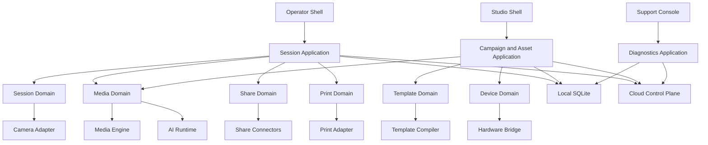

### 21.5 生命周期设计

- 启动阶段只初始化最小拍摄链路
- 进入活动前完成模板、素材、打印机、AI 模型健康检查
- 会话中只允许热切换轻量设置
- 会话后通过异步队列处理导出、分享、同步、分析
- 退出阶段统一做队列 drain、日志 flush、设备释放

### 21.6 推荐代码仓与程序集拆分

为了避免再次走向 `dslrBooth.exe + dslrBooth.Core.dll` 式大单体，建议在代码结构上直接体现边界：

| 建议仓库 / 解决方案层 | 建议程序集 / 包 | 说明 |
|---|---|---|
| `booth-runtime` | `Booth.Runtime.App` | 现场运行时宿主程序 |
| `booth-runtime` | `Booth.Runtime.OperatorUI` | 前台 Booth 交互界面 |
| `booth-runtime` | `Booth.Runtime.SessionApp` | 会话编排用例 |
| `booth-runtime` | `Booth.Runtime.DeviceApp` | 相机、打印、外设编排 |
| `booth-runtime` | `Booth.Runtime.JobApp` | 打印、分享、同步、导出任务编排 |
| `booth-domain` | `Booth.Domain.Session` | 会话领域模型 |
| `booth-domain` | `Booth.Domain.Media` | 模板、资源、输出、媒体规则 |
| `booth-domain` | `Booth.Domain.Printing` | 打印规则、纸型、路由 |
| `booth-domain` | `Booth.Domain.Sharing` | 分享、同意、渠道状态 |
| `booth-domain` | `Booth.Domain.Commerce` | 支付、券、收费入口 |
| `booth-domain` | `Booth.Domain.Fleet` | 设备、门店、心跳、版本 |
| `booth-infra` | `Booth.Infra.Camera.*` | 相机厂商适配层 |
| `booth-infra` | `Booth.Infra.Print.*` | 打印机/驱动适配层 |
| `booth-infra` | `Booth.Infra.AI` | AI Runtime 和推理后端 |
| `booth-infra` | `Booth.Infra.Storage` | SQLite、文件、对象存储 |
| `booth-infra` | `Booth.Infra.Network` | API、Webhook、WebDAV、MQTT |
| `booth-studio` | `Booth.Studio.App` | 设计与配置管理端 |
| `booth-cloud` | `Booth.Cloud.*` | 云端控制面服务 |

### 21.7 推荐的依赖方向

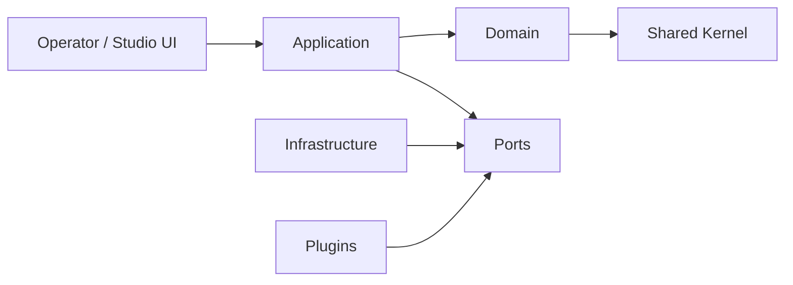

必须遵守的规则：

- UI 不直接引用基础设施实现
- Domain 不依赖任何 UI 或外部 SDK
- 厂商 SDK 只能出现在 `Infra.Camera.*` / `Infra.Print.*`
- 插件只能依赖 `Plugin SDK` 和公开 `Ports`
- AI 模型与推理后端不得侵入业务域对象

### 21.8 推荐项目目录骨架

以下目录骨架用于把本方案直接转成可执行仓库结构：

```text
src/
├─ runtime/
│  ├─ Booth.Runtime.App/
│  ├─ Booth.Runtime.OperatorUI/
│  ├─ Booth.Runtime.SessionApp/
│  ├─ Booth.Runtime.DeviceApp/
│  ├─ Booth.Runtime.JobApp/
│  └─ Booth.Runtime.Shared/
├─ studio/
│  ├─ Booth.Studio.App/
│  ├─ Booth.Studio.TemplateDesigner/
│  └─ Booth.Studio.AssetManager/
├─ domain/
│  ├─ Booth.Domain.Session/
│  ├─ Booth.Domain.Media/
│  ├─ Booth.Domain.Printing/
│  ├─ Booth.Domain.Sharing/
│  ├─ Booth.Domain.Commerce/
│  └─ Booth.Domain.Fleet/
├─ infra/
│  ├─ Booth.Infra.Camera.Canon/
│  ├─ Booth.Infra.Camera.Nikon/
│  ├─ Booth.Infra.Camera.Sony/
│  ├─ Booth.Infra.Camera.Webcam/
│  ├─ Booth.Infra.Print.Windows/
│  ├─ Booth.Infra.Print.Dnp/
│  ├─ Booth.Infra.AI/
│  ├─ Booth.Infra.Storage/
│  └─ Booth.Infra.Network/
├─ plugins-sdk/
│  ├─ Booth.Plugin.Abstractions/
│  └─ Booth.Plugin.Host/
├─ cloud/
│  ├─ Booth.Cloud.ApiGateway/
│  ├─ Booth.Cloud.Identity/
│  ├─ Booth.Cloud.DeviceFleet/
│  ├─ Booth.Cloud.Campaigns/
│  ├─ Booth.Cloud.Templates/
│  ├─ Booth.Cloud.Assets/
│  ├─ Booth.Cloud.Analytics/
│  └─ Booth.Cloud.Billing/
└─ shared/
   ├─ Booth.Shared.Contracts/
   ├─ Booth.Shared.Errors/
   └─ Booth.Shared.Telemetry/
```

### 21.9 启动阶段推荐实施顺序

若研发团队要直接开工，建议按以下顺序初始化代码仓：

1. `shared + domain`：先定统一契约、错误码、核心实体
2. `runtime + infra.storage + infra.network`：先跑通本地任务与配置链路
3. `infra.camera + infra.print`：再接硬件适配
4. `infra.ai`：最后接入 AI Runtime 底座
5. `studio + cloud`：在本地主链路稳定后同步建设平台面

## 22. 数据流设计

### 22.1 核心数据流原则

- 拍摄数据流和后台运营数据流必须解耦
- 本地永远先成功，再异步同步到云
- 用户输入、媒体资产、模板资源、打印任务、分享任务分别建模
- 每一步都要能追踪 `SessionId`

### 22.2 拍摄会话数据流

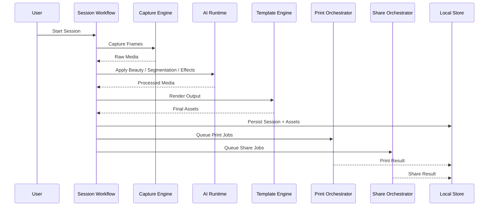

### 22.3 后台同步数据流

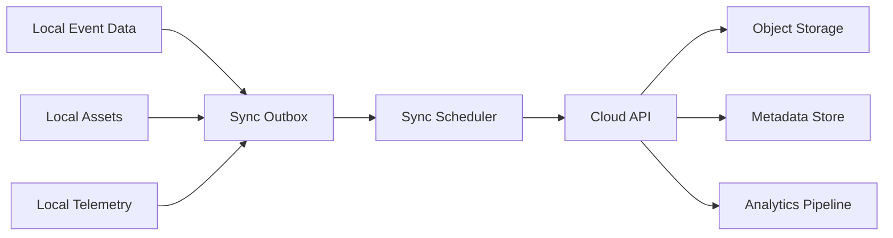

### 22.4 数据对象分层

| 层 | 对象 | 示例 |
|---|---|---|
| 会话层 | `Session`, `SessionStep`, `Shot`, `OutputAsset` | 单次拍摄全流程 |
| 运营层 | `Event`, `Campaign`, `BoothProfile`, `Theme` | 活动级配置 |
| 媒体层 | `Template`, `Overlay`, `AudioTrack`, `BackgroundAsset` | 可复用资产 |
| 任务层 | `PrintJob`, `ShareJob`, `UploadJob`, `SyncJob` | 异步执行实体 |
| 合规层 | `ConsentRecord`, `RetentionPolicy`, `AuditEvent` | 数据治理 |

### 22.5 推荐的异步模型

- 所有副作用任务一律通过 `Outbox + Job Queue`
- UI 只看任务状态，不直接耦合外部操作结果
- 失败任务必须有 `RetryPolicy`、`DeadLetter`、`OperatorAction`

## 23. 插件系统设计

### 23.1 插件系统目标

插件不是“方便以后扩展”的抽象，而是必须解决 DSLRBooth 当前主程序膨胀问题。

目标：

- 新相机、新打印机、新分享渠道、新 AI 效果不再改主程序核心
- 活动客户定制能力可以隔离交付
- 第三方生态可以在权限边界内接入

### 23.2 插件类型

| 类型 | 示例 |
|---|---|
| Device Plugin | Canon Adapter、Sony Adapter、Button Box、RFID、Printer Vendor |
| Media Plugin | Filter、Beauty、LUT、Sticker、Dynamic Overlay |
| Workflow Plugin | Survey、Payment、Coupon、Contest、Guest Book |
| Share Plugin | WeChat、WhatsApp、SMS、Email、Dropbox、WebDAV |
| AI Plugin | Face Detection、Segmentation、Face Swap、Pose、Avatar |
| Cloud Plugin | CRM、CDP、Webhook、Marketing Automation |

### 23.3 插件清单结构

```json
{
  "id": "vendor.touchpix.facefx",
  "name": "Face FX Plugin",
  "version": "1.0.0",
  "type": "ai-effect",
  "entry": "plugin.dll",
  "permissions": ["camera.read", "media.read", "media.write", "gpu.inference"],
  "capabilities": ["face-detect", "face-swap"],
  "minRuntimeVersion": "1.0.0"
}
```

### 23.4 生命周期

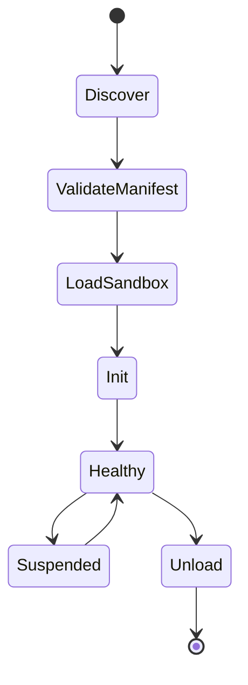

### 23.5 设计原则

- 插件只通过接口和事件总线通信
- 权限最小化，默认拒绝
- 插件崩溃不允许拖垮 Booth 主流程
- AI 插件与设备插件分别沙箱
- 插件版本兼容通过 `Capability Contract` 而不是靠反射猜测

### 23.6 Plugin SDK 接口草案

```csharp
public interface IBoothPlugin
{
    string Id { get; }
    string Name { get; }
    string Version { get; }
    Task InitializeAsync(IPluginContext context, CancellationToken cancellationToken);
    Task ShutdownAsync(CancellationToken cancellationToken);
}

public interface ICameraPlugin : IBoothPlugin
{
    Task<IReadOnlyList<CameraDescriptor>> DiscoverAsync(CancellationToken cancellationToken);
    Task<ICameraSession> ConnectAsync(string deviceId, CancellationToken cancellationToken);
}

public interface ISharePlugin : IBoothPlugin
{
    Task<ShareExecutionResult> SendAsync(ShareExecutionRequest request, CancellationToken cancellationToken);
}

public interface IAiEffectPlugin : IBoothPlugin
{
    Task<bool> WarmupAsync(CancellationToken cancellationToken);
    Task<MediaFrame> ProcessAsync(MediaFrame frame, CancellationToken cancellationToken);
}
```

### 23.7 Plugin Host 最小职责

| 能力 | 说明 |
|---|---|
| Manifest 校验 | 校验插件元数据、权限、版本 |
| 生命周期管理 | 初始化、健康检查、卸载、恢复 |
| 权限隔离 | 限制文件、网络、设备和 GPU 访问 |
| Telemetry 接入 | 记录插件耗时、崩溃率、资源占用 |
| 兼容性校验 | 校验 Runtime 版本与能力契约 |

## 24. AI架构设计

### 24.1 AI 架构目标

目标不是“加几个 AI 特效”，而是建立一个未来可持续替换模型、替换供应商、替换推理后端的 **AI Runtime**。

### 24.2 AI Runtime 分层

| 层 | 职责 |
|---|---|
| AI API Layer | 给业务暴露统一接口，如 `SegmentPerson`、`BeautifyFace` |
| Model Registry | 模型版本、依赖、输入输出、阈值、硬件要求 |
| Inference Scheduler | GPU/CPU 选择、批处理、优先级、熔断 |
| Backend Adapter | ONNX Runtime、TensorRT、DirectML、OpenVINO |
| Feature Plugins | Beauty、Background Removal、Face Swap、Avatar |

### 24.3 AI 流水线

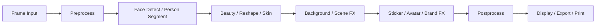

### 24.4 关键设计要求

- 单帧预算必须可配置
- 必须支持多人脸和多人分割
- 必须支持 GPU 优先、CPU 回退
- 必须支持模型热更新和灰度启用
- 必须支持不同 Booth 配置加载不同模型包

### 24.5 推荐能力包

#### P0 AI 基础包

- 人脸检测
- 人脸关键点
- 人像分割
- 磨皮/美白/祛痘
- 背景虚化

#### P1 创意增强包

- AI 背景替换
- 风格化滤镜
- AI 贴纸定位
- Avatar 模板融合

#### P2 高级商业包

- 实时 Face Swap
- 品牌吉祥物替身
- Pose 驱动模板
- 语义分镜生成

### 24.6 GPU 调度策略

- `Critical`: Live View 美颜、实时抠图
- `High`: 预览特效、拍后精选
- `Normal`: 导出增强
- `Low`: 云前处理、离线批量生成

### 24.7 AI 安全与治理

- 模型签名校验
- 模型来源白名单
- 推理日志脱敏
- 明确记录是否使用 AI 生成内容
- 对外提供 AI 同意与品牌免责声明配置

## 25. 数据库设计

### 25.1 数据库总体策略

- 本地运行时数据库：`SQLite`
- 云端业务数据库：`PostgreSQL`
- 大媒体文件：对象存储
- 分析事件：ClickHouse 或 BigQuery 类分析库

### 25.2 本地数据库职责

- 会话与镜头元数据
- 打印任务、分享任务、同步任务
- 资产缓存索引
- 设备健康与错误日志
- 离线问卷与同意记录

### 25.3 云端数据库职责

- 多租户账号体系
- 设备资产与门店关系
- 活动配置与模板版本
- 运营报表与 KPI
- 审计日志与权限

### 25.4 核心 ER 图

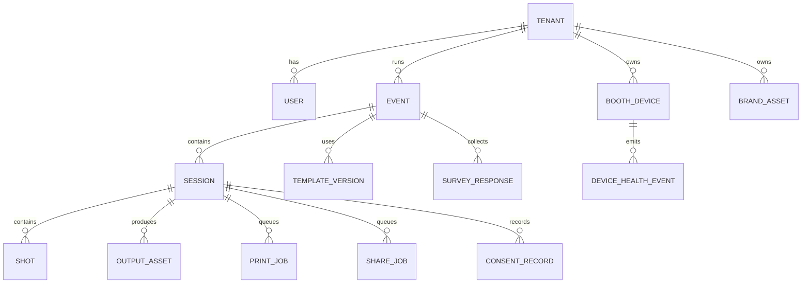

### 25.5 建议表模型

| 表 | 说明 |
|---|---|
| `sessions` | 会话主表 |
| `shots` | 每次拍摄分镜 |
| `output_assets` | 导出成片、打印图、缩略图、视频 |
| `print_jobs` | 打印任务 |
| `share_jobs` | 分享任务 |
| `sync_jobs` | 同步任务 |
| `template_versions` | 模板版本化 |
| `brand_assets` | 背景、Logo、贴纸、字体 |
| `device_health_events` | 设备状态、故障、恢复 |
| `audit_events` | 关键操作审计 |

### 25.6 数据治理

- 会话数据默认带保留策略
- PII 与媒体分仓
- 同意记录单独保存
- 支持租户级数据清除与导出

### 25.7 关键本地表字段草案

以下字段草案优先服务本地 Runtime，不追求一步到位，而是用于指导 MVP 到 V1.0 的数据库建模。

#### `sessions`

| 字段 | 类型 | 说明 |
|---|---|---|
| `id` | `TEXT` | 主键，建议使用 `ULID` |
| `event_id` | `TEXT` | 所属活动 |
| `session_mode` | `TEXT` | `print/gif/boomerang/video/...` |
| `status` | `TEXT` | `ready/capturing/rendering/printing/sharing/completed/failed` |
| `started_at_utc` | `TEXT` | 启动时间 |
| `completed_at_utc` | `TEXT` | 完成时间 |
| `device_id` | `TEXT` | 设备标识 |
| `operator_id` | `TEXT` | 操作员标识 |
| `guest_ref` | `TEXT` | 访客标识或匿名引用 |
| `retry_count` | `INTEGER` | 当前会话重试次数 |

#### `shots`

| 字段 | 类型 | 说明 |
|---|---|---|
| `id` | `TEXT` | 主键 |
| `session_id` | `TEXT` | 会话外键 |
| `shot_index` | `INTEGER` | 第几拍 |
| `capture_type` | `TEXT` | `photo/liveview/video_frame` |
| `raw_asset_path` | `TEXT` | 原始文件路径 |
| `preview_asset_path` | `TEXT` | 预览图路径 |
| `capture_started_at_utc` | `TEXT` | 开拍时间 |
| `capture_completed_at_utc` | `TEXT` | 结束时间 |
| `technical_score` | `REAL` | 清晰度/闭眼等技术评分 |
| `ai_pick_score` | `REAL` | AI 精选评分 |

#### `output_assets`

| 字段 | 类型 | 说明 |
|---|---|---|
| `id` | `TEXT` | 主键 |
| `session_id` | `TEXT` | 会话外键 |
| `asset_type` | `TEXT` | `print/jpg/gif/mp4/thumb/landing` |
| `template_version_id` | `TEXT` | 使用的模板版本 |
| `storage_scope` | `TEXT` | `local/nas/cloud` |
| `local_path` | `TEXT` | 本地路径 |
| `remote_url` | `TEXT` | 云端地址 |
| `checksum` | `TEXT` | 内容校验 |
| `created_at_utc` | `TEXT` | 生成时间 |
| `is_deleted` | `INTEGER` | 软删除标志 |

#### `jobs`

建议不要把所有异步任务完全分散到很多表；在本地可额外建立统一 `jobs` 总表，再配合专题子表：

| 字段 | 类型 | 说明 |
|---|---|---|
| `id` | `TEXT` | 主键 |
| `job_type` | `TEXT` | `print/share/sync/export` |
| `aggregate_id` | `TEXT` | 对应会话或资产 |
| `status` | `TEXT` | `queued/running/succeeded/failed/deadletter` |
| `priority` | `INTEGER` | 优先级 |
| `attempt_count` | `INTEGER` | 已重试次数 |
| `scheduled_at_utc` | `TEXT` | 调度时间 |
| `last_error_code` | `TEXT` | 最后错误码 |
| `last_error_message` | `TEXT` | 最后错误摘要 |

### 25.8 云端核心表字段草案

#### `booth_devices`

| 字段 | 类型 | 说明 |
|---|---|---|
| `id` | `UUID` | 设备 ID |
| `tenant_id` | `UUID` | 所属租户 |
| `site_id` | `UUID` | 所属门店/场馆 |
| `device_name` | `TEXT` | 设备名称 |
| `runtime_version` | `TEXT` | 运行时版本 |
| `health_status` | `TEXT` | 健康状态 |
| `last_heartbeat_at` | `TIMESTAMPTZ` | 最近心跳 |
| `hardware_profile` | `JSONB` | CPU/GPU/内存等 |
| `certificate_thumbprint` | `TEXT` | 设备证书摘要 |

#### `template_versions`

| 字段 | 类型 | 说明 |
|---|---|---|
| `id` | `UUID` | 主键 |
| `tenant_id` | `UUID` | 所属租户 |
| `template_id` | `UUID` | 模板主对象 |
| `version_no` | `INTEGER` | 版本号 |
| `status` | `TEXT` | `draft/review/approved/published` |
| `theme_id` | `UUID` | 关联主题 |
| `manifest_json` | `JSONB` | 模板中间表示 |
| `preview_urls` | `JSONB` | 各端预览地址 |
| `published_at` | `TIMESTAMPTZ` | 发布时间 |

### 25.9 索引与分区建议

- 本地 `sessions` 按 `event_id + started_at_utc` 建联合索引
- 本地 `jobs` 按 `status + priority + scheduled_at_utc` 建索引
- 云端 `device_health_events`、`share_events`、`session_events` 建时间分区
- 分析库按 `tenant_id / event_id / date` 做多维分桶

### 25.10 SQLite 建表草案示例

```sql
CREATE TABLE sessions (
    id TEXT PRIMARY KEY,
    event_id TEXT NOT NULL,
    session_mode TEXT NOT NULL,
    status TEXT NOT NULL,
    started_at_utc TEXT NOT NULL,
    completed_at_utc TEXT NULL,
    device_id TEXT NOT NULL,
    operator_id TEXT NULL,
    guest_ref TEXT NULL,
    retry_count INTEGER NOT NULL DEFAULT 0
);

CREATE TABLE shots (
    id TEXT PRIMARY KEY,
    session_id TEXT NOT NULL,
    shot_index INTEGER NOT NULL,
    capture_type TEXT NOT NULL,
    raw_asset_path TEXT NULL,
    preview_asset_path TEXT NULL,
    capture_started_at_utc TEXT NOT NULL,
    capture_completed_at_utc TEXT NULL,
    technical_score REAL NULL,
    ai_pick_score REAL NULL,
    FOREIGN KEY(session_id) REFERENCES sessions(id)
);

CREATE TABLE jobs (
    id TEXT PRIMARY KEY,
    job_type TEXT NOT NULL,
    aggregate_id TEXT NOT NULL,
    status TEXT NOT NULL,
    priority INTEGER NOT NULL DEFAULT 100,
    attempt_count INTEGER NOT NULL DEFAULT 0,
    scheduled_at_utc TEXT NOT NULL,
    last_error_code TEXT NULL,
    last_error_message TEXT NULL
);

CREATE INDEX idx_sessions_event_time ON sessions(event_id, started_at_utc);
CREATE INDEX idx_jobs_status_priority_time ON jobs(status, priority, scheduled_at_utc);
```

### 25.11 PostgreSQL 表结构草案示例

```sql
CREATE TABLE booth_devices (
    id UUID PRIMARY KEY,
    tenant_id UUID NOT NULL,
    site_id UUID NULL,
    device_name TEXT NOT NULL,
    runtime_version TEXT NOT NULL,
    health_status TEXT NOT NULL,
    last_heartbeat_at TIMESTAMPTZ NULL,
    hardware_profile JSONB NOT NULL DEFAULT '{}'::jsonb,
    certificate_thumbprint TEXT NULL
);

CREATE TABLE template_versions (
    id UUID PRIMARY KEY,
    tenant_id UUID NOT NULL,
    template_id UUID NOT NULL,
    version_no INTEGER NOT NULL,
    status TEXT NOT NULL,
    theme_id UUID NULL,
    manifest_json JSONB NOT NULL,
    preview_urls JSONB NOT NULL DEFAULT '{}'::jsonb,
    published_at TIMESTAMPTZ NULL
);
```

## 26. API设计

### 26.1 API 分层

| API 类型 | 作用 |
|---|---|
| Local Device API | Booth 本地控制与自动化 |
| Cloud Admin API | 门店、设备、活动、模板管理 |
| Public Integration API | 第三方 CRM/营销/票务集成 |
| Webhook | 会话、分享、打印、支付事件回调 |

### 26.2 Local Device API 设计原则

- 不再使用 query string 密码
- 必须使用本地签名 Token 或 mTLS
- 按能力授权，而不是单一全局密码
- 默认只绑定 `localhost`

### 26.3 Local API 示例

| 方法 | 路径 | 作用 |
|---|---|---|
| `POST` | `/v1/session/start` | 启动拍摄会话 |
| `POST` | `/v1/session/{id}/cancel` | 取消会话 |
| `POST` | `/v1/print/jobs` | 提交打印任务 |
| `POST` | `/v1/share/jobs` | 提交分享任务 |
| `GET` | `/v1/health` | 健康检查 |
| `GET` | `/v1/devices` | 查看设备状态 |

### 26.4 事件回调

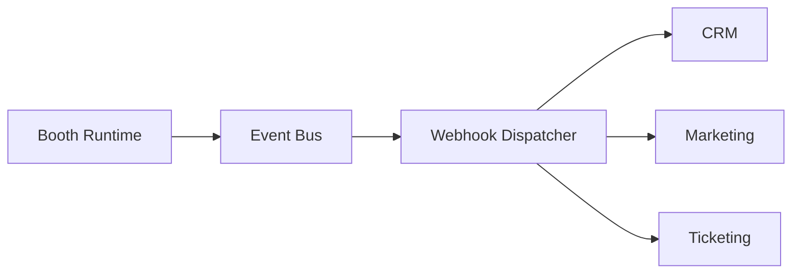

### 26.5 安全设计

- OAuth2/OIDC 用于云端 API
- Local API 使用 Booth-scoped token
- Webhook 使用签名和重放保护
- 所有写接口都带审计

### 26.6 API 风格建议

- 命令型接口用于 Booth 控制
- 资源型接口用于后台管理
- 长耗时任务统一返回 `jobId`
- 实时状态用 `WebSocket` 或 `Server-Sent Events`

### 26.7 Local API 请求 / 响应草案

#### `POST /v1/session/start`

请求：

```json
{
  "mode": "print",
  "campaignId": "camp_01J0000000000000000000000",
  "templateVersionId": "tplv_01J0000000000000000000000",
  "guestContext": {
    "language": "zh-CN",
    "source": "onsite-touch"
  }
}
```

响应：

```json
{
  "sessionId": "ses_01J0000000000000000000000",
  "status": "ready",
  "nextAction": "countdown"
}
```

#### `POST /v1/share/jobs`

请求：

```json
{
  "sessionId": "ses_01J0000000000000000000000",
  "channels": [
    {
      "type": "email",
      "to": "guest@example.com"
    },
    {
      "type": "sms",
      "to": "+15551234567"
    }
  ],
  "consentToken": "consent_opaque_token"
}
```

响应：

```json
{
  "jobIds": [
    "job_share_01J000000000000000000001",
    "job_share_01J000000000000000000002"
  ],
  "status": "queued"
}
```

### 26.8 Cloud Admin API 资源草案

| 资源 | 典型路径 | 说明 |
|---|---|---|
| `tenants` | `/admin/v1/tenants/{tenantId}` | 租户与授权 |
| `devices` | `/admin/v1/devices` | 设备舰队与健康状态 |
| `campaigns` | `/admin/v1/campaigns` | 活动与活动包 |
| `templates` | `/admin/v1/templates` | 模板与版本 |
| `assets` | `/admin/v1/assets` | 图片、视频、字体、品牌素材 |
| `jobs` | `/admin/v1/jobs` | 打印/分享/同步/导出任务 |
| `reports` | `/admin/v1/reports/*` | 报表与导出 |

### 26.9 Webhook 事件草案

| 事件名 | 触发时机 | 关键字段 |
|---|---|---|
| `session.started` | 会话开始 | `sessionId`, `campaignId`, `deviceId` |
| `session.completed` | 会话完成 | `sessionId`, `assetIds`, `durationMs` |
| `print.succeeded` | 打印完成 | `jobId`, `printerId`, `copies` |
| `print.failed` | 打印失败 | `jobId`, `errorCode`, `retriable` |
| `share.delivered` | 渠道送达 | `jobId`, `channel`, `recipientRef` |
| `share.failed` | 渠道失败 | `jobId`, `channel`, `errorCode` |
| `device.health.changed` | 设备健康变化 | `deviceId`, `oldStatus`, `newStatus` |

### 26.10 错误码策略

建议所有本地 API 和云端 API 使用统一错误码前缀：

| 前缀 | 含义 |
|---|---|
| `CAM_*` | 相机与采集错误 |
| `PRN_*` | 打印错误 |
| `SHR_*` | 分享与渠道错误 |
| `SYN_*` | 同步错误 |
| `AI_*` | AI Runtime 与模型错误 |
| `CFG_*` | 配置、模板、资产错误 |
| `SEC_*` | 安全与认证错误 |

### 26.11 OpenAPI 契约草案示例

```yaml
openapi: 3.1.0
info:
  title: Booth Local Device API
  version: 1.0.0
paths:
  /v1/session/start:
    post:
      summary: Start a booth session
      requestBody:
        required: true
        content:
          application/json:
            schema:
              type: object
              required: [mode, campaignId]
              properties:
                mode:
                  type: string
                campaignId:
                  type: string
                templateVersionId:
                  type: string
      responses:
        "200":
          description: Session created
  /v1/share/jobs:
    post:
      summary: Queue share jobs
      responses:
        "202":
          description: Share jobs accepted
```

### 26.12 Webhook Payload 草案示例

```json
{
  "event": "session.completed",
  "eventId": "evt_01J0000000000000000000000",
  "occurredAtUtc": "2026-07-02T10:20:30Z",
  "tenantId": "ten_01J0000000000000000000000",
  "payload": {
    "sessionId": "ses_01J0000000000000000000000",
    "campaignId": "camp_01J0000000000000000000000",
    "deviceId": "dev_01J0000000000000000000000",
    "assetIds": [
      "asset_01J0000000000000000000001"
    ],
    "durationMs": 48210
  },
  "signature": "base64-hmac-signature"
}
```

## 27. 前端设计

### 27.1 前端产品面

下一代产品至少包含四套前端：

1. `Booth Operator UI`
2. `Touch Guest UI`
3. `Studio Designer UI`
4. `Cloud Admin UI`

### 27.2 Operator UI 原则

- 强状态感
- 强错误可见性
- 强触摸热区
- 强恢复路径
- 强品牌氛围

### 27.3 Guest UI 原则

- 3 秒内理解
- 大按钮、少文字
- 每一步有明确反馈
- 拍摄前紧张感低，拍摄后分享冲动高

### 27.4 Studio 设计台

Studio 不是传统“设置窗口”，而应更像：

- Figma 式图层面板
- Adobe 式属性面板
- Notion 式资产组织
- Linear 式状态管理

### 27.5 设计系统

| 层 | 说明 |
|---|---|
| Design Tokens | 颜色、字体、间距、圆角、动效、阴影 |
| Booth Components | 倒计时、相机预览、模板卡、分享卡、打印状态卡 |
| Studio Components | 画布、图层、变量、资源、版本、预览 |
| Admin Components | 表格、设备状态、告警、运营报表 |

### 27.6 推荐交互模式

- 现场界面使用“场景模式”，而不是多窗口模式
- 设计台支持多画布、多预览比例、多设备预览
- 管理后台支持设备地图、活动时间轴、错误回放

## 28. 后端设计

### 28.1 后端职责

后端不是 Booth 运行的前提，但它是规模化运营的前提。

### 28.2 建议服务划分

| 服务 | 职责 |
|---|---|
| Identity Service | 用户、角色、租户、设备身份 |
| Device Fleet Service | 设备注册、心跳、远程命令、版本 |
| Event Service | 活动、套餐、工作流、活动配置 |
| Template Service | 模板、变量、主题、版本、审批 |
| Asset Service | 图片、视频、品牌素材、字体、CDN |
| Share Service | 邮件、短信、二维码、社交平台 |
| Print Telemetry Service | 打印状态、异常、耗材统计 |
| AI Service | 模型分发、配置策略、推理配额 |
| Analytics Service | 会话、分享、转化、设备报表 |
| Billing Service | 订阅、门店授权、支付、结算 |

### 28.3 后端架构图

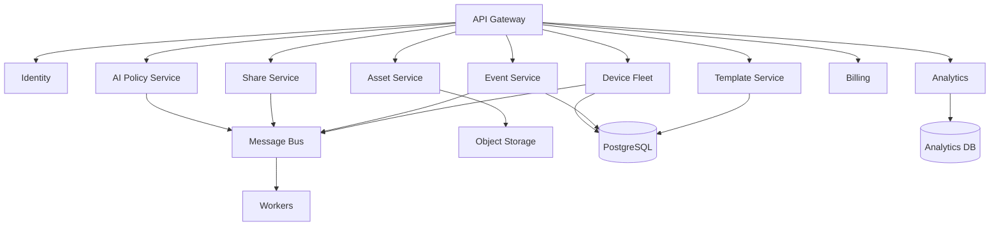

### 28.4 后端实施原则

- 控制面和数据面分离
- 大文件走对象存储，不穿透主数据库
- 所有异步任务可重放、可观测、可审计
- 设备控制指令必须幂等

## 29. 部署架构

### 29.1 部署目标

- 单机 Booth 可独立运行
- 门店可局域网协同
- 集团可云端统一管理
- 不同租户相互隔离

### 29.2 本地 Booth 节点

每个 Booth 节点包含：

- Booth Runtime
- Local SQLite
- Asset Cache
- AI Model Cache
- Print Spooler
- Share Queue
- Diagnostics Agent

### 29.3 云端部署

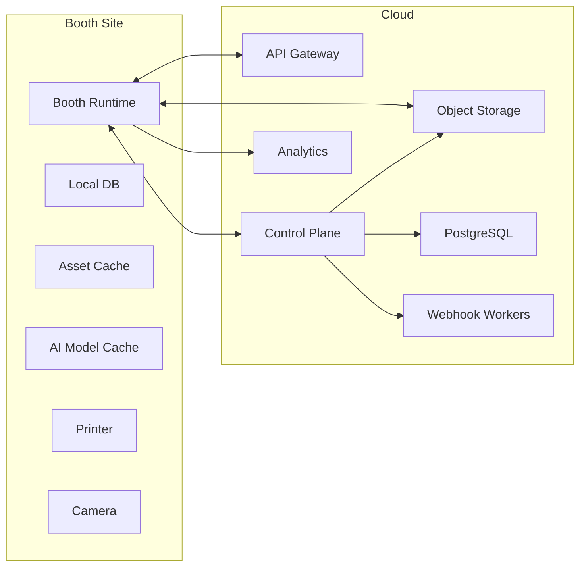

### 29.4 发布策略

- Runtime 支持稳定版、候选版、灰度版
- AI 模型单独版本化
- 模板和活动配置单独版本化
- 驱动插件独立发布

### 29.5 远程运维

- 远程日志拉取
- 健康检查与自检报告
- 设备截图与录像诊断
- 远程清缓存
- 远程切换活动配置
- 远程回滚插件和模型

## 30. 开发路线图

说明：根据当前会话中的文档约束，本节只描述阶段目标、依赖与优先级，不给出时间估算。

### 30.1 MVP

#### 目标

- 跑通 Canon/Nikon/Sony/Webcam 基础拍摄
- 跑通单模板拍摄、导出、打印、二维码分享
- 跑通本地 SQLite、打印队列、分享队列
- 跑通 Booth Runtime 与最小云同步

#### 范围

- 基础模板引擎
- 基础打印引擎
- 基础分享引擎
- 基础设备管理
- 最小 Booth API

#### 依赖

- 先完成本地运行时架构
- 再接相机与打印适配
- 再接最小云控制面

### 30.2 V1.0

#### 目标

- 达到可商业部署的 Windows 专业 Booth 能力
- 支持多会话模式：Print、GIF、Boomerang、Video
- 支持模板版本化、活动配置、离线稳定运行
- 建立远程日志、健康检查、灰度发布能力

#### 核心能力

- 多品牌打印机适配
- 本地 API 安全重构
- 资产同步与活动同步
- Studio 模板管理
- 设备健康与故障恢复

### 30.3 V2.0

#### 目标

- 建立 AI Runtime 平台化能力
- 建立模板工业化生产能力
- 建立企业级设备舰队管理能力

#### 核心能力

- GPU 实时美颜与分割
- 云模板市场
- PSD/Figma/Canva 导入
- 多门店、多设备、多角色权限
- 数据分析与转化漏斗

### 30.4 V3.0

#### 目标

- 从“Booth 软件”升级为“现场内容运营平台”
- 支持插件市场和第三方开发者生态
- 支持品牌和代理商自定义行业方案

#### 核心能力

- 插件市场
- 工作流编排器
- 高级 AI 特效
- 赛事/婚礼/商场/品牌快闪行业包

### 30.5 长期规划

- Booth 设备集群自治
- AI 生成模板与 AI 生成活动包
- 全渠道 CRM 联动
- 无人值守 Booth 与远程托管运营
- 全球化部署与多区域合规

## 31. 风险分析

### 31.1 技术风险

| 风险 | 说明 | 对策 |
|---|---|---|
| 相机 SDK 差异大 | Canon/Nikon/Sony/Webcam/GoPro 生命周期与能力不一致 | 先抽象统一 Capture Contract，再分设备适配 |
| 打印机驱动复杂 | Windows 驱动抽象有限，厂商行为不一致 | 引入 Vendor Adapter 与打印诊断工具 |
| AI 性能不稳定 | 不同 GPU/驱动/显存差异大 | 做能力分级与模型分层 |
| 视频链路复杂 | FFmpeg、编码器、容器格式、音轨组合繁杂 | 建立统一 Media Job Pipeline |

### 31.2 产品风险

| 风险 | 说明 | 对策 |
|---|---|---|
| 功能堆叠重演 DSLRBooth 技术债 | 需求一多，容易重新回到大单体 | 先定义扩展点，再交付功能 |
| AI 过度优先影响稳定性 | AI 很吸引市场，但会拖慢主路径 | AI 必须以 SLA 和预算治理 |
| 模板系统过于理想化 | 设计师需求容易无限膨胀 | 用组件、变量、约束三层逐步推进 |

### 31.3 商业风险

| 风险 | 说明 | 对策 |
|---|---|---|
| 只做软件不做运营能力 | 难以超越 SaaS 型竞品 | 必须同步建设云端与分析 |
| 只做创意不做打印稳定性 | 难以赢下真实商用现场 | 打印与拍摄链路列为最高优先级 |
| 只做 Windows 单点产品 | 难以形成平台估值 | 云控制面、开放 API、模板市场必须同步规划 |

### 31.4 交付风险

- 模板、打印、AI、同步四大子系统存在强耦合，必须严格分层
- 如果不先建诊断与可观测性体系，后期问题会难以定位
- 如果不先建本地 API 安全边界，未来所有自动化都会变成风险源

## 32. 最终总结

### 32.1 当前阶段结论

DSLRBooth 之所以能成为行业内长期有竞争力的产品，不是因为它某一个技术点特别先进，而是因为它把 **相机、模板、打印、分享、活动运营** 这几条线在一个 Windows 商业软件里真正打通了。

但它当前也已经明显进入“大单体成熟产品”的典型后期阶段：

- 业务能力强
- 工程债务重
- AI 已接入但未平台化
- 商业成熟但技术架构接近天花板

### 32.2 分项评分

| 维度 | 评分 | 评价 |
|---|---:|---|
| 架构 | 71 | 商业闭环强，但边界膨胀明显 |
| 代码 | 58 | 可用性优先，工程债较重 |
| 性能 | 68 | 经过多年优化，但热路径仍有较多历史包袱 |
| UI | 63 | 可用但不够现代，设置后台负担大 |
| 安全 | 34 | 存在不应接受的客户端密钥与本地 API 风险 |
| 模板系统 | 69 | 实用成熟，但表达力与工业化不足 |
| 打印系统 | 74 | 商业实用性强，但缺少供应商抽象层 |
| 相机系统 | 79 | 多设备兼容广，经验积累深 |
| AI 能力 | 61 | 已有落地，但还不是底座能力 |
| 扩展性 | 57 | 新功能能加，但代价持续升高 |
| 维护性 | 52 | 巨型类、巨型窗口、字符串流程带来高成本 |
| 商业成熟度 | 84 | 行业理解深，功能闭环完整 |

### 32.3 DSLRBooth 最值得学习的地方

- 真正理解线下 Booth 的工作流，而不是只做拍照软件
- 高度重视离线能力和商用稳定性
- 把模板、打印、分享、支付、同步逐步产品化
- 对 Canon/Nikon/Sony/Webcam/GoPro 等设备现实差异有长期积累

### 32.4 DSLRBooth 最大的不足

- 没有把架构及时升级为平台化
- 模板系统无法承接下一代设计工作流
- AI 能力仍是功能点，不是统一运行时
- 安全治理明显落后于企业级标准
- 本地 API、同步、分享、遥测的数据治理边界不够成熟

### 32.5 如果重新开发，怎样做到行业第一

要做到行业第一，不能只做以下其中一项：

- 更强 AI
- 更漂亮 UI
- 更多模板

而必须同时完成三件事：

1. 把 **拍摄稳定性** 做到行业标杆。
2. 把 **模板与品牌生产效率** 做到行业第一。
3. 把 **设备、门店、活动、用户、数据** 连接成平台。

最终胜负不只看特效，而看谁能把这三条线合成一个真正可规模化运营的系统。

### 32.6 术语统一表

为避免后续研发、产品、设计、测试、运维、售前使用不同词汇导致理解偏差，建议全项目统一采用以下术语：

| 术语 | 统一含义 | 不建议混用的词 |
|---|---|---|
| `Booth Runtime` | 现场运行时主程序与本地任务系统 | 主程序、客户端、前台软件 |
| `Booth Studio` | 模板、活动、素材、配置的设计与管理端 | 后台、设置器、模板编辑器 |
| `Booth Cloud` | 云控制面、设备舰队、分析、账号与同步平台 | 云端、服务器、后台系统 |
| `Session` | 一次完整用户拍摄会话 | 订单、任务、拍摄流程 |
| `Shot` | 会话中的一次拍摄片段或单帧阶段 | 照片、镜头、素材 |
| `Output Asset` | 可交付输出，如照片、打印图、GIF、视频 | 文件、成片、资源 |
| `Template` | 打印/屏幕/分享输出的结构化设计定义 | 布局、画框、海报 |
| `Theme` | 跨模板和跨页面复用的品牌视觉体系 | 皮肤、样式包 |
| `Campaign Package` | 活动级配置包，包含模板、素材、文案、规则 | 活动包、项目包、配置包 |
| `AI Runtime` | 模型加载、推理、调度、回退的统一底座 | AI 模块、特效引擎 |
| `Print Orchestrator` | 打印任务编排与供应商适配层 | 打印模块、打印功能 |
| `Share Orchestrator` | 分享任务编排与渠道治理层 | 分享模块、发送模块 |
| `Device Fleet` | 多 Booth、多门店设备管理体系 | 设备管理、机器管理 |
| `Operator UI` | 现场操作员和用户可见的运行界面 | 前台、主界面 |
| `Admin UI` | 面向运营、设计、支持和管理人员的后台界面 | 设置页、后台页 |
| `Health Console` | 汇总设备、AI、打印、同步、网络状态的健康面板 | 状态页、诊断页 |
| `Outbox / Job Queue` | 本地异步任务存储与执行模型 | 队列、任务表、后台线程 |

### 32.7 最终交付建议

若把本文档作为正式研发启动材料，建议按以下方式使用：

1. 第 `18` 章作为现状问题清单。
2. 第 `19` 章作为改造候选池和优先级来源。
3. 第 `20` 到 `29` 章作为目标架构和产品蓝图。
4. 第 `30` 和 `31` 章作为推进顺序与风险控制依据。
5. 第 `32` 章作为管理层与项目负责人的统一判断标准。

### 32.8 已生成的配套实施文件

除主文档外，当前还已生成以下实施草案文件：

- [openapi.local-device.v1.yaml](D:\安装包归档\咏彩booth\docs\implementation\openapi.local-device.v1.yaml)
- [sqlite.runtime.schema.sql](D:\安装包归档\咏彩booth\docs\implementation\sqlite.runtime.schema.sql)
- [postgres.cloud.schema.sql](D:\安装包归档\咏彩booth\docs\implementation\postgres.cloud.schema.sql)
- [Booth.Plugin.Abstractions.cs](D:\安装包归档\咏彩booth\docs\implementation\Booth.Plugin.Abstractions.cs)
- [runtime-dotnet/Booth.Runtime.sln](D:\安装包归档\咏彩booth\D-Booth\runtime-dotnet\Booth.Runtime.sln)
- [runtime-dotnet/README.md](D:\安装包归档\咏彩booth\D-Booth\runtime-dotnet\README.md)
- [runtime-dotnet/requests.http](D:\安装包归档\咏彩booth\D-Booth\runtime-dotnet\requests.http)

这些文件的定位是：

- 主文档负责统一产品、架构和实施语言
- `openapi` 草案负责 API 契约雏形
- `sql` 草案负责数据库启动建模
- `Plugin SDK` 草案负责插件生态的第一版接口边界
- `runtime-dotnet` 骨架负责把 Runtime / Domain / App / Infra / Plugin 的边界落成真实工程结构

### 32.9 当前已生成的工程骨架

已在 `D-Booth/runtime-dotnet` 下生成最小可编译 `.NET 8` 解决方案，当前包含：

- `Booth.Runtime.App`
- `Booth.Runtime.ApiHost`
- `Booth.Runtime.SessionApp`
- `Booth.Domain.Session`
- `Booth.Shared.Contracts`
- `Booth.Infra.Storage.Sqlite`
- `Booth.Plugin.Abstractions`

当前已具备的真实能力边界：

- `SessionAggregate` 与 `SessionApplicationService`
- `SessionStartApiRequest / Response` 等本地 API DTO
- `CaptureShotApiRequest / Response` 与 `ShotDetailsApiResponse`
- `SessionDetailsApiResponse` 聚合查询模型
- 基于 `Microsoft.Data.Sqlite` 的 `SqliteSessionRepository`
- 基于 `Microsoft.Data.Sqlite` 的 `SqliteShotRepository`
- 基于 SQLite 的 `jobs` 队列仓储骨架
- 基于 SQLite 的 `output_assets` 仓储骨架
- `JobExecutionService` 最小任务执行器
- 最小可运行 `Local Device API Host`
- 已接通 `health / session start / session shot capture / session shot list / session cancel / print jobs / share jobs / job query / job execute / session assets / asset get / asset delete` 端点
- `print/share` 端点已补 session 存在性校验
- `print/share` 任务已支持结构化 payload 持久化
- `job execute` 已能真实写出本地输出文件并反写资产记录
- `shot capture` 已能真实写出本地采集文件并持久化 `shots`
- `assets` 已支持单项查询与软删除
- 已新增 `GET /v1/sessions/{sessionId}` 聚合端点，一次返回 `session + shots + jobs + assets`
- `ApiHost` 已支持通过 `Runtime:DataDirectory` 覆盖默认数据目录，便于测试隔离和多实例运行
- 已修复 `Session` 从 SQLite 回读时状态与时间戳丢失的持久化 bug
- 已补最小 `xUnit` 测试项目并通过回归测试
- 已补外部进程方式的真实 HTTP 集成测试，直接覆盖 `ApiHost -> SQLite -> 文件落盘` 主链路

当前骨架已通过本地构建验证：

```text
dotnet build D:\安装包归档\咏彩booth\D-Booth\runtime-dotnet\Booth.Runtime.sln
=> 0 warning, 0 error
```

当前测试验证结果：

```text
dotnet test D:\安装包归档\咏彩booth\D-Booth\runtime-dotnet\Booth.Runtime.sln
=> 6 passed, 0 failed
```

运行验证说明：

- `ApiHost` 代码与构建已通过
- 当前机器仍缺少 `Microsoft.AspNetCore.App 8.0.x` 运行时
- 集成测试通过 `DOTNET_ROLL_FORWARD=Major` 方式拉起外部 `ApiHost` 进程，因此已能在本机完成真实 HTTP 验证

---

## 进度记录

### 当前已完成

- 确认输入不是源码仓库，而是商业发行包
- 识别安装器类型为 `Tarma InstallMate 9`
- 通过安装日志定位真实安装目录
- 提取主技术栈与关键第三方依赖
- 识别目录树、资源分类和部分业务域
- 建立统一交付文档骨架
- 完成程序集 / Window / ViewModel / Layout 的更细粒度映射
- 完成相机、流程、模板、美颜、打印、相册、分享、UI/UX、性能、安全的结构分析
- 完成竞品章节的公开信息调研与归纳
- 完成竞品章节的能力路线对比与官方来源索引表
- 完成竞品章节的官方页面入口归档
- 完成性能瓶颈排行与结构化优化优先级
- 完成代码质量 / 架构债 `TOP100` 问题清单
- 完成升级建议章节的统一字段规范与前 `210` 条建议
- 完成 `210` 条建议的主题聚类与架构章节映射
- 完成高优先级建议与实施章节对照表
- 完成下一代 AI Photo Booth 的总体产品定义
- 完成软件架构、数据流、插件、AI、数据库、API、前后端、部署章节第一版
- 完成代码仓拆分、关键表字段草案与 API 契约草案
- 完成 Plugin SDK 接口草案与 OpenAPI / Webhook 示例
- 完成 `docs/implementation` 配套实施草案文件落地
- 完成 `D-Booth/runtime-dotnet` 最小可编译工程骨架并通过构建验证
- 完成 Local Device API Host、Session DTO 与 SQLite 真仓储骨架
- 完成 Swagger/OpenAPI 对齐与 `jobs` SQLite 仓储骨架
- 完成 `runtime-dotnet/requests.http` 联调请求示例与运行环境说明
- 完成 Session 持久化回读 bug 修复、端点存在性校验与最小测试项目
- 完成 `jobs -> execute -> output_assets` 最小链路与第二个回归测试
- 完成 `job payload` 持久化、真实文件产出与仓储职责拆分优化
- 完成 `shots` 持久化、采集文件落盘与第三个回归测试
- 完成 `assets` 单项查询、软删除与第四个回归测试
- 完成 `session details` 聚合端点与 `jobs` 聚合查询能力
- 完成 `ApiHost` 外部进程真实 HTTP 集成测试并通过 `6` 条回归测试
- 完成 `Runtime:DataDirectory` 覆盖能力与联调/测试隔离支持
- 完成路线图、风险分析、阶段性评分与总结第一版
- 完成术语统一表与最终交付使用建议

### 当前未完成

- WinUI Operator Shell 仍未接到当前本地 Runtime 主链路
- `camera simulator / print adapter / share provider abstraction` 仍停留在下一轮应落地的边界
- `ApiHost` 已有真实 HTTP 测试，但设备级真实适配层还未接入
